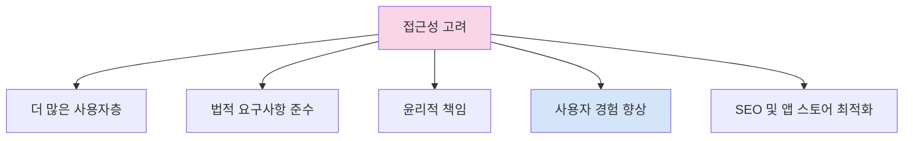

# 접근성

모든 사용자가 앱을 편리하게 사용할 수 있도록 접근성(Accessibility)을 고려하는 것은 매우 중요합니다. 접근성이 높은 앱은 시각, 청각, 운동 능력 등에 제한이 있는 사용자들도 불편함 없이 이용할 수 있습니다. Flutter는 다양한 접근성 기능을 지원하여 개발자가 더 포용적인 앱을 만들 수 있도록 도와줍니다.

## 접근성의 중요성

접근성을 고려하는 것은 다음과 같은 여러 가지 이유로 중요합니다:



1. **더 많은 사용자층**: 전 세계적으로 약 10억 명이 넘는 사람들이 장애를 갖고 있으며, 접근성을 고려하면 더 많은 사용자가 앱을 사용할 수 있습니다.
2. **법적 요구사항**: 많은 국가에서 디지털 접근성은 법적 요구사항입니다. 미국의 ADA(Americans with Disabilities Act)나 유럽의 EAA(European Accessibility Act) 등이 있습니다.
3. **윤리적 책임**: 모든 사용자에게 평등한 접근성을 제공하는 것은 개발자의 윤리적 책임입니다.
4. **사용자 경험 향상**: 접근성을 개선하면 모든 사용자의 경험이 향상됩니다. 예를 들어, 고대비 모드는 밝은 환경에서 모든 사용자에게 도움이 됩니다.
5. **검색 엔진 및 앱 스토어 최적화**: 접근성이 높은 앱은 검색 엔진 및 앱 스토어 알고리즘에서 더 높은 평가를 받을 수 있습니다.

## 플랫폼별 접근성 기능

Flutter 앱에서 접근성을 구현할 때는 각 플랫폼의 접근성 서비스를 활용합니다:

- **Android**: TalkBack (화면 낭독기)
- **iOS**: VoiceOver (화면 낭독기)
- **웹**: 다양한 화면 낭독기 (NVDA, JAWS, VoiceOver 등)

Flutter는 이러한 서비스와 자연스럽게 연동되도록 설계되었습니다.

## Flutter에서의 접근성 구현

### 1. 기본적인 접근성 속성

Flutter의 대부분의 위젯은 기본적인 접근성 기능을 갖추고 있지만, `Semantics` 위젯을 사용하여 추가적인 접근성 정보를 제공할 수 있습니다.

```dart
Semantics(
  label: '이메일 보내기 버튼',
  hint: '탭하여 이메일 작성 화면으로 이동합니다',
  button: true,
  child: IconButton(
    icon: Icon(Icons.email),
    onPressed: () {
      // 이메일 작성 화면으로 이동
    },
  ),
)
```

### 2. 접근성 속성

`Semantics` 위젯의 주요 속성들:

- **label**: 요소를 설명하는 텍스트
- **hint**: 요소의 기능을 설명하는 추가 정보
- **value**: 요소의 현재 값 (예: 슬라이더의 현재 값)
- **button**: 요소가 버튼임을 나타냄
- **enabled**: 요소의 활성화 상태
- **checked**: 요소의 선택 상태 (체크박스, 라디오 버튼 등)
- **selected**: 요소의 선택 상태 (탭, 메뉴 아이템 등)
- **focusable**: 키보드 초점을 받을 수 있는지 여부
- **focused**: 현재 키보드 초점을 가지고 있는지 여부
- **onTap**, **onLongPress** 등: 제스처 콜백

### 3. MergeSemantics와 ExcludeSemantics

여러 위젯의 의미론적 정보를 합치거나 제외하기 위한 위젯들:

```dart
// 여러 위젯의 의미론적 정보를 하나로 합치기
MergeSemantics(
  child: Row(
    children: [
      Icon(Icons.favorite),
      Text('좋아요'),
    ],
  ),
)

// 특정 위젯의 의미론적 정보 제외하기
ExcludeSemantics(
  child: DecorativeImage(), // 순수 장식용 이미지
)
```

### 4. Semantics 디버깅

Flutter DevTools를 사용하여 앱의 의미론적 트리를 검사할 수 있습니다:

1. Flutter 앱을 디버그 모드로 실행
2. DevTools 열기
3. "Flutter Inspector" 탭 선택
4. "Toggle Platform" 버튼 클릭하여 플랫폼 모드 전환
5. "Highlight Semantics" 버튼 클릭하여 의미론적 정보 강조 표시

### 5. 화면 낭독기 테스트

앱의 접근성을 테스트하기 위해 실제 기기에서 화면 낭독기를 활성화하고 테스트하는 것이 중요합니다:

- **Android**: 설정 > 접근성 > TalkBack
- **iOS**: 설정 > 접근성 > VoiceOver

## 접근성 구현 예제

### 1. 이미지 접근성

```dart
// 장식용 이미지
ExcludeSemantics(
  child: Image.asset('assets/decorative_background.png'),
)

// 내용이 있는 이미지
Image.asset(
  'assets/chart.png',
  semanticLabel: '2023년 분기별 매출 차트: 1분기 100만, 2분기 150만, 3분기 200만, 4분기 250만',
)
```

### 2. 폼 요소 접근성

```dart
// 접근성이 향상된 텍스트 필드
TextField(
  decoration: InputDecoration(
    labelText: '이메일',
    hintText: '예: example@gmail.com',
  ),
  // 명시적 접근성 레이블 제공
  semanticsLabel: '이메일 주소 입력',
)

// 접근성이 향상된 버튼
ElevatedButton(
  onPressed: _submit,
  child: Text('제출'),
  // Semantics 위젯을 사용하여 추가 정보 제공
  child: Semantics(
    label: '양식 제출 버튼',
    hint: '탭하여 작성한 양식을 제출합니다',
    button: true,
    child: Text('제출'),
  ),
)
```

### 3. 커스텀 위젯 접근성

```dart
class RatingBar extends StatelessWidget {
  final int rating;
  final int maxRating;
  final ValueChanged<int>? onRatingChanged;

  const RatingBar({
    Key? key,
    required this.rating,
    this.maxRating = 5,
    this.onRatingChanged,
  }) : super(key: key);

  @override
  Widget build(BuildContext context) {
    return Semantics(
      label: '별점',
      value: '$rating/$maxRating',
      // onRatingChanged가 null이 아니면 조정 가능한 것으로 표시
      slider: onRatingChanged != null,
      hint: onRatingChanged != null ? '좌우로 스와이프하여 별점 조정' : null,
      child: Row(
        mainAxisSize: MainAxisSize.min,
        children: List.generate(maxRating, (index) {
          return GestureDetector(
            onTap: onRatingChanged == null ? null : () {
              onRatingChanged!(index + 1);
            },
            // 개별 별에 대한 의미론적 정보는 제외
            child: ExcludeSemantics(
              child: Icon(
                index < rating ? Icons.star : Icons.star_border,
                color: Colors.amber,
              ),
            ),
          );
        }),
      ),
    );
  }
}
```

### 4. 네비게이션 접근성

```dart
Scaffold(
  appBar: AppBar(
    title: Text('접근성 예제'),
    // 뒤로 가기 버튼의 접근성 레이블 설정
    leading: Semantics(
      label: '뒤로 가기',
      hint: '이전 화면으로 돌아갑니다',
      button: true,
      child: IconButton(
        icon: Icon(Icons.arrow_back),
        onPressed: () => Navigator.of(context).pop(),
      ),
    ),
  ),
  // 하단 탐색 바의 접근성 향상
  bottomNavigationBar: BottomNavigationBar(
    items: [
      BottomNavigationBarItem(
        icon: Semantics(
          label: '홈 탭',
          selected: _selectedIndex == 0,
          child: Icon(Icons.home),
        ),
        label: '홈',
      ),
      BottomNavigationBarItem(
        icon: Semantics(
          label: '검색 탭',
          selected: _selectedIndex == 1,
          child: Icon(Icons.search),
        ),
        label: '검색',
      ),
      BottomNavigationBarItem(
        icon: Semantics(
          label: '프로필 탭',
          selected: _selectedIndex == 2,
          child: Icon(Icons.person),
        ),
        label: '프로필',
      ),
    ],
    currentIndex: _selectedIndex,
    onTap: _onItemTapped,
  ),
)
```

## 고급 접근성 기법

### 1. 키보드 탐색 및 초점 관리

키보드 사용자를 위한 탐색 및 초점 관리:

```dart
// 초점 관리를 위한 FocusNode 사용
class KeyboardNavigationExample extends StatefulWidget {
  @override
  _KeyboardNavigationExampleState createState() => _KeyboardNavigationExampleState();
}

class _KeyboardNavigationExampleState extends State<KeyboardNavigationExample> {
  final FocusNode _nameFocus = FocusNode();
  final FocusNode _emailFocus = FocusNode();
  final FocusNode _passwordFocus = FocusNode();
  final FocusNode _submitFocus = FocusNode();

  @override
  void dispose() {
    _nameFocus.dispose();
    _emailFocus.dispose();
    _passwordFocus.dispose();
    _submitFocus.dispose();
    super.dispose();
  }

  @override
  Widget build(BuildContext context) {
    return Scaffold(
      appBar: AppBar(title: Text('키보드 탐색 예제')),
      body: Padding(
        padding: EdgeInsets.all(16.0),
        child: Column(
          children: [
            // 이름 필드
            TextField(
              focusNode: _nameFocus,
              decoration: InputDecoration(labelText: '이름'),
              textInputAction: TextInputAction.next,
              onEditingComplete: () {
                FocusScope.of(context).requestFocus(_emailFocus);
              },
            ),
            SizedBox(height: 16),

            // 이메일 필드
            TextField(
              focusNode: _emailFocus,
              decoration: InputDecoration(labelText: '이메일'),
              keyboardType: TextInputType.emailAddress,
              textInputAction: TextInputAction.next,
              onEditingComplete: () {
                FocusScope.of(context).requestFocus(_passwordFocus);
              },
            ),
            SizedBox(height: 16),

            // 비밀번호 필드
            TextField(
              focusNode: _passwordFocus,
              decoration: InputDecoration(labelText: '비밀번호'),
              obscureText: true,
              textInputAction: TextInputAction.done,
              onEditingComplete: () {
                FocusScope.of(context).requestFocus(_submitFocus);
              },
            ),
            SizedBox(height: 24),

            // 제출 버튼
            Focus(
              focusNode: _submitFocus,
              child: ElevatedButton(
                onPressed: () {
                  // 폼 제출 로직
                },
                child: Text('제출'),
              ),
              onKeyEvent: (node, event) {
                if (event is KeyDownEvent && event.logicalKey == LogicalKeyboardKey.enter) {
                  // 엔터 키 처리
                  // 폼 제출 로직
                  return KeyEventResult.handled;
                }
                return KeyEventResult.ignored;
              },
            ),
          ],
        ),
      ),
    );
  }
}
```

### 2. 접근성 서비스 감지

현재 활성화된 접근성 서비스에 따라 UI를 조정할 수 있습니다:

```dart
import 'package:flutter/semantics.dart';

class AccessibilityAwareWidget extends StatefulWidget {
  @override
  _AccessibilityAwareWidgetState createState() => _AccessibilityAwareWidgetState();
}

class _AccessibilityAwareWidgetState extends State<AccessibilityAwareWidget> {
  bool _isScreenReaderEnabled = false;

  @override
  void initState() {
    super.initState();
    _checkAccessibilityFeatures();
    SemanticsBinding.instance.window.onAccessibilityFeaturesChanged = _checkAccessibilityFeatures;
  }

  void _checkAccessibilityFeatures() {
    setState(() {
      _isScreenReaderEnabled = SemanticsBinding.instance.window.accessibilityFeatures.accessibleNavigation;
    });
  }

  @override
  Widget build(BuildContext context) {
    if (_isScreenReaderEnabled) {
      // 화면 낭독기가 활성화되었을 때 더 간단한 UI 제공
      return ListView(
        children: [
          ListTile(
            title: Text('항목 1'),
            onTap: () => _selectItem(1),
          ),
          ListTile(
            title: Text('항목 2'),
            onTap: () => _selectItem(2),
          ),
          // ... 더 많은 항목
        ],
      );
    } else {
      // 일반 UI
      return GridView.builder(
        gridDelegate: SliverGridDelegateWithFixedCrossAxisCount(crossAxisCount: 3),
        itemBuilder: (context, index) {
          return GestureDetector(
            onTap: () => _selectItem(index + 1),
            child: Card(
              child: Center(
                child: Text('항목 ${index + 1}'),
              ),
            ),
          );
        },
        itemCount: 9,
      );
    }
  }

  void _selectItem(int number) {
    // 항목 선택 처리
  }
}
```

### 3. 커스텀 접근성 액션

특정 제스처나 액션을 정의하여 접근성 서비스에 노출할 수 있습니다:

```dart
Semantics(
  customSemanticsActions: {
    CustomSemanticsAction(label: '새로고침'): () {
      _refreshData();
    },
    CustomSemanticsAction(label: '공유'): () {
      _shareContent();
    },
  },
  child: Container(
    // 콘텐츠
  ),
)
```

## 국제 접근성 가이드라인

접근성을 올바르게 구현하기 위해 따를 수 있는 주요 국제 가이드라인:

### 1. WCAG 2.1 (Web Content Accessibility Guidelines)

WCAG는 웹 콘텐츠의 접근성을 향상시키기 위한 가이드라인으로, 모바일 앱에도 적용할 수 있는 많은 원칙을 제공합니다:

1. **인식 가능(Perceivable)**: 정보와 인터페이스 요소는 사용자가 인식할 수 있어야 합니다.

   - 텍스트가 아닌 콘텐츠에 대체 텍스트 제공
   - 시간 기반 미디어에 대한 대안 제공
   - 내용을 다양한 방식으로 표현 가능하게 함
   - 사용자가 콘텐츠를 보고 들을 수 있도록 함

2. **운용 가능(Operable)**: 인터페이스 요소와 탐색은 조작 가능해야 합니다.

   - 모든 기능을 키보드로 사용 가능하게 함
   - 콘텐츠를 읽고 사용할 충분한 시간 제공
   - 발작이나 신체적 반응을 유발하는 콘텐츠 방지
   - 탐색 및 위치 찾기를 도울 수 있는 방법 제공

3. **이해 가능(Understandable)**: 정보와 인터페이스 조작은 이해 가능해야 합니다.

   - 텍스트 내용을 읽고 이해할 수 있게 함
   - 콘텐츠가 예측 가능한 방식으로 나타나고 작동하게 함
   - 사용자의 실수를 방지하고 수정할 수 있게 함

4. **견고함(Robust)**: 콘텐츠는 다양한 사용자 에이전트에서 해석될 수 있도록 충분히 견고해야 합니다.
   - 현재 및 미래의 사용자 도구와의 호환성 최대화

### 2. 모바일 앱 접근성 가이드라인

모바일 앱에 특화된 접근성 가이드라인도 있습니다:

- **BBC 모바일 접근성 가이드라인**
- **미국 재활법 508조**
- **구글의 Android 접근성 가이드라인**
- **애플의 iOS 접근성 가이드라인**

## 접근성 체크리스트

다음은 Flutter 앱의 접근성을 평가하기 위한 간단한 체크리스트입니다:

### 기본 요소

- [ ] 모든 이미지에 적절한 대체 텍스트(alt text) 제공
- [ ] 컬러 대비 충족 (최소 4.5:1, 큰 텍스트는 3:1)
- [ ] 컬러만으로 정보를 전달하지 않음 (아이콘, 텍스트 등 병행)
- [ ] 인터랙티브 요소의 최소 터치 영역 48x48dp 이상
- [ ] 모든 인터랙티브 요소에 명확한 포커스 표시
- [ ] 키보드로 모든 기능 접근 가능
- [ ] 터치 제스처에 대체 방법 제공

### 화면 낭독기 지원

- [ ] 모든 UI 요소에 적절한 의미론적 레이블 제공
- [ ] 장식용 이미지 의미론적 트리에서 제외
- [ ] 커스텀 위젯에 적절한 접근성 역할 및 속성 정의
- [ ] 관련 요소 그룹화 (`MergeSemantics` 사용)
- [ ] 화면 낭독기로 앱의 주요 흐름 테스트 완료

### 텍스트 및 언어

- [ ] 앱 전체에서 명확하고 일관된 언어 사용
- [ ] 복잡한 용어와 약어 최소화 또는 설명 제공
- [ ] 텍스트 크기 조정 지원
- [ ] 적절한 줄 간격 및 문단 간격

### 시간 및 동작

- [ ] 자동 시간 제한이 있는 경우 연장 또는 해제 옵션 제공
- [ ] 움직이는 콘텐츠 일시 중지, 정지, 숨기기 가능
- [ ] 깜박이는 콘텐츠 없음 (또는 3회/초 미만)

### 오류 및 피드백

- [ ] 오류 메시지가 명확하고 해결 방법 제시
- [ ] 중요한 액션 시 확인 요청
- [ ] 폼 제출 시 오류 식별 및 정정 안내
- [ ] 시각, 청각, 촉각 등 다중 피드백 제공

## 접근성 테스트 도구

Flutter 앱의 접근성을 테스트할 수 있는 다양한 도구가 있습니다:

1. **Flutter 접근성 검사기**:

   ```dart
   // main.dart
   import 'package:flutter/material.dart';

   void main() {
     runApp(MyApp());
   }

   class MyApp extends StatelessWidget {
     @override
     Widget build(BuildContext context) {
       return MaterialApp(
         // 접근성 디버깅 모드 활성화
         showSemanticsDebugger: true,
         home: MyHomePage(),
       );
     }
   }
   ```

2. **디바이스 내장 접근성 도구**:

   - Android: 접근성 스캐너 앱
   - iOS: 접근성 검사기

3. **Flutter DevTools**: 의미론적 트리 및 접근성 속성 검사

4. **색상 대비 검사기**:
   - [WebAIM Contrast Checker](https://webaim.org/resources/contrastchecker/)
   - [Contrast Ratio](https://contrast-ratio.com/)

## 접근성을 고려한 앱 설계 모범 사례

### 1. 디자인 단계부터 접근성 고려

접근성은 개발 과정의 마지막에 추가되는 기능이 아니라, 디자인 단계부터 고려해야 하는 핵심 요소입니다.

- 다양한 사용자 persona를 개발하여 다양한 접근성 요구사항 이해
- 디자인 시스템에 접근성 가이드라인 포함
- 와이어프레임과 프로토타입에 접근성 요소 포함

### 2. 충분한 색상 대비 제공

텍스트와 배경 간의 적절한 색상 대비는 모든 사용자에게 중요합니다:

```dart
// 접근성을 고려한 테마 설정
ThemeData(
  // 기본 색상 대비 확인 필요
  primaryColor: Colors.blue.shade700, // 밝은 배경에 충분한 대비
  colorScheme: ColorScheme.fromSwatch(
    primarySwatch: Colors.blue,
    // 어두운 배경에 충분한 대비를 가진 강조 색상
    accentColor: Colors.orangeAccent.shade700,
  ),
  // 높은 대비의 텍스트 스타일
  textTheme: TextTheme(
    bodyText1: TextStyle(
      color: Colors.black87, // 밝은 배경에 적합
      fontSize: 16,
    ),
    bodyText2: TextStyle(
      color: Colors.black87,
      fontSize: 14,
    ),
    // 강조 텍스트에 충분한 크기와 굵기
    headline6: TextStyle(
      color: Colors.black,
      fontSize: 18,
      fontWeight: FontWeight.bold,
    ),
  ),
  // 다크 모드 텍스트 스타일
  // 다크 테마에서는 충분한 대비를 위해 텍스트 색상을 더 밝게 조정
)
```

### 3. 텍스트 크기 조정 지원

사용자가 시스템 설정에서 텍스트 크기를 조정할 수 있도록 지원합니다:

```dart
// 시스템 텍스트 크기 설정 반영
MaterialApp(
  builder: (context, child) {
    return MediaQuery(
      // 시스템 텍스트 크기 설정 적용
      data: MediaQuery.of(context).copyWith(
        textScaleFactor: MediaQuery.of(context).textScaleFactor,
      ),
      child: child!,
    );
  },
  // ...
)
```

### 4. 제스처 및 터치 영역 최적화

충분한 터치 영역과 대체 입력 방법 제공:

```dart
// 충분한 터치 영역 제공
GestureDetector(
  onTap: () {
    // 탭 동작
  },
  // 최소 48x48 크기의 터치 영역 보장
  child: Container(
    width: 48,
    height: 48,
    alignment: Alignment.center,
    child: Icon(Icons.add, size: 24),
  ),
)

// 복잡한 제스처에 대체 방법 제공
class SwipeOrButtonsWidget extends StatelessWidget {
  final Function onNext;
  final Function onPrevious;

  const SwipeOrButtonsWidget({
    Key? key,
    required this.onNext,
    required this.onPrevious,
  }) : super(key: key);

  @override
  Widget build(BuildContext context) {
    return Column(
      children: [
        // 스와이프 동작
        GestureDetector(
          onHorizontalDragEnd: (details) {
            if (details.primaryVelocity! < 0) {
              onNext();
            } else if (details.primaryVelocity! > 0) {
              onPrevious();
            }
          },
          child: Container(
            // 콘텐츠
          ),
        ),

        // 대체 탐색 버튼 (접근성용)
        Semantics(
          label: '탐색 버튼',
          explicitChildNodes: true,
          child: Row(
            mainAxisAlignment: MainAxisAlignment.center,
            children: [
              ElevatedButton(
                onPressed: () => onPrevious(),
                child: Text('이전'),
              ),
              SizedBox(width: 16),
              ElevatedButton(
                onPressed: () => onNext(),
                child: Text('다음'),
              ),
            ],
          ),
        ),
      ],
    );
  }
}
```

## 결론

접근성은 모든 사용자가 앱을 불편 없이 사용할 수 있도록 하는 중요한 요소입니다. Flutter는 `Semantics` 위젯을 통해 풍부한 접근성 기능을 제공하며, 이를 활용하면 다양한 사용자의 요구에 맞는 앱을 개발할 수 있습니다.

효과적인 접근성 구현은 디자인 초기 단계부터 시작되어야 하며, 개발 중에 지속적으로 테스트해야 합니다. 접근성을 고려한 앱 개발은 단지 장애가 있는 사용자만을 위한 것이 아니라, 모든 사용자에게 더 나은 경험을 제공하는 과정임을 기억하세요.

다음 장에서는 Flutter 앱의 다국어 처리에 대해 알아보겠습니다.
