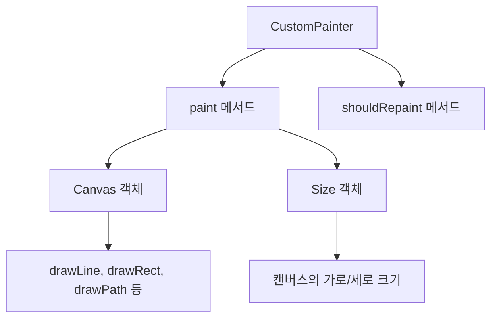
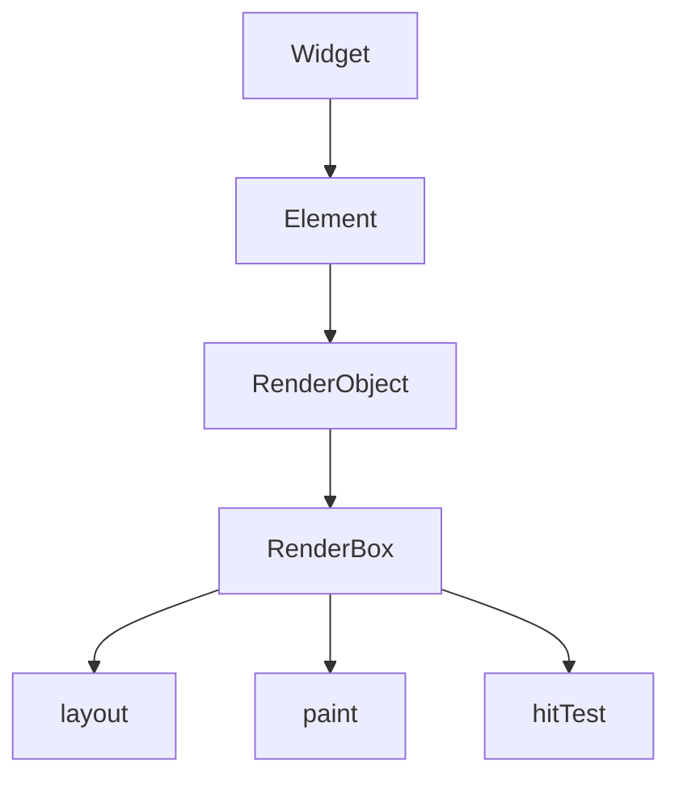

# CustomPainter와 RenderBox 이해

Flutter에서 복잡한 사용자 정의 UI를 구현하기 위해서는 기본 위젯만으로는 한계가 있습니다. 더 유연하고 세밀한 UI를 구현하기 위해 Flutter는 저수준 그래픽 API인 `CustomPainter`와 렌더링 시스템의 기본 요소인 `RenderBox`를 제공합니다. 이 장에서는 이 두 가지 중요한 개념을 자세히 알아보겠습니다.

## CustomPainter 개요

`CustomPainter`는 Flutter에서 직접 캔버스에 그리기 위한 강력한 도구입니다. 벡터 그래픽, 차트, 복잡한 애니메이션, 커스텀 진행 표시기 등을 구현할 때 매우 유용합니다.



### CustomPainter 사용 방법

`CustomPainter`를 사용하려면 다음 세 가지 주요 구성 요소가 필요합니다:

1. `CustomPainter`를 상속받는 클래스
2. `CustomPaint` 위젯
3. `Paint` 객체로 스타일 정의

#### 1. CustomPainter 클래스 구현

```dart
class MyPainter extends CustomPainter {
  @override
  void paint(Canvas canvas, Size size) {
    // 여기에 그리기 코드 작성
  }

  @override
  bool shouldRepaint(covariant MyPainter oldDelegate) {
    // 다시 그려야 하는지 결정
    return false;
  }
}
```

#### 2. CustomPaint 위젯 사용

```dart
CustomPaint(
  painter: MyPainter(),
  size: Size(300, 200), // 명시적 크기 지정
  child: Container(), // 선택적 자식 위젯
)
```

또는 자식 위젯의 크기에 맞추기:

```dart
SizedBox(
  width: 300,
  height: 200,
  child: CustomPaint(
    painter: MyPainter(),
    child: Container(), // 선택적 자식 위젯
  ),
)
```

### 기본 도형 그리기

`Canvas` 객체는 다양한 도형을 그리기 위한 메서드를 제공합니다:

```dart
class BasicShapesPainter extends CustomPainter {
  @override
  void paint(Canvas canvas, Size size) {
    final paint = Paint()
      ..color = Colors.blue
      ..strokeWidth = 4.0
      ..style = PaintingStyle.stroke;

    // 선 그리기
    canvas.drawLine(
      Offset(0, 0),
      Offset(size.width, size.height),
      paint,
    );

    // 사각형 그리기
    canvas.drawRect(
      Rect.fromLTWH(50, 50, 100, 100),
      paint..color = Colors.red,
    );

    // 원 그리기
    canvas.drawCircle(
      Offset(size.width / 2, size.height / 2),
      50,
      paint..color = Colors.green,
    );

    // 둥근 사각형 그리기
    canvas.drawRRect(
      RRect.fromRectAndRadius(
        Rect.fromLTWH(200, 50, 100, 100),
        Radius.circular(20),
      ),
      paint..color = Colors.orange,
    );
  }

  @override
  bool shouldRepaint(covariant BasicShapesPainter oldDelegate) => false;
}
```

### Path를 사용한 복잡한 도형 그리기

더 복잡한 도형은 `Path` 클래스를 사용하여 그릴 수 있습니다:

```dart
class PathPainter extends CustomPainter {
  @override
  void paint(Canvas canvas, Size size) {
    final paint = Paint()
      ..color = Colors.purple
      ..style = PaintingStyle.stroke
      ..strokeWidth = 3;

    final path = Path();

    // 시작점 설정
    path.moveTo(0, size.height / 2);

    // 곡선 그리기
    path.quadraticBezierTo(
      size.width / 4, 0,
      size.width / 2, size.height / 2,
    );

    path.quadraticBezierTo(
      size.width * 3 / 4, size.height,
      size.width, size.height / 2,
    );

    canvas.drawPath(path, paint);
  }

  @override
  bool shouldRepaint(covariant PathPainter oldDelegate) => false;
}
```

### 실제 예제: 커스텀 차트 구현

다음은 간단한 막대 차트를 구현하는 예제입니다:

```dart
class BarChartPainter extends CustomPainter {
  final List<double> dataPoints;
  final double maxValue;

  BarChartPainter({
    required this.dataPoints,
    required this.maxValue,
  });

  @override
  void paint(Canvas canvas, Size size) {
    final barWidth = size.width / dataPoints.length;
    final paint = Paint()
      ..color = Colors.blue
      ..style = PaintingStyle.fill;

    // 데이터 포인트에 따라 막대 그리기
    for (int i = 0; i < dataPoints.length; i++) {
      final barHeight = (dataPoints[i] / maxValue) * size.height;

      canvas.drawRect(
        Rect.fromLTWH(
          i * barWidth,
          size.height - barHeight,
          barWidth - 4, // 막대 사이 간격
          barHeight,
        ),
        paint,
      );
    }

    // x축 그리기
    canvas.drawLine(
      Offset(0, size.height),
      Offset(size.width, size.height),
      Paint()
        ..color = Colors.black
        ..strokeWidth = 2,
    );
  }

  @override
  bool shouldRepaint(covariant BarChartPainter oldDelegate) {
    return oldDelegate.dataPoints != dataPoints ||
        oldDelegate.maxValue != maxValue;
  }
}

// 사용 예시
CustomPaint(
  painter: BarChartPainter(
    dataPoints: [30, 80, 40, 90, 60],
    maxValue: 100,
  ),
  size: Size(300, 200),
)
```

## shouldRepaint 메서드 최적화

`shouldRepaint` 메서드는 이전에 그린 것과 비교하여 다시 그려야 하는지 결정합니다. 이 메서드를 올바르게 구현하면 성능을 크게 향상시킬 수 있습니다:

```dart
class OptimizedPainter extends CustomPainter {
  final Color color;
  final double strokeWidth;

  OptimizedPainter({
    required this.color,
    required this.strokeWidth,
  });

  @override
  void paint(Canvas canvas, Size size) {
    // 그리기 로직...
  }

  @override
  bool shouldRepaint(covariant OptimizedPainter oldDelegate) {
    // 변경 사항이 있을 때만 다시 그리기
    return oldDelegate.color != color ||
        oldDelegate.strokeWidth != strokeWidth;
  }
}
```

## CustomPainter 애니메이션

`AnimationController`와 `CustomPainter`를 결합하여 애니메이션 효과를 만들 수 있습니다:

```dart
class AnimatedCirclePainter extends CustomPainter {
  final double animationValue;

  AnimatedCirclePainter({required this.animationValue});

  @override
  void paint(Canvas canvas, Size size) {
    final center = Offset(size.width / 2, size.height / 2);
    final radius = 50.0 + 20.0 * animationValue;

    final paint = Paint()
      ..color = Color.lerp(
        Colors.blue,
        Colors.red,
        animationValue,
      )!
      ..style = PaintingStyle.fill;

    canvas.drawCircle(center, radius, paint);
  }

  @override
  bool shouldRepaint(covariant AnimatedCirclePainter oldDelegate) {
    return oldDelegate.animationValue != animationValue;
  }
}

// 사용 예시 (StatefulWidget 내부)
Widget build(BuildContext context) {
  return AnimatedBuilder(
    animation: _controller, // AnimationController
    builder: (context, child) {
      return CustomPaint(
        painter: AnimatedCirclePainter(
          animationValue: _controller.value,
        ),
        size: Size(300, 300),
      );
    },
  );
}
```

## RenderBox 이해하기

`RenderBox`는 Flutter 렌더링 시스템의 핵심 요소로, 위젯의 레이아웃과 그리기 로직을 담당합니다. 일반적으로 개발자는 직접 `RenderBox`를 다루기보다는 위젯 API를 통해 간접적으로 사용합니다.



### RenderBox 계층 구조

Flutter의 렌더링 시스템은 세 가지 주요 계층으로 구성됩니다:

1. **위젯(Widget)**: 불변의 설정 객체
2. **요소(Element)**: 위젯의 인스턴스
3. **렌더 객체(RenderObject/RenderBox)**: 실제 레이아웃과 그리기 담당

### 커스텀 RenderBox 만들기

커스텀 `RenderBox`를 만드는 것은 고급 주제이지만, 특수한 레이아웃 동작이 필요할 때 유용합니다. 전체 과정은 다음과 같습니다:

1. `RenderBox`를 상속받는 클래스 구현
2. `SingleChildRenderObjectWidget`을 상속받는 위젯 구현
3. `SingleChildRenderObjectElement`를 확장하는 요소 구현 (선택적)

간단한 예제를 살펴보겠습니다:

```dart
// 1. RenderBox 구현
class RenderCenterSquare extends RenderBox {
  @override
  void performLayout() {
    // 원하는 크기 계산
    size = constraints.biggest;
  }

  @override
  void paint(PaintingContext context, Offset offset) {
    // 중앙에 정사각형 그리기
    final canvas = context.canvas;
    final squareSize = size.shortestSide / 2;
    final center = Offset(size.width / 2, size.height / 2);
    final rect = Rect.fromCenter(
      center: center,
      width: squareSize,
      height: squareSize,
    );

    canvas.drawRect(
      rect,
      Paint()..color = Colors.purple,
    );
  }
}

// 2. SingleChildRenderObjectWidget 구현
class CenterSquare extends SingleChildRenderObjectWidget {
  const CenterSquare({Key? key, Widget? child}) : super(key: key, child: child);

  @override
  RenderObject createRenderObject(BuildContext context) {
    return RenderCenterSquare();
  }
}
```

### RenderBox vs CustomPainter

`RenderBox`와 `CustomPainter`의 주요 차이점은:

1. **목적**:

   - `CustomPainter`: 그리기 전용
   - `RenderBox`: 레이아웃과 그리기 모두 담당

2. **복잡성**:

   - `CustomPainter`: 비교적 간단한 구현
   - `RenderBox`: 더 복잡하지만 유연성 높음

3. **사용 사례**:
   - `CustomPainter`: 복잡한 그래픽, 차트, 사용자 정의 표시
   - `RenderBox`: 사용자 정의 레이아웃 동작이 필요한 경우

## 실전 사례: 서명 패드 구현

`CustomPainter`를 사용한 실제 응용 사례로 서명 패드를 구현해 보겠습니다:

```dart
class SignaturePainter extends CustomPainter {
  final List<List<Offset>> strokes;

  SignaturePainter({required this.strokes});

  @override
  void paint(Canvas canvas, Size size) {
    final paint = Paint()
      ..color = Colors.black
      ..strokeWidth = 3.0
      ..strokeCap = StrokeCap.round
      ..style = PaintingStyle.stroke;

    for (final stroke in strokes) {
      if (stroke.length < 2) continue;

      final path = Path();
      path.moveTo(stroke[0].dx, stroke[0].dy);

      for (int i = 1; i < stroke.length; i++) {
        path.lineTo(stroke[i].dx, stroke[i].dy);
      }

      canvas.drawPath(path, paint);
    }
  }

  @override
  bool shouldRepaint(covariant SignaturePainter oldDelegate) {
    return oldDelegate.strokes != strokes;
  }
}

// 사용 예시 (StatefulWidget 내부)
class SignaturePad extends StatefulWidget {
  @override
  _SignaturePadState createState() => _SignaturePadState();
}

class _SignaturePadState extends State<SignaturePad> {
  List<List<Offset>> strokes = [];
  List<Offset> currentStroke = [];

  @override
  Widget build(BuildContext context) {
    return GestureDetector(
      onPanStart: (details) {
        setState(() {
          currentStroke = [details.localPosition];
          strokes.add(currentStroke);
        });
      },
      onPanUpdate: (details) {
        setState(() {
          currentStroke.add(details.localPosition);
          // 참조를 통해 strokes가 자동으로 업데이트됨
        });
      },
      child: CustomPaint(
        painter: SignaturePainter(strokes: strokes),
        size: Size.infinite,
      ),
    );
  }
}
```

## 성능 최적화 팁

### 1. Path 최적화

많은 점을 그릴 때는 개별 선보다 `Path`를 사용하는 것이 훨씬 효율적입니다:

```dart
// 비효율적인 방법
for (int i = 1; i < points.length; i++) {
  canvas.drawLine(points[i - 1], points[i], paint);
}

// 더 효율적인 방법
final path = Path();
path.moveTo(points[0].dx, points[0].dy);
for (int i = 1; i < points.length; i++) {
  path.lineTo(points[i].dx, points[i].dy);
}
canvas.drawPath(path, paint);
```

### 2. 클리핑 사용

필요한 영역만 그리기 위해 클리핑을 활용할 수 있습니다:

```dart
canvas.clipRect(Rect.fromLTWH(0, 0, size.width, size.height));
```

### 3. 캐싱 활용

자주 변경되지 않는 복잡한 그림은 캐싱을 고려하세요:

```dart
class CachedPainter extends CustomPainter {
  ui.Image? _cachedImage;

  Future<void> _createCachedImage(Size size) async {
    if (_cachedImage != null) return;

    final pictureRecorder = ui.PictureRecorder();
    final canvas = Canvas(pictureRecorder);

    // 복잡한 그리기 작업 수행

    final picture = pictureRecorder.endRecording();
    _cachedImage = await picture.toImage(
      size.width.toInt(),
      size.height.toInt(),
    );
  }

  @override
  void paint(Canvas canvas, Size size) async {
    await _createCachedImage(size);
    if (_cachedImage != null) {
      canvas.drawImage(_cachedImage!, Offset.zero, Paint());
    }
  }

  @override
  bool shouldRepaint(covariant CustomPainter oldDelegate) => false;
}
```

## 결론

`CustomPainter`와 `RenderBox`는 Flutter에서 복잡한 UI와 그래픽을 구현하기 위한 강력한 도구입니다. `CustomPainter`는 비교적 쉽게 시작할 수 있으며 대부분의 사용자 정의 그리기 요구사항을 충족합니다. 반면 `RenderBox`는 더 복잡하지만 완전히 사용자 정의된 레이아웃 동작이 필요한 경우에 유용합니다.

이러한 도구를 이해하고 활용하면 기본 위젯으로는 구현하기 어려운 복잡한 UI 요소를 만들 수 있습니다. 차트, 그래프, 커스텀 애니메이션, 게임 UI 등 다양한 응용 분야에서 활용할 수 있습니다.

다음 장에서는 위젯 캐싱과 `RepaintBoundary`를 활용하여 Flutter 앱의 렌더링 성능을 최적화하는 방법에 대해 알아보겠습니다.
