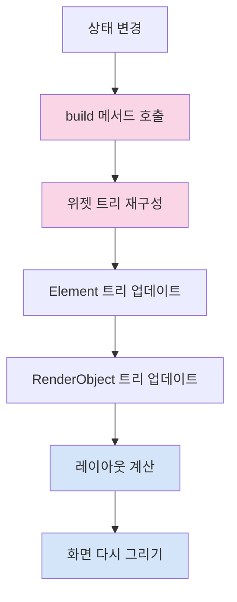
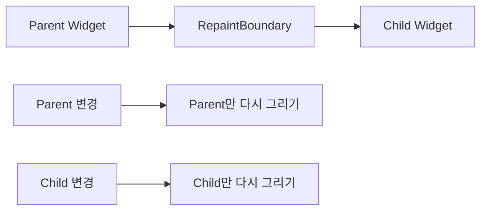

# 위젯 캐싱

Flutter 앱의 성능을 최적화하는 데 있어 중요한 측면 중 하나는 불필요한 위젯 재구성(rebuild)과 재그리기(repaint)를 최소화하는 것입니다. 이번 장에서는 Flutter에서 위젯을 효율적으로 캐싱하고 렌더링 성능을 향상시키는 다양한 기법에 대해 알아보겠습니다.

## 불필요한 재구성 문제 이해하기

Flutter의 선언적 UI 모델에서는 상태가 변경될 때마다 `build` 메서드가 호출되어 위젯 트리를 재구성합니다. 이 과정은 다음과 같은 문제를 야기할 수 있습니다:



1. **성능 저하**: 복잡한 위젯 트리를 자주 재구성하면 프레임 드롭이 발생할 수 있습니다.
2. **불필요한 계산**: 변경되지 않은 위젯도 재구성될 수 있습니다.
3. **배터리 소모**: 과도한 CPU 및 GPU 사용으로 배터리 소모가 증가합니다.

## RepaintBoundary 이해하기

`RepaintBoundary`는 Flutter에서 제공하는 중요한 최적화 도구로, 렌더링 레이어를 분리하여 변경이 필요한 부분만 다시 그리도록 합니다.

### RepaintBoundary 작동 원리



`RepaintBoundary`는 자식 위젯을 별도의 레이어로 분리합니다:

1. 부모 위젯이 변경되면 자식은 다시 그려지지 않습니다.
2. 자식 위젯이 변경되면 부모는 영향을 받지 않습니다.
3. 각 레이어는 GPU에 개별적으로 래스터화되고 캐시됩니다.

### RepaintBoundary 사용 방법

기본 사용법은 간단합니다:

```dart
RepaintBoundary(
  child: MyComplexWidget(),
)
```

일반적으로 다음과 같은 경우에 `RepaintBoundary`를 사용하는 것이 좋습니다:

1. **복잡한 UI**: 계산 비용이 높은 위젯이나 복잡한 렌더링이 필요한 경우
2. **독립적으로 변경되는 부분**: 애니메이션이 있는 위젯이나 자주 업데이트되는 위젯
3. **ListView 내부 항목**: 스크롤 성능 향상을 위해 각 항목을 분리

### 실용적인 예제

스크롤 목록에서 복잡한 항목을 최적화하는 예:

```dart
ListView.builder(
  itemCount: items.length,
  itemBuilder: (context, index) {
    return RepaintBoundary(
      child: ComplexListItem(item: items[index]),
    );
  },
)
```

애니메이션이 있는 UI 부분 분리:

```dart
class AnimatedProfilePage extends StatelessWidget {
  @override
  Widget build(BuildContext context) {
    return Column(
      children: [
        // 자주 변경되지 않는 프로필 정보
        UserProfileHeader(),

        // 독립적으로 애니메이션되는 부분
        RepaintBoundary(
          child: AnimatedActivityGraph(),
        ),

        // 정적 콘텐츠
        UserDetails(),
      ],
    );
  }
}
```

## const 생성자를 활용한 위젯 캐싱

Flutter에서 가장 간단하고 효과적인 캐싱 방법 중 하나는 `const` 생성자를 사용하는 것입니다. `const` 위젯은 빌드 시간이 아닌 컴파일 시간에 생성되어 재사용됩니다.

### const 위젯의 이점

1. **메모리 효율성**: 동일한 `const` 위젯은 메모리에 한 번만 생성됩니다.
2. **빌드 스킵**: Flutter는 동일한 `const` 위젯을 다시 빌드하지 않습니다.
3. **빠른 비교**: `operator ==`를 호출하지 않고 참조 비교만 수행합니다.

### const 위젯 사용 예시

```dart
// 좋음: const 생성자 사용
const MyWidget(
  title: 'Hello',
  padding: EdgeInsets.all(16.0),
)

// 나쁨: 매번 새로운 인스턴스 생성
MyWidget(
  title: 'Hello',
  padding: EdgeInsets.all(16.0),
)
```

모든 자식 위젯에 `const`를 적용한 예:

```dart
const Scaffold(
  appBar: const AppBar(
    title: const Text('Cached Widgets Demo'),
  ),
  body: const Center(
    child: const Column(
      mainAxisAlignment: MainAxisAlignment.center,
      children: const [
        const Text('This is a cached widget'),
        const SizedBox(height: 20),
        const Icon(Icons.cached),
      ],
    ),
  ),
)
```

### const 사용 시 주의사항

1. 모든 인스턴스 변수는 `final`이어야 합니다.
2. 모든 인스턴스 변수는 컴파일 타임 상수여야 합니다.
3. 런타임에 결정되는 값(예: `DateTime.now()`)은 사용할 수 없습니다.

## ValueKey를 활용한 위젯 식별

Flutter의 요소 재활용 메커니즘을 최대한 활용하려면 적절한 키를 사용하는 것이 중요합니다.

### 키의 역할

키는 Flutter가 위젯 트리 업데이트 중에 위젯을 식별하는 데 도움을 줍니다:

1. **요소 재사용**: 올바른 키를 사용하면 Flutter가 적절한 요소를 재활용할 수 있습니다.
2. **상태 보존**: 위젯이 이동하더라도 키를 통해 상태를 보존할 수 있습니다.
3. **불필요한 재구성 방지**: 올바른 비교를 통해 불필요한 재구성을 방지합니다.

### 키 사용 예시

목록 항목에 대한 적절한 키 사용:

```dart
ListView.builder(
  itemCount: items.length,
  itemBuilder: (context, index) {
    final item = items[index];
    return ListTile(
      // 항목의 고유 식별자로 키 생성
      key: ValueKey(item.id),
      title: Text(item.title),
    );
  },
)
```

상태를 가진 위젯의 키 사용:

```dart
class TodoList extends StatelessWidget {
  final List<Todo> todos;

  @override
  Widget build(BuildContext context) {
    return Column(
      children: todos.map((todo) =>
        // 키를 사용하여 위젯 재정렬 시 상태 보존
        TodoItem(
          key: ValueKey(todo.id),
          todo: todo,
        ),
      ).toList(),
    );
  }
}
```

## 메모이제이션 기법

메모이제이션은 함수의 결과를 캐싱하여 동일한 입력에 대해 계산을 반복하지 않는 기법입니다. Flutter에서는 다음과 같은 방법으로 구현할 수 있습니다.

### 1. 클래스 내부 캐싱

```dart
class ExpensiveWidgetBuilder extends StatelessWidget {
  final String data;

  // 캐시 변수
  Widget? _cachedWidget;
  String? _cachedData;

  ExpensiveWidgetBuilder({required this.data});

  @override
  Widget build(BuildContext context) {
    // 데이터가 변경되지 않았으면 캐시된 위젯 반환
    if (data == _cachedData && _cachedWidget != null) {
      return _cachedWidget!;
    }

    // 데이터가 변경되었으면 새로 계산하고 캐시
    _cachedData = data;
    _cachedWidget = _buildExpensiveWidget(data);

    return _cachedWidget!;
  }

  Widget _buildExpensiveWidget(String data) {
    // 비용이 많이 드는 위젯 생성 로직
    return Text('Processed: $data');
  }
}
```

### 2. 전역 캐시 맵 사용

여러 위젯에서 재사용해야 하는 경우:

```dart
// 전역 캐시
final Map<String, Widget> _widgetCache = {};

Widget getCachedWidget(String key, Widget Function() builder) {
  if (!_widgetCache.containsKey(key)) {
    _widgetCache[key] = builder();
  }
  return _widgetCache[key]!;
}

// 사용 예시
Widget build(BuildContext context) {
  return getCachedWidget(
    'unique_key_$parameterValue',
    () => ExpensiveWidget(parameter: parameterValue),
  );
}
```

### 3. 고급: 캐시 크기 제한 및 LRU 캐시

메모리 사용을 제한하기 위한 LRU(Least Recently Used) 캐시 구현:

```dart
import 'package:collection/collection.dart';

class LruWidgetCache {
  final int maxSize;
  final Map<String, Widget> _cache = {};
  final Queue<String> _lruQueue = Queue<String>();

  LruWidgetCache({this.maxSize = 100});

  Widget getWidget(String key, Widget Function() builder) {
    // 캐시에 있으면 최근 사용 큐 업데이트
    if (_cache.containsKey(key)) {
      _lruQueue.remove(key);
      _lruQueue.add(key);
      return _cache[key]!;
    }

    // 캐시 크기 제한 확인
    if (_lruQueue.length >= maxSize) {
      final oldest = _lruQueue.removeFirst();
      _cache.remove(oldest);
    }

    // 새 항목 캐싱
    final widget = builder();
    _cache[key] = widget;
    _lruQueue.add(key);

    return widget;
  }

  void clear() {
    _cache.clear();
    _lruQueue.clear();
  }
}
```

## Riverpod과 select를 활용한 최적화

Riverpod을 사용하는 경우 `select` 메서드를 활용하여 필요한 상태 변경만 감지하도록 최적화할 수 있습니다.

### select 메서드 사용 예시

```dart
// 상태 구조
class UserState {
  final String name;
  final int age;
  final String address;

  UserState({required this.name, required this.age, required this.address});
}

// 프로바이더
final userProvider = StateProvider<UserState>((ref) =>
  UserState(name: 'John', age: 30, address: 'New York'));

// 최적화된 위젯
class UserNameWidget extends ConsumerWidget {
  @override
  Widget build(BuildContext context, WidgetRef ref) {
    // name 변경 시에만 재구성
    final name = ref.watch(userProvider.select((user) => user.name));

    return Text('Name: $name');
  }
}

class UserAgeWidget extends ConsumerWidget {
  @override
  Widget build(BuildContext context, WidgetRef ref) {
    // age 변경 시에만 재구성
    final age = ref.watch(userProvider.select((user) => user.age));

    return Text('Age: $age');
  }
}
```

### 대규모 앱에서의 Riverpod 캐싱 전략

복잡한 앱에서는 여러 프로바이더를 조합하여 효율적인 캐싱 전략을 구현할 수 있습니다:

```dart
// 1. 원본 데이터 프로바이더
final todosProvider = StateNotifierProvider<TodosNotifier, List<Todo>>((ref) =>
  TodosNotifier());

// 2. 필터링된 데이터 프로바이더 (파생)
final filteredTodosProvider = Provider<List<Todo>>((ref) {
  final todos = ref.watch(todosProvider);
  final filter = ref.watch(filterProvider);

  // 필터에 따라 할 일 필터링
  switch (filter) {
    case Filter.all:
      return todos;
    case Filter.completed:
      return todos.where((todo) => todo.completed).toList();
    case Filter.active:
      return todos.where((todo) => !todo.completed).toList();
  }
});

// 3. 통계 프로바이더 (파생)
final todoStatsProvider = Provider<TodoStats>((ref) {
  final todos = ref.watch(todosProvider);

  // 통계 계산 (비용이 많이 들 수 있음)
  int completed = todos.where((todo) => todo.completed).length;

  return TodoStats(
    total: todos.length,
    completed: completed,
    active: todos.length - completed,
  );
});
```

## 이미지 캐싱 최적화

이미지는 앱에서 가장 메모리와 성능을 많이 사용하는 리소스 중 하나입니다. 효과적인 이미지 캐싱은 성능에 큰 영향을 미칩니다.

### cached_network_image 패키지 사용

```dart
import 'package:cached_network_image/cached_network_image.dart';

CachedNetworkImage(
  imageUrl: 'https://example.com/image.jpg',
  placeholder: (context, url) => CircularProgressIndicator(),
  errorWidget: (context, url, error) => Icon(Icons.error),
  // 디스크 캐시 활성화
  cacheManager: CacheManager(
    Config(
      'customCacheKey',
      stalePeriod: Duration(days: 7),
      maxNrOfCacheObjects: 100,
    ),
  ),
)
```

### 성능을 위한 이미지 크기 최적화

```dart
class OptimizedNetworkImage extends StatelessWidget {
  final String url;
  final double width;
  final double height;

  const OptimizedNetworkImage({
    required this.url,
    required this.width,
    required this.height,
  });

  @override
  Widget build(BuildContext context) {
    // 이미지 URL에 크기 파라미터 추가
    final optimizedUrl = '$url?w=${width.toInt()}&h=${height.toInt()}';

    return CachedNetworkImage(
      imageUrl: optimizedUrl,
      width: width,
      height: height,
      fit: BoxFit.cover,
      memCacheWidth: width.toInt(),
      memCacheHeight: height.toInt(),
    );
  }
}
```

## 캐싱 사례 연구: 복잡한 폼

복잡한 폼을 가진 앱의 성능을 최적화하는 전략을 살펴보겠습니다:

```dart
class OptimizedFormScreen extends StatelessWidget {
  @override
  Widget build(BuildContext context) {
    return Scaffold(
      appBar: AppBar(title: const Text('복잡한 폼')),
      body: Column(
        children: [
          // 자주 변경되지 않는 부분
          const RepaintBoundary(
            child: const FormHeader(),
          ),

          // 사용자 입력 필드들 (자주 변경됨)
          Expanded(
            child: ListView(
              children: [
                // 각 섹션을 독립적인 위젯으로 분리
                PersonalInfoSection(),

                const SizedBox(height: 16),

                // 복잡하지만 자주 변경되지 않는 섹션
                const RepaintBoundary(
                  child: const AddressSection(),
                ),

                const SizedBox(height: 16),

                PaymentInfoSection(),
              ],
            ),
          ),

          // 제출 버튼 (상태에 따라 변경됨)
          SubmitButton(),
        ],
      ),
    );
  }
}

// 각 섹션은 ConsumerWidget으로 구현하여
// 필요한 상태만 구독하도록 최적화
class PersonalInfoSection extends ConsumerWidget {
  @override
  Widget build(BuildContext context, WidgetRef ref) {
    // 개인 정보 관련 상태만 구독
    final personalInfo = ref.watch(
      formProvider.select((state) => state.personalInfo)
    );

    return Card(
      child: Padding(
        padding: const EdgeInsets.all(16.0),
        child: Column(
          crossAxisAlignment: CrossAxisAlignment.start,
          children: [
            const Text('개인 정보', style: TextStyle(fontWeight: FontWeight.bold)),
            TextField(
              decoration: const InputDecoration(labelText: '이름'),
              onChanged: (value) => ref.read(formProvider.notifier).updateName(value),
              controller: TextEditingController(text: personalInfo.name),
            ),
            // 기타 입력 필드...
          ],
        ),
      ),
    );
  }
}
```

## 위젯 캐싱 최적화 체크리스트

효과적인 위젯 캐싱을 위한 체크리스트입니다:

1. **const 생성자 사용하기**

   - 가능한 모든 위젯에 `const` 생성자 사용
   - 리터럴 값으로 위젯 생성 시 `const` 키워드 사용

2. **적절한 위치에 RepaintBoundary 추가하기**

   - 복잡하지만 독립적으로 변경되는 UI 부분
   - 애니메이션이 있는 부분
   - 목록 항목 등

3. **위젯 분리 및 세분화**

   - 자주 변경되는 부분과 정적인 부분 분리
   - 큰 위젯을 작은 위젯으로 분리하여 최적화

4. **상태 관리 최적화**

   - Riverpod `select` 메서드 활용
   - 필요한 상태만 구독하도록 구현

5. **키 올바르게 사용하기**

   - 목록 항목에 적절한 키 사용
   - 위젯 재사용을 위한 식별자 제공

6. **불필요한 중복 계산 피하기**

   - 비용이 많이 드는 계산 결과 캐싱
   - 파생 데이터에 메모이제이션 적용

7. **이미지 최적화**
   - 적절한 크기의 이미지 요청
   - 효율적인 이미지 캐싱 구현

## 결론

위젯 캐싱은 Flutter 앱의 성능을 크게 향상시킬 수 있는 중요한 기법입니다. `const` 생성자, `RepaintBoundary`, 적절한 키 사용, 메모이제이션, 상태 관리 최적화 등 다양한 방법을 함께 활용하면 부드럽고 반응성 좋은 앱을 만들 수 있습니다.

특히 중요한 점은 모든 상황에 일률적으로 적용할 수 있는 최적화 방법은 없다는 것입니다. 앱의 특성과 사용 패턴에 맞게 적절한 캐싱 전략을 선택하고, DevTools의 성능 프로파일러를 활용하여 실제 성능 개선을 측정하며 최적화해야 합니다.

다음 장에서는 Flutter의 다양한 애니메이션 기법과 활용법에 대해 알아보겠습니다.
