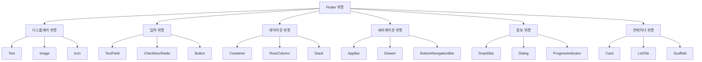
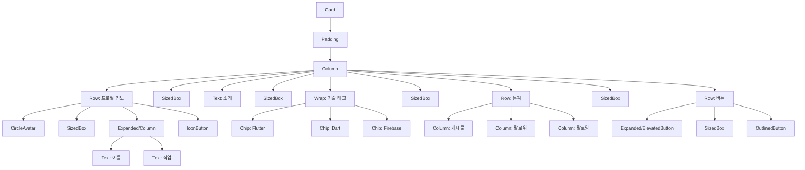

# 주요 위젯

Flutter는 다양한 UI 요소를 구현하기 위한 풍부한 위젯 세트를 제공합니다. 이 장에서는 Flutter 앱을 구축할 때 자주 사용되는 핵심 위젯들을 살펴보겠습니다.

## 위젯 카테고리

Flutter 위젯은 기능과 용도에 따라 다양한 카테고리로 분류할 수 있습니다:



이 장에서는 기본적인 디스플레이, 입력, 컨테이너 위젯을 중점적으로 살펴보겠습니다. 레이아웃 위젯은 다음 장에서 자세히 다룰 예정입니다.

## 기본 디스플레이 위젯

### Text

`Text` 위젯은 애플리케이션에 스타일이 지정된 텍스트를 표시합니다.

```dart
Text(
  '안녕하세요, Flutter!',
  style: TextStyle(
    fontWeight: FontWeight.bold,
    fontSize: 20,
    color: Colors.blue,
    letterSpacing: 1.2,
    height: 1.4,
  ),
  textAlign: TextAlign.center,
  maxLines: 2,
  overflow: TextOverflow.ellipsis,
)
```

**주요 속성**:

- `style`: 텍스트의 시각적 형식 지정 (색상, 크기, 굵기 등)
- `textAlign`: 텍스트 정렬 방법
- `maxLines`: 최대 표시 줄 수
- `overflow`: 내용이 공간을 초과할 때 처리 방법
- `softWrap`: 줄 바꿈 허용 여부

### RichText

`RichText` 위젯은 서로 다른 스타일의 텍스트를 한 줄에 표시할 수 있게 해줍니다.

```dart
RichText(
  text: TextSpan(
    text: '안녕하세요, ',
    style: TextStyle(color: Colors.black),
    children: [
      TextSpan(
        text: '홍길동',
        style: TextStyle(
          fontWeight: FontWeight.bold,
          color: Colors.blue,
        ),
      ),
      TextSpan(
        text: '님!',
        style: TextStyle(color: Colors.black),
      ),
    ],
  ),
)
```

### Image

`Image` 위젯은 다양한 소스에서 이미지를 표시합니다.

```dart
// 네트워크 이미지
Image.network(
  'https://flutter.dev/images/flutter-logo.png',
  width: 200,
  height: 100,
  fit: BoxFit.cover,
  loadingBuilder: (context, child, loadingProgress) {
    if (loadingProgress == null) return child;
    return CircularProgressIndicator();
  },
  errorBuilder: (context, error, stackTrace) {
    return Text('이미지를 불러올 수 없습니다');
  },
)

// 에셋 이미지
Image.asset(
  'assets/images/flutter_logo.png',
  width: 200,
  height: 100,
)

// 파일 이미지
Image.file(
  File('/path/to/image.jpg'),
  width: 200,
  height: 100,
)

// 메모리 이미지
Image.memory(
  Uint8List(...),
  width: 200,
  height: 100,
)
```

**주요 속성**:

- `width`, `height`: 이미지 크기
- `fit`: 이미지가 제공된 영역에 맞는 방식 (cover, contain, fill 등)
- `color`, `colorBlendMode`: 이미지에 적용할 색상 필터
- `alignment`: 이미지 정렬 방식
- `repeat`: 이미지 반복 방식

### Icon

`Icon` 위젯은 Material Design 아이콘이나 커스텀 아이콘 폰트의 그래픽 아이콘을 표시합니다.

```dart
Icon(
  Icons.favorite,
  color: Colors.red,
  size: 30,
)
```

**주요 속성**:

- `color`: 아이콘 색상
- `size`: 아이콘 크기
- `semanticLabel`: 접근성을 위한 텍스트 라벨

## 입력 위젯

### Button 위젯

Flutter는 다양한 종류의 버튼 위젯을 제공합니다.

#### ElevatedButton

Material Design 스타일의 돌출된 버튼입니다.

```dart
ElevatedButton(
  onPressed: () {
    print('버튼이 눌렸습니다!');
  },
  style: ElevatedButton.styleFrom(
    primary: Colors.blue,
    onPrimary: Colors.white,
    padding: EdgeInsets.symmetric(horizontal: 16, vertical: 12),
    shape: RoundedRectangleBorder(
      borderRadius: BorderRadius.circular(8),
    ),
  ),
  child: Text('눌러보세요'),
)
```

#### TextButton

텍스트만 있는 플랫 버튼입니다.

```dart
TextButton(
  onPressed: () {
    print('텍스트 버튼 클릭');
  },
  child: Text('자세히 보기'),
)
```

#### OutlinedButton

테두리가 있는 버튼입니다.

```dart
OutlinedButton(
  onPressed: () {
    print('테두리 버튼 클릭');
  },
  style: OutlinedButton.styleFrom(
    side: BorderSide(color: Colors.blue, width: 2),
    shape: RoundedRectangleBorder(
      borderRadius: BorderRadius.circular(8),
    ),
  ),
  child: Text('등록하기'),
)
```

#### IconButton

아이콘만 있는 버튼입니다.

```dart
IconButton(
  icon: Icon(Icons.favorite),
  color: Colors.red,
  onPressed: () {
    print('좋아요!');
  },
)
```

### TextField

텍스트 입력을 위한 위젯입니다.

```dart
TextField(
  decoration: InputDecoration(
    labelText: '이메일',
    hintText: 'example@email.com',
    prefixIcon: Icon(Icons.email),
    border: OutlineInputBorder(),
  ),
  keyboardType: TextInputType.emailAddress,
  textInputAction: TextInputAction.next,
  obscureText: false, // 비밀번호 필드일 경우 true
  onChanged: (value) {
    print('입력 값: $value');
  },
  onSubmitted: (value) {
    print('제출된 값: $value');
  },
)
```

**주요 속성**:

- `decoration`: 입력 필드의 외관 설정
- `keyboardType`: 표시할 키보드 유형
- `textInputAction`: 키보드의 실행 버튼 유형
- `obscureText`: 비밀번호 필드 여부
- `maxLines`: 여러 줄 텍스트 입력시 최대 줄 수
- `controller`: 입력 값을 관리하는 TextEditingController

### Checkbox와 Radio

상태 선택을 위한 위젯입니다.

```dart
// Checkbox 예제
Checkbox(
  value: isChecked,
  onChanged: (bool? value) {
    setState(() {
      isChecked = value!;
    });
  },
  activeColor: Colors.blue,
)

// Radio 예제
Radio<String>(
  value: 'option1',
  groupValue: selectedOption,
  onChanged: (String? value) {
    setState(() {
      selectedOption = value!;
    });
  },
)
```

### Slider

범위 내에서 값을 선택하기 위한 위젯입니다.

```dart
Slider(
  value: _currentValue,
  min: 0,
  max: 100,
  divisions: 10,
  label: _currentValue.round().toString(),
  onChanged: (double value) {
    setState(() {
      _currentValue = value;
    });
  },
)
```

## 컨테이너 위젯

### Container

`Container`는 Flutter에서 가장 유용한 위젯 중 하나로, 패딩, 마진, 테두리, 색상 등을 설정할 수 있는 범용 컨테이너입니다.

```dart
Container(
  width: 200,
  height: 150,
  margin: EdgeInsets.all(10),
  padding: EdgeInsets.symmetric(horizontal: 16, vertical: 8),
  decoration: BoxDecoration(
    color: Colors.white,
    borderRadius: BorderRadius.circular(8),
    boxShadow: [
      BoxShadow(
        color: Colors.black26,
        offset: Offset(0, 2),
        blurRadius: 6,
      ),
    ],
    border: Border.all(color: Colors.grey[300]!),
  ),
  alignment: Alignment.center,
  child: Text('Hello, Container!'),
)
```

**주요 속성**:

- `width`, `height`: 컨테이너 크기
- `margin`: 외부 여백
- `padding`: 내부 여백
- `decoration`: 배경색, 테두리, 그림자 등의 장식
- `alignment`: 자식 위젯의 정렬 방식
- `transform`: 변환 행렬

### Card

`Card`는 약간 둥근 모서리와 그림자가 있는 Material Design 카드입니다.

```dart
Card(
  elevation: 4.0,
  margin: EdgeInsets.all(8),
  shape: RoundedRectangleBorder(
    borderRadius: BorderRadius.circular(8),
  ),
  child: Padding(
    padding: EdgeInsets.all(16.0),
    child: Column(
      crossAxisAlignment: CrossAxisAlignment.start,
      children: [
        Text(
          '카드 제목',
          style: TextStyle(
            fontSize: 18,
            fontWeight: FontWeight.bold,
          ),
        ),
        SizedBox(height: 8),
        Text('카드 내용이 들어가는 곳입니다.'),
      ],
    ),
  ),
)
```

### ListTile

`ListTile`은 아이콘, 텍스트, 후행 위젯을 포함하는 목록 항목입니다.

```dart
ListTile(
  leading: Icon(Icons.person),
  title: Text('홍길동'),
  subtitle: Text('개발자'),
  trailing: Icon(Icons.arrow_forward_ios),
  onTap: () {
    print('항목 클릭됨');
  },
)
```

### ExpansionTile

`ExpansionTile`은 확장 가능한 목록 항목입니다.

```dart
ExpansionTile(
  title: Text('더 보기'),
  leading: Icon(Icons.info),
  children: [
    Padding(
      padding: EdgeInsets.all(16.0),
      child: Text('확장된 내용이 여기에 표시됩니다.'),
    ),
  ],
)
```

## 정보 표시 위젯

### SnackBar

`SnackBar`는 화면 하단에 표시되는 간단한 메시지입니다.

```dart
// ScaffoldMessenger를 사용하여 SnackBar 표시
ScaffoldMessenger.of(context).showSnackBar(
  SnackBar(
    content: Text('저장되었습니다.'),
    action: SnackBarAction(
      label: '실행 취소',
      onPressed: () {
        // 실행 취소 작업
      },
    ),
    duration: Duration(seconds: 2),
    behavior: SnackBarBehavior.floating,
  ),
);
```

### Dialog

대화 상자는 사용자에게 중요한 정보를 표시하거나 결정을 요구할 때 사용합니다.

```dart
// AlertDialog
showDialog(
  context: context,
  builder: (BuildContext context) {
    return AlertDialog(
      title: Text('확인'),
      content: Text('정말 삭제하시겠습니까?'),
      actions: [
        TextButton(
          child: Text('취소'),
          onPressed: () {
            Navigator.of(context).pop();
          },
        ),
        TextButton(
          child: Text('삭제'),
          onPressed: () {
            // 삭제 작업 수행
            Navigator.of(context).pop();
          },
        ),
      ],
    );
  },
);

// SimpleDialog
showDialog(
  context: context,
  builder: (BuildContext context) {
    return SimpleDialog(
      title: Text('옵션 선택'),
      children: [
        SimpleDialogOption(
          onPressed: () {
            Navigator.pop(context, '옵션 1');
          },
          child: Text('옵션 1'),
        ),
        SimpleDialogOption(
          onPressed: () {
            Navigator.pop(context, '옵션 2');
          },
          child: Text('옵션 2'),
        ),
      ],
    );
  },
);
```

### ProgressIndicator

로딩 상태를 표시하는 위젯입니다.

```dart
// 원형 진행 표시기
CircularProgressIndicator(
  value: 0.7, // null이면 불확정 진행 표시기
  backgroundColor: Colors.grey[200],
  valueColor: AlwaysStoppedAnimation<Color>(Colors.blue),
)

// 선형 진행 표시기
LinearProgressIndicator(
  value: 0.7,
  backgroundColor: Colors.grey[200],
  valueColor: AlwaysStoppedAnimation<Color>(Colors.blue),
)
```

## 상호작용 위젯

### GestureDetector

여러 제스처를 감지하여 처리하는 위젯입니다.

```dart
GestureDetector(
  onTap: () {
    print('탭 감지됨');
  },
  onDoubleTap: () {
    print('더블 탭 감지됨');
  },
  onLongPress: () {
    print('길게 누르기 감지됨');
  },
  onPanUpdate: (details) {
    print('드래그: ${details.delta}');
  },
  child: Container(
    width: 200,
    height: 100,
    color: Colors.amber,
    child: Center(
      child: Text('여기를 터치하세요'),
    ),
  ),
)
```

### InkWell

Material Design 스타일의 터치 효과(잉크 스플래시)가 있는 터치 영역입니다.

```dart
InkWell(
  onTap: () {
    print('탭 감지됨');
  },
  splashColor: Colors.blue.withOpacity(0.5),
  highlightColor: Colors.blue.withOpacity(0.2),
  child: Container(
    width: 200,
    height: 100,
    alignment: Alignment.center,
    child: Text('터치해보세요'),
  ),
)
```

## 위젯 조합 예제

위젯은 조합하여 복잡한 UI를 구성할 수 있습니다. 다음은 프로필 카드 예제입니다:

```dart
Card(
  margin: EdgeInsets.all(16.0),
  elevation: 4.0,
  shape: RoundedRectangleBorder(borderRadius: BorderRadius.circular(12.0)),
  child: Padding(
    padding: EdgeInsets.all(16.0),
    child: Column(
      crossAxisAlignment: CrossAxisAlignment.start,
      children: [
        Row(
          children: [
            CircleAvatar(
              radius: 30,
              backgroundImage: NetworkImage('https://example.com/avatar.jpg'),
            ),
            SizedBox(width: 16),
            Expanded(
              child: Column(
                crossAxisAlignment: CrossAxisAlignment.start,
                children: [
                  Text(
                    '홍길동',
                    style: TextStyle(
                      fontSize: 18,
                      fontWeight: FontWeight.bold,
                    ),
                  ),
                  Text(
                    '프론트엔드 개발자',
                    style: TextStyle(
                      color: Colors.grey[600],
                    ),
                  ),
                ],
              ),
            ),
            IconButton(
              icon: Icon(Icons.more_vert),
              onPressed: () {},
            ),
          ],
        ),
        SizedBox(height: 16),
        Text(
          '모바일 앱과 웹 개발에 관심이 많은 개발자입니다. Flutter와 React를 주로 사용합니다.',
        ),
        SizedBox(height: 16),
        Wrap(
          spacing: 8,
          children: [
            Chip(label: Text('Flutter')),
            Chip(label: Text('Dart')),
            Chip(label: Text('Firebase')),
          ],
        ),
        SizedBox(height: 16),
        Row(
          mainAxisAlignment: MainAxisAlignment.spaceEvenly,
          children: [
            Column(
              children: [
                Text(
                  '156',
                  style: TextStyle(fontWeight: FontWeight.bold),
                ),
                Text('게시물'),
              ],
            ),
            Column(
              children: [
                Text(
                  '572',
                  style: TextStyle(fontWeight: FontWeight.bold),
                ),
                Text('팔로워'),
              ],
            ),
            Column(
              children: [
                Text(
                  '128',
                  style: TextStyle(fontWeight: FontWeight.bold),
                ),
                Text('팔로잉'),
              ],
            ),
          ],
        ),
        SizedBox(height: 16),
        Row(
          children: [
            Expanded(
              child: ElevatedButton(
                onPressed: () {},
                child: Text('팔로우'),
              ),
            ),
            SizedBox(width: 8),
            OutlinedButton(
              onPressed: () {},
              child: Text('메시지'),
            ),
          ],
        ),
      ],
    ),
  ),
)
```

위젯 트리:



## 위젯 사용 팁

### 1. 재사용 가능한 위젯 만들기

자주 사용되는 UI 패턴은 커스텀 위젯으로 만들어 재사용하세요:

```dart
class CustomButton extends StatelessWidget {
  final String text;
  final VoidCallback onPressed;
  final Color color;

  const CustomButton({
    Key? key,
    required this.text,
    required this.onPressed,
    this.color = Colors.blue,
  }) : super(key: key);

  @override
  Widget build(BuildContext context) {
    return ElevatedButton(
      onPressed: onPressed,
      style: ElevatedButton.styleFrom(
        primary: color,
        padding: EdgeInsets.symmetric(horizontal: 24, vertical: 12),
        shape: RoundedRectangleBorder(
          borderRadius: BorderRadius.circular(8),
        ),
      ),
      child: Text(
        text,
        style: TextStyle(fontSize: 16),
      ),
    );
  }
}

// 사용 예
CustomButton(
  text: '제출하기',
  onPressed: () {
    // 처리 로직
  },
  color: Colors.green,
)
```

### 2. 조건부 위젯

조건에 따라 다른 위젯을 표시하는 방법:

```dart
// 삼항 연산자 사용
isLoading
    ? CircularProgressIndicator()
    : Text('데이터 로드됨'),

// 조건부 위젯 포함
Column(
  children: [
    Text('항상 표시되는 텍스트'),
    if (isVisible) Text('조건에 따라 표시되는 텍스트'),
    for (var item in items) Text(item),
  ],
)
```

### 3. const 생성자 사용

가능한 경우 `const` 생성자를 사용하여 위젯 재빌드 성능을 최적화하세요:

```dart
// const 위젯: 빌드 시간에 생성되고 재사용됨
const SizedBox(height: 16),
const Divider(),
const Text('고정된 텍스트'),

// 동적 데이터가 있는 경우 const를 사용할 수 없음
Text(dynamicText),
```

## 결론

Flutter의 기본 위젯들은 앱 UI를 구성하는 핵심 요소입니다. 이 장에서 소개한 위젯들을 조합하여 복잡한 인터페이스를 구현할 수 있습니다. 효과적인 Flutter 개발자가 되기 위해서는 각 위젯의 특성과 용도를 이해하고, 적절한 상황에 올바른 위젯을 선택하는 능력을 기르는 것이 중요합니다.

다음 장에서는 레이아웃 위젯에 대해 더 자세히 알아보겠습니다.
