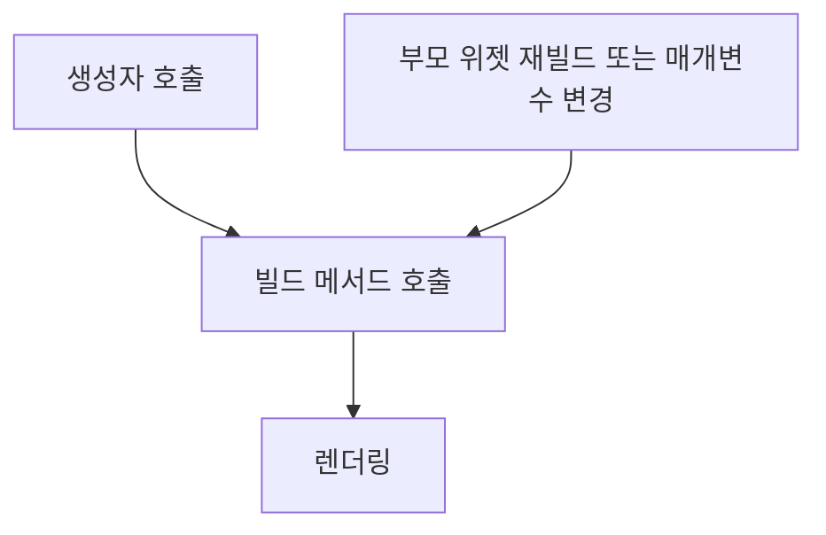
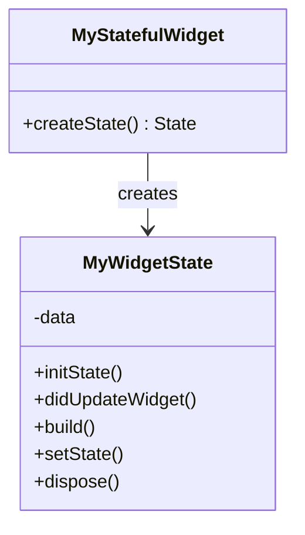
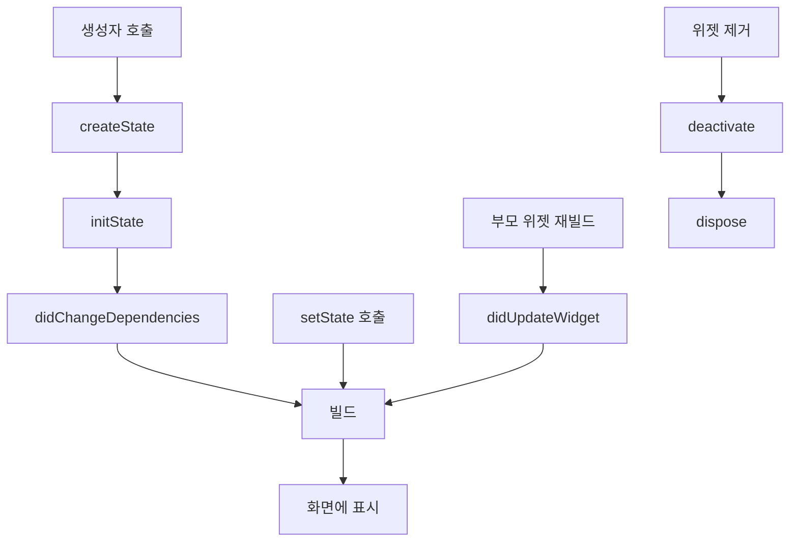
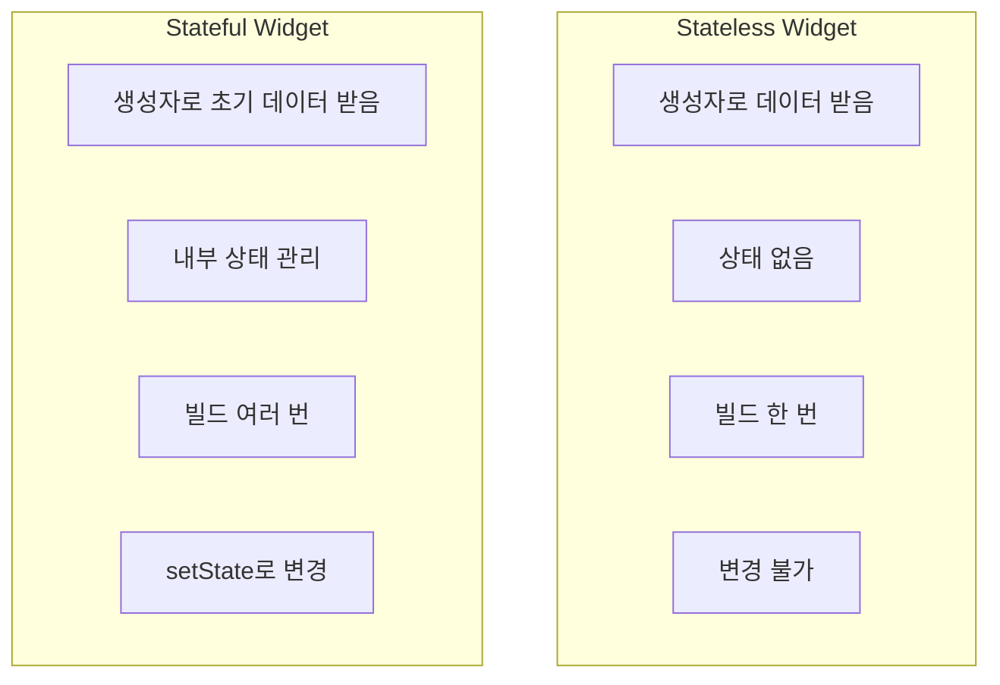
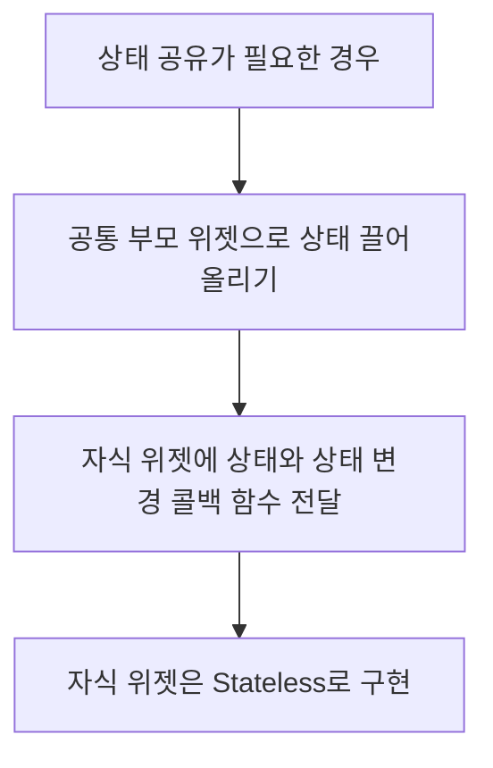

# Stateless / Stateful 위젯

Flutter에서 위젯은 크게 Stateless 위젯과 Stateful 위젯으로 구분됩니다. 이 두 가지 위젯 유형은 UI 구성의 기본 요소이며, 각각 다른 용도와 특성을 가지고 있습니다. 이 장에서는 두 위젯의 차이점, 동작 원리, 사용 패턴에 대해 알아보겠습니다.

## Stateless 위젯 (StatelessWidget)

Stateless 위젯은 내부 상태(state)를 가지지 않는 불변(immutable)의 위젯입니다. 한번 빌드되면 입력된 매개변수가 변경되지 않는 한 다시 빌드되지 않습니다. 정적인 UI 요소를 표현하는데 적합합니다.

### 특징

- **불변성**: 내부 상태를 가지지 않으며, 생성 후 변경되지 않습니다.
- **성능**: 상태가 없어 효율적이고 빠르게 렌더링됩니다.
- **단순성**: 구현이 간단하고 이해하기 쉽습니다.
- **용도**: 정적인 UI, 표시 전용 컴포넌트에 적합합니다.

### 생명 주기

Stateless 위젯의 생명 주기는 간단합니다:



1. **생성자 호출**: 위젯이 생성되고 속성이 초기화됩니다.
2. **빌드 메서드 호출**: `build()` 메서드가 호출되어 위젯 트리를 구성합니다.
3. **렌더링**: 생성된 위젯 트리가 화면에 렌더링됩니다.
4. **재빌드**: 부모 위젯이 재빌드되거나 매개변수가 변경되면 새로운 위젯 인스턴스가 생성되고 다시 빌드됩니다.

### 구현 예제

```dart
class GreetingCard extends StatelessWidget {
  final String name;
  final String message;
  final Color backgroundColor;

  // 생성자 - 필요한 데이터를 주입받습니다
  const GreetingCard({
    Key? key,
    required this.name,
    required this.message,
    this.backgroundColor = Colors.white,
  }) : super(key: key);

  // 빌드 메서드 - UI를 정의합니다
  @override
  Widget build(BuildContext context) {
    return Container(
      padding: const EdgeInsets.all(16.0),
      color: backgroundColor,
      child: Column(
        crossAxisAlignment: CrossAxisAlignment.start,
        mainAxisSize: MainAxisSize.min,
        children: [
          Text(
            '안녕하세요, $name님!',
            style: const TextStyle(
              fontSize: 18,
              fontWeight: FontWeight.bold,
            ),
          ),
          const SizedBox(height: 8),
          Text(
            message,
            style: const TextStyle(fontSize: 14),
          ),
        ],
      ),
    );
  }
}

// 사용 예시
GreetingCard(
  name: '홍길동',
  message: '오늘도 좋은 하루 되세요!',
  backgroundColor: Colors.amber.shade100,
)
```

위 예제에서 `GreetingCard`는 이름, 메시지, 배경색을 입력받아 인사말 카드를 표시하는 Stateless 위젯입니다. 이 위젯은 내부 상태를 가지지 않으며, 입력된 속성에 따라 UI를 구성합니다.

## Stateful 위젯 (StatefulWidget)

Stateful 위젯은 시간에 따라 변경될 수 있는 내부 상태(state)를 가진 위젯입니다. 사용자 상호작용, 데이터 변경, 애니메이션 등으로 인해 UI가 동적으로 변경되어야 할 때 사용합니다.

### 특징

- **가변성**: 생성 후에도 상태가 변경될 수 있습니다.
- **상태 관리**: 위젯의 생명 주기 동안 상태를 유지하고 관리합니다.
- **복잡성**: Stateless 위젯보다 구현이 복잡합니다.
- **용도**: 사용자 입력, 애니메이션, 동적 데이터 표시 등에 적합합니다.

### 구조

Stateful 위젯은 두 개의 클래스로 구성됩니다:

1. **StatefulWidget 클래스**: 위젯의 설정과 매개변수를 정의합니다.
2. **State 클래스**: 위젯의 상태를 관리하고 UI를 구성합니다.



### 생명 주기

Stateful 위젯의 생명 주기는 Stateless 위젯보다 복잡합니다:



1. **생성자 호출**: 위젯이 생성되고 속성이 초기화됩니다.
2. **createState()**: 위젯의 State 객체를 생성합니다.
3. **initState()**: State가 초기화됩니다. 이 메서드는 State 객체가 생성된 직후 한 번만 호출됩니다.
4. **didChangeDependencies()**: State가 의존하는 객체가 변경될 때 호출됩니다.
5. **build()**: UI를 구성합니다. 이 메서드는 initState 후, 그리고 setState가 호출될 때마다 호출됩니다.
6. **setState()**: 상태 변경을 알리고 rebuild를 예약합니다.
7. **didUpdateWidget()**: 부모 위젯이 재빌드되어 위젯이 재구성될 때 호출됩니다.
8. **deactivate()**: State 객체가 위젯 트리에서 제거될 때 호출됩니다.
9. **dispose()**: State 객체가 영구적으로 제거될 때 호출됩니다. 리소스를 정리하는 데 사용됩니다.

### 구현 예제

```dart
// 1. StatefulWidget 클래스
class Counter extends StatefulWidget {
  final int initialCount;

  const Counter({Key? key, this.initialCount = 0}) : super(key: key);

  @override
  _CounterState createState() => _CounterState();
}

// 2. State 클래스
class _CounterState extends State<Counter> {
  late int _count;

  // 초기화
  @override
  void initState() {
    super.initState();
    _count = widget.initialCount;
    print('Counter 위젯 초기화');
  }

  // 위젯이 업데이트될 때
  @override
  void didUpdateWidget(Counter oldWidget) {
    super.didUpdateWidget(oldWidget);
    if (oldWidget.initialCount != widget.initialCount) {
      _count = widget.initialCount;
      print('초기 카운트 값 변경: $_count');
    }
  }

  // 상태 변경 함수
  void _increment() {
    setState(() {
      _count++;
      print('카운트 증가: $_count');
    });
  }

  // 리소스 정리
  @override
  void dispose() {
    print('Counter 위젯 제거');
    super.dispose();
  }

  // UI 구성
  @override
  Widget build(BuildContext context) {
    return Container(
      padding: const EdgeInsets.all(16.0),
      decoration: BoxDecoration(
        border: Border.all(color: Colors.grey),
        borderRadius: BorderRadius.circular(8.0),
      ),
      child: Column(
        mainAxisSize: MainAxisSize.min,
        children: [
          Text(
            '현재 카운트: $_count',
            style: const TextStyle(fontSize: 18),
          ),
          const SizedBox(height: 16),
          ElevatedButton(
            onPressed: _increment,
            child: const Text('증가'),
          ),
        ],
      ),
    );
  }
}

// 사용 예시
Counter(initialCount: 5)
```

위 예제에서 `Counter`는 카운트 값을 관리하고 증가 버튼이 있는 Stateful 위젯입니다. 상태(\_count)는 `_CounterState` 클래스 내에서 관리되며, 버튼 클릭 시 `setState()`를 호출하여 UI를 업데이트합니다.

## Stateless vs Stateful 위젯 비교

두 위젯 유형의 주요 차이점을 비교해 보겠습니다:



| 항목            | Stateless 위젯        | Stateful 위젯                          |
| --------------- | --------------------- | -------------------------------------- |
| **상태 관리**   | 내부 상태 없음        | 내부 상태 관리                         |
| **빌드 빈도**   | 부모 위젯 변경 시에만 | setState() 호출 시마다                 |
| **생명 주기**   | 간단함                | 복잡함                                 |
| **성능**        | 일반적으로 더 효율적  | 상태 관리 오버헤드                     |
| **용도**        | 정적 UI               | 동적 UI                                |
| **구현 복잡도** | 낮음                  | 중간-높음                              |
| **예시**        | Text, Icon, RichText  | TextField, Checkbox, AnimatedContainer |

## 언제 어떤 위젯을 사용해야 할까?

### Stateless 위젯 사용 사례

- **정적 콘텐츠 표시**: 텍스트, 이미지, 아이콘 등 변하지 않는 UI 요소
- **데이터 표시 전용 컴포넌트**: 입력 데이터만으로 UI를 구성할 때
- **재사용 가능한 UI 컴포넌트**: 여러 곳에서 동일한 모양으로 사용되는 컴포넌트
- **부모로부터 모든 데이터를 받아 표시**: 자체 상태가 필요 없는 경우

예시:

- 프로필 카드
- 제품 정보 표시
- 헤더/푸터
- 아이콘 버튼

### Stateful 위젯 사용 사례

- **사용자 입력 처리**: 폼, 텍스트 입력, 체크박스 등
- **애니메이션 및 변환 효과**: 상태에 따라 변하는 UI
- **데이터 로딩 및 진행 상황 표시**: 로딩 인디케이터, 진행 바
- **타이머 또는 주기적 업데이트**: 시계, 카운트다운 타이머
- **내부적으로 데이터를 관리하는 컴포넌트**: 자체 상태가 필요한 경우

예시:

- 로그인 폼
- 이미지 슬라이더
- 카운터
- 토글 버튼

## 상태 관리의 기본 원칙

### 1. 상태의 범위 최소화

위젯 트리에서 가능한 낮은 위치에 상태를 유지하는 것이 좋습니다. 이는 불필요한 리빌드를 방지하고 성능을 향상시킵니다.

```dart
// 좋지 않은 예: 부모 위젯에서 불필요한 상태 관리
class ParentWidget extends StatefulWidget {
  @override
  _ParentWidgetState createState() => _ParentWidgetState();
}

class _ParentWidgetState extends State<ParentWidget> {
  bool _isExpanded = false;

  @override
  Widget build(BuildContext context) {
    return Column(
      children: [
        Text('제목'),
        SomeWidget(), // 이 위젯은 _isExpanded와 관련 없음
        AnotherWidget(), // 이 위젯도 _isExpanded와 관련 없음
        ExpandableWidget(
          isExpanded: _isExpanded,
          onToggle: () => setState(() => _isExpanded = !_isExpanded),
        ),
      ],
    );
  }
}

// 좋은 예: 관련 상태를 해당 위젯 내에서 관리
class ExpandableWidget extends StatefulWidget {
  @override
  _ExpandableWidgetState createState() => _ExpandableWidgetState();
}

class _ExpandableWidgetState extends State<ExpandableWidget> {
  bool _isExpanded = false;

  @override
  Widget build(BuildContext context) {
    return Column(
      children: [
        GestureDetector(
          onTap: () => setState(() => _isExpanded = !_isExpanded),
          child: Text(_isExpanded ? '접기' : '펼치기'),
        ),
        if (_isExpanded)
          Container(
            child: Text('펼쳐진 내용'),
          ),
      ],
    );
  }
}
```

### 2. 상태 끌어올리기

여러 위젯이 동일한 상태를 공유해야 하는 경우, 상태를 공통 부모 위젯으로 "끌어올립니다".



```dart
// 공통 부모 위젯에서 상태 관리
class CounterPage extends StatefulWidget {
  @override
  _CounterPageState createState() => _CounterPageState();
}

class _CounterPageState extends State<CounterPage> {
  int _count = 0;

  void _increment() {
    setState(() {
      _count++;
    });
  }

  @override
  Widget build(BuildContext context) {
    return Column(
      children: [
        // 두 위젯이 동일한 상태(_count)를 공유
        CounterDisplay(count: _count),
        CounterControls(onIncrement: _increment),
      ],
    );
  }
}

// 표시만 담당하는 Stateless 위젯
class CounterDisplay extends StatelessWidget {
  final int count;

  const CounterDisplay({Key? key, required this.count}) : super(key: key);

  @override
  Widget build(BuildContext context) {
    return Text('현재 카운트: $count');
  }
}

// 조작만 담당하는 Stateless 위젯
class CounterControls extends StatelessWidget {
  final VoidCallback onIncrement;

  const CounterControls({Key? key, required this.onIncrement}) : super(key: key);

  @override
  Widget build(BuildContext context) {
    return ElevatedButton(
      onPressed: onIncrement,
      child: Text('증가'),
    );
  }
}
```

### 3. 상태를 종류별로 관리

상태의 종류와 범위에 따라 적절한 관리 방법을 선택합니다:

1. **UI 상태(임시 상태)**: 텍스트 필드 포커스, 애니메이션 진행 상태 등
   - Stateful 위젯 내에서 관리
2. **앱 상태(영구 상태)**: 사용자 설정, 로그인 정보, 장바구니 등
   - Provider, Riverpod, Bloc 등의 상태 관리 솔루션 사용

## 실전 예제: 위젯 타입 선택하기

실제 애플리케이션에서 어떤 위젯 타입을 선택해야 하는지 살펴보겠습니다:

### 예제 1: 제품 카드

```dart
// Stateless 위젯 사용 - 정적 데이터 표시
class ProductCard extends StatelessWidget {
  final String name;
  final double price;
  final String imageUrl;
  final VoidCallback? onAddToCart;

  const ProductCard({
    Key? key,
    required this.name,
    required this.price,
    required this.imageUrl,
    this.onAddToCart,
  }) : super(key: key);

  @override
  Widget build(BuildContext context) {
    return Card(
      margin: EdgeInsets.all(8.0),
      child: Column(
        crossAxisAlignment: CrossAxisAlignment.start,
        children: [
          Image.network(
            imageUrl,
            height: 120,
            width: double.infinity,
            fit: BoxFit.cover,
          ),
          Padding(
            padding: EdgeInsets.all(8.0),
            child: Column(
              crossAxisAlignment: CrossAxisAlignment.start,
              children: [
                Text(
                  name,
                  style: TextStyle(fontWeight: FontWeight.bold, fontSize: 16),
                ),
                SizedBox(height: 4),
                Text(
                  '₩${price.toStringAsFixed(0)}',
                  style: TextStyle(color: Colors.green, fontSize: 14),
                ),
                SizedBox(height: 8),
                ElevatedButton(
                  onPressed: onAddToCart,
                  child: Text('장바구니 추가'),
                ),
              ],
            ),
          ),
        ],
      ),
    );
  }
}
```

### 예제 2: 수량 선택 위젯

```dart
// Stateful 위젯 사용 - 내부 상태 관리
class QuantitySelector extends StatefulWidget {
  final int initialValue;
  final int min;
  final int max;
  final ValueChanged<int>? onChanged;

  const QuantitySelector({
    Key? key,
    this.initialValue = 1,
    this.min = 1,
    this.max = 10,
    this.onChanged,
  }) : super(key: key);

  @override
  _QuantitySelectorState createState() => _QuantitySelectorState();
}

class _QuantitySelectorState extends State<QuantitySelector> {
  late int _quantity;

  @override
  void initState() {
    super.initState();
    _quantity = widget.initialValue.clamp(widget.min, widget.max);
  }

  void _increment() {
    setState(() {
      if (_quantity < widget.max) {
        _quantity++;
        widget.onChanged?.call(_quantity);
      }
    });
  }

  void _decrement() {
    setState(() {
      if (_quantity > widget.min) {
        _quantity--;
        widget.onChanged?.call(_quantity);
      }
    });
  }

  @override
  Widget build(BuildContext context) {
    return Row(
      mainAxisSize: MainAxisSize.min,
      children: [
        IconButton(
          icon: Icon(Icons.remove),
          onPressed: _quantity > widget.min ? _decrement : null,
        ),
        Container(
          padding: EdgeInsets.symmetric(horizontal: 12, vertical: 4),
          decoration: BoxDecoration(
            border: Border.all(color: Colors.grey),
            borderRadius: BorderRadius.circular(4),
          ),
          child: Text(
            _quantity.toString(),
            style: TextStyle(fontSize: 16),
          ),
        ),
        IconButton(
          icon: Icon(Icons.add),
          onPressed: _quantity < widget.max ? _increment : null,
        ),
      ],
    );
  }
}
```

## 고급 기법: 위젯 참조 및 통신

### GlobalKey를 사용한 위젯 참조

`GlobalKey`를 사용하면 위젯의 State 객체에 직접 접근할 수 있습니다:

```dart
// GlobalKey 예제
class MyApp extends StatelessWidget {
  // GlobalKey 생성
  final formKey = GlobalKey<FormState>();

  @override
  Widget build(BuildContext context) {
    return MaterialApp(
      home: Scaffold(
        body: Form(
          // 위젯에 키 할당
          key: formKey,
          child: Column(
            children: [
              TextFormField(
                validator: (value) {
                  if (value == null || value.isEmpty) {
                    return '이 필드는 필수입니다';
                  }
                  return null;
                },
              ),
              ElevatedButton(
                onPressed: () {
                  // 폼 상태에 접근
                  if (formKey.currentState!.validate()) {
                    print('유효성 검사 통과');
                  }
                },
                child: Text('제출'),
              ),
            ],
          ),
        ),
      ),
    );
  }
}
```

### 콜백 함수를 통한 자식-부모 통신

자식 위젯이 부모 위젯과 통신하는 일반적인 방법은 콜백 함수를 사용하는 것입니다:

```dart
// 부모 위젯
class ParentWidget extends StatefulWidget {
  @override
  _ParentWidgetState createState() => _ParentWidgetState();
}

class _ParentWidgetState extends State<ParentWidget> {
  String _selectedItem = '';

  void _handleItemSelected(String item) {
    setState(() {
      _selectedItem = item;
    });
    print('선택된 항목: $item');
  }

  @override
  Widget build(BuildContext context) {
    return Column(
      children: [
        Text('선택된 항목: $_selectedItem'),
        ChildWidget(onItemSelected: _handleItemSelected),
      ],
    );
  }
}

// 자식 위젯 (Stateless)
class ChildWidget extends StatelessWidget {
  final Function(String) onItemSelected;

  const ChildWidget({Key? key, required this.onItemSelected}) : super(key: key);

  @override
  Widget build(BuildContext context) {
    return Column(
      children: [
        ElevatedButton(
          onPressed: () => onItemSelected('항목 1'),
          child: Text('항목 1 선택'),
        ),
        ElevatedButton(
          onPressed: () => onItemSelected('항목 2'),
          child: Text('항목 2 선택'),
        ),
      ],
    );
  }
}
```

## 성능 최적화 팁

### 1. const 생성자 사용

가능한 경우 `const` 생성자를 사용하여 위젯을 선언하면 Flutter는 동일한 위젯 인스턴스를 재사용할 수 있습니다:

```dart
// 상수 위젯 예시
const Text('Hello') // 재사용 가능

// vs

Text('Hello') // 매번 새로운 인스턴스 생성
```

### 2. 불필요한 상태 업데이트 방지

`setState()`를 호출할 때는 실제로 상태가 변경되었는지 확인합니다:

```dart
// 좋지 않은 예
void _updateValue(int newValue) {
  setState(() {
    _value = newValue; // 이전 값과 같더라도 항상 setState 호출
  });
}

// 좋은 예
void _updateValue(int newValue) {
  if (_value != newValue) { // 값이 변경된 경우에만 setState 호출
    setState(() {
      _value = newValue;
    });
  }
}
```

### 3. 위젯 분리

큰 위젯을 작은 위젯으로 분리하여 필요한 부분만 리빌드되도록 합니다:

```dart
// 좋지 않은 예: 전체 위젯이 다시 빌드됨
class WeatherApp extends StatefulWidget {
  @override
  _WeatherAppState createState() => _WeatherAppState();
}

class _WeatherAppState extends State<WeatherApp> {
  bool _isLoading = false;
  WeatherData? _weatherData;

  // ... 날씨 데이터 로드 로직 ...

  @override
  Widget build(BuildContext context) {
    return Column(
      children: [
        AppHeader(), // 재빌드할 필요 없음
        if (_isLoading)
          CircularProgressIndicator()
        else if (_weatherData != null)
          Column(
            children: [
              Text('${_weatherData!.temperature}°C'),
              Text(_weatherData!.description),
              Image.network(_weatherData!.iconUrl),
            ],
          ),
        SearchBar(onSearch: _loadWeather), // 재빌드할 필요 없음
      ],
    );
  }
}

// 좋은 예: 필요한 위젯만 분리하여 재빌드
class WeatherApp extends StatefulWidget {
  @override
  _WeatherAppState createState() => _WeatherAppState();
}

class _WeatherAppState extends State<WeatherApp> {
  bool _isLoading = false;
  WeatherData? _weatherData;

  // ... 날씨 데이터 로드 로직 ...

  @override
  Widget build(BuildContext context) {
    return Column(
      children: [
        const AppHeader(), // const로 선언하여 재사용
        WeatherDisplay(
          isLoading: _isLoading,
          weatherData: _weatherData,
        ),
        SearchBar(onSearch: _loadWeather), // 검색 로직만 전달
      ],
    );
  }
}

// 분리된 날씨 표시 위젯
class WeatherDisplay extends StatelessWidget {
  final bool isLoading;
  final WeatherData? weatherData;

  const WeatherDisplay({
    Key? key,
    required this.isLoading,
    this.weatherData,
  }) : super(key: key);

  @override
  Widget build(BuildContext context) {
    if (isLoading) {
      return CircularProgressIndicator();
    } else if (weatherData != null) {
      return Column(
        children: [
          Text('${weatherData!.temperature}°C'),
          Text(weatherData!.description),
          Image.network(weatherData!.iconUrl),
        ],
      );
    } else {
      return Text('날씨 정보가 없습니다');
    }
  }
}
```

## 결론

Stateless 위젯과 Stateful 위젯은 Flutter UI 구성의 기본 요소입니다. 각 위젯 유형의 특성과 적절한 사용 사례를 이해하면 더 효율적이고 유지 관리가 쉬운 애플리케이션을 개발할 수 있습니다.

- **Stateless 위젯**은 간단하고 효율적이며, 정적인 UI 요소에 적합합니다.
- **Stateful 위젯**은 동적인 UI와 사용자 상호작용이 필요한 경우에 사용합니다.
- **상태 관리**는 위젯의 복잡성과 성능에 직접적인 영향을 미칩니다.
- **위젯 분리와 const 생성자**는 성능 최적화에 도움이 됩니다.

다음 장에서는 위젯 트리의 구조와 작동 방식에 대해 더 자세히 알아보겠습니다.
