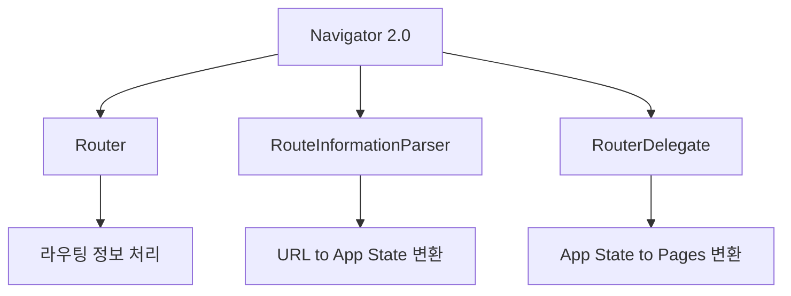

# Navigator 2.0

Flutter 1.22 버전에서 도입된 Navigator 2.0은 이전의 명령형(imperative) 스타일의 Navigator 1.0을 보완하는 선언적(declarative) 접근 방식의 네비게이션 API입니다. 이 새로운 API는 복잡한 라우팅 시나리오와 웹 애플리케이션에서의 딥 링크 처리를 더 효과적으로 관리할 수 있도록 설계되었습니다.

## Navigator 2.0의 등장 배경

Navigator 1.0은 간단한 앱에서는 충분했지만, 복잡한 네비게이션 시나리오나 웹 애플리케이션에서는 한계가 있었습니다:

1. **앱 상태와 URL 동기화 어려움**: 웹에서 URL을 기반으로 화면을 관리하기 어려움
2. **딥 링크 처리의 복잡성**: 특정 화면으로 직접 이동하는 딥 링크 구현이 복잡함
3. **선언적 UI와의 불일치**: Flutter의 나머지 부분은 선언적인데 네비게이션만 명령형
4. **전체 라우팅 상태 관리 부재**: 앱의 전체 네비게이션 상태를 한 곳에서 관리하기 어려움

이러한 문제를 해결하기 위해 Navigator 2.0이 도입되었습니다.

## Navigator 2.0의 핵심 컴포넌트

Navigator 2.0은 다음과 같은 세 가지 핵심 컴포넌트로 구성됩니다:



### 1. Router

`Router` 위젯은 Navigator 2.0의 최상위 위젯으로, 라우팅 정보를 처리하고 적절한 화면을 표시합니다. 주로 `MaterialApp.router` 생성자를 통해 사용됩니다.

```dart
MaterialApp.router(
  routeInformationParser: MyRouteInformationParser(),
  routerDelegate: MyRouterDelegate(),
);
```

### 2. RouteInformationParser

`RouteInformationParser`는 URL 경로와 같은 라우트 정보를 앱의 상태 객체로 변환하는 역할을 합니다. 예를 들어, '/users/123'이라는 URL을 `UserDetailsState(userId: 123)`와 같은 앱 상태 객체로 변환합니다.

```dart
class MyRouteInformationParser extends RouteInformationParser<AppState> {
  @override
  Future<AppState> parseRouteInformation(RouteInformation routeInformation) async {
    final uri = Uri.parse(routeInformation.location!);

    // 홈 화면
    if (uri.pathSegments.isEmpty) {
      return HomeState();
    }

    // 사용자 세부 정보 화면
    if (uri.pathSegments.length == 2 && uri.pathSegments[0] == 'users') {
      return UserDetailsState(userId: uri.pathSegments[1]);
    }

    // 알 수 없는 경로는 Not Found 상태로 처리
    return NotFoundState();
  }

  @override
  RouteInformation? restoreRouteInformation(AppState state) {
    if (state is HomeState) {
      return RouteInformation(location: '/');
    }

    if (state is UserDetailsState) {
      return RouteInformation(location: '/users/${state.userId}');
    }

    if (state is NotFoundState) {
      return RouteInformation(location: '/not-found');
    }

    return null;
  }
}
```

### 3. RouterDelegate

`RouterDelegate`는 앱의 상태를 기반으로 `Navigator` 위젯과 그 안의 페이지 스택을 구성합니다. 앱의 상태가 변경되면 이를 감지하고 화면을 업데이트합니다.

```dart
class MyRouterDelegate extends RouterDelegate<AppState>
    with ChangeNotifier, PopNavigatorRouterDelegateMixin<AppState> {

  @override
  final GlobalKey<NavigatorState> navigatorKey = GlobalKey<NavigatorState>();

  AppState _appState = HomeState();

  AppState get appState => _appState;

  set appState(AppState value) {
    if (_appState == value) return;
    _appState = value;
    notifyListeners();
  }

  @override
  AppState? get currentConfiguration => _appState;

  @override
  Widget build(BuildContext context) {
    List<Page> pages = [];

    // 앱 상태에 따라 페이지 스택 구성
    if (_appState is HomeState) {
      pages.add(MaterialPage(
        key: ValueKey('home'),
        child: HomeScreen(
          onUserTap: (String userId) {
            appState = UserDetailsState(userId: userId);
          },
        ),
      ));
    }

    if (_appState is UserDetailsState) {
      final userState = _appState as UserDetailsState;
      pages.add(MaterialPage(
        key: ValueKey('home'),
        child: HomeScreen(
          onUserTap: (String userId) {
            appState = UserDetailsState(userId: userId);
          },
        ),
      ));

      pages.add(MaterialPage(
        key: ValueKey('user-${userState.userId}'),
        child: UserDetailsScreen(
          userId: userState.userId,
          onBack: () {
            appState = HomeState();
          },
        ),
      ));
    }

    if (_appState is NotFoundState) {
      pages.add(MaterialPage(
        key: ValueKey('not-found'),
        child: NotFoundScreen(
          onBack: () {
            appState = HomeState();
          },
        ),
      ));
    }

    return Navigator(
      key: navigatorKey,
      pages: pages,
      onPopPage: (route, result) {
        if (!route.didPop(result)) {
          return false;
        }

        // 뒤로 가기 처리
        if (pages.length > 1) {
          appState = HomeState();
        }

        return true;
      },
    );
  }

  @override
  Future<void> setNewRoutePath(AppState configuration) async {
    appState = configuration;
  }
}
```

## Navigator 2.0의 핵심 개념

### 1. Page 위젯

Navigator 2.0에서는 화면을 `Page` 위젯으로 표현합니다. `Page`는 화면에 표시될 내용과 전환 애니메이션을 정의하는 불변(immutable) 객체입니다.

```dart
Navigator(
  pages: [
    MaterialPage(
      key: ValueKey('home'),
      child: HomeScreen(),
    ),
    MaterialPage(
      key: ValueKey('details'),
      child: DetailsScreen(),
    ),
  ],
  onPopPage: (route, result) {
    // 뒤로 가기 처리
    return route.didPop(result);
  },
);
```

주요 `Page` 구현체로는 다음과 같은 것들이 있습니다:

- **MaterialPage**: Material Design 스타일의 화면 전환
- **CupertinoPage**: iOS 스타일의 화면 전환
- **CustomPage**: 커스텀 애니메이션을 정의한 화면 전환

### 2. 선언적 방식의 페이지 스택 관리

Navigator 2.0의 가장 큰 특징은 페이지 스택을 선언적으로 관리한다는 점입니다. 화면의 추가/제거를 명령형 메서드(push, pop)로 처리하는 대신, 전체 페이지 스택을 한 번에 정의합니다.

```dart
// 명령형 방식 (Navigator 1.0)
Navigator.push(context, MaterialPageRoute(builder: (_) => DetailsScreen()));

// 선언적 방식 (Navigator 2.0)
// 페이지 스택 전체를 다시 정의
Navigator(
  pages: [
    MaterialPage(child: HomeScreen()),
    if (showDetails) MaterialPage(child: DetailsScreen()),
  ],
  onPopPage: (route, result) => route.didPop(result),
);
```

선언적 방식의 장점은 앱의 상태와 UI가 항상 동기화된다는 점입니다. 라우팅 상태가 변경되면 전체 페이지 스택이 자동으로 업데이트됩니다.

### 3. 히스토리 스택 관리

Navigator 2.0은 브라우저의 히스토리 스택과도 통합됩니다. 이는 웹 앱에서 특히 중요하며, 사용자가 브라우저의 뒤로 가기/앞으로 가기 버튼을 사용할 때 앱의 상태가
적절히 변경되도록 합니다.

```dart
// RouterDelegate 내부에서 페이지 스택 관리
@override
Widget build(BuildContext context) {
  return Navigator(
    key: navigatorKey,
    pages: [
      MaterialPage(child: HomeScreen()),
      if (_showUserList) MaterialPage(child: UserListScreen()),
      if (_selectedUserId != null) MaterialPage(
        child: UserDetailsScreen(userId: _selectedUserId!),
      ),
    ],
    onPopPage: (route, result) {
      if (!route.didPop(result)) return false;

      // 뒤로 가기 로직
      if (_selectedUserId != null) {
        _selectedUserId = null;
        return true;
      }

      if (_showUserList) {
        _showUserList = false;
        return true;
      }

      return false;
    },
  );
}
```

## 실제 예제: 쇼핑 앱 구현

Navigator 2.0을 사용한 쇼핑 앱의 구현 예제를 살펴보겠습니다:

```dart
// 앱 상태 정의
abstract class AppState {}

class HomeState extends AppState {}

class CategoryState extends AppState {
  final String categoryId;
  CategoryState({required this.categoryId});
}

class ProductDetailsState extends AppState {
  final String productId;
  ProductDetailsState({required this.productId});
}

class CartState extends AppState {}

class CheckoutState extends AppState {}

// RouteInformationParser 구현
class ShopRouteInformationParser extends RouteInformationParser<AppState> {
  @override
  Future<AppState> parseRouteInformation(RouteInformation routeInformation) async {
    final uri = Uri.parse(routeInformation.location!);

    // 홈 화면
    if (uri.pathSegments.isEmpty) {
      return HomeState();
    }

    // 카테고리 화면
    if (uri.pathSegments.length == 2 && uri.pathSegments[0] == 'category') {
      return CategoryState(categoryId: uri.pathSegments[1]);
    }

    // 상품 상세 화면
    if (uri.pathSegments.length == 2 && uri.pathSegments[0] == 'product') {
      return ProductDetailsState(productId: uri.pathSegments[1]);
    }

    // 장바구니 화면
    if (uri.pathSegments.length == 1 && uri.pathSegments[0] == 'cart') {
      return CartState();
    }

    // 결제 화면
    if (uri.pathSegments.length == 1 && uri.pathSegments[0] == 'checkout') {
      return CheckoutState();
    }

    // 알 수 없는 경로는 홈으로
    return HomeState();
  }

  @override
  RouteInformation? restoreRouteInformation(AppState state) {
    if (state is HomeState) {
      return RouteInformation(location: '/');
    }

    if (state is CategoryState) {
      return RouteInformation(location: '/category/${state.categoryId}');
    }

    if (state is ProductDetailsState) {
      return RouteInformation(location: '/product/${state.productId}');
    }

    if (state is CartState) {
      return RouteInformation(location: '/cart');
    }

    if (state is CheckoutState) {
      return RouteInformation(location: '/checkout');
    }

    return null;
  }
}

// RouterDelegate 구현
class ShopRouterDelegate extends RouterDelegate<AppState>
    with ChangeNotifier, PopNavigatorRouterDelegateMixin<AppState> {

  @override
  final GlobalKey<NavigatorState> navigatorKey = GlobalKey<NavigatorState>();

  AppState _appState = HomeState();
  List<AppState> _history = [HomeState()];

  AppState get appState => _appState;

  void navigateTo(AppState state) {
    _appState = state;
    _history.add(state);
    notifyListeners();
  }

  bool goBack() {
    if (_history.length > 1) {
      _history.removeLast();
      _appState = _history.last;
      notifyListeners();
      return true;
    }
    return false;
  }

  @override
  AppState? get currentConfiguration => _appState;

  @override
  Widget build(BuildContext context) {
    return Navigator(
      key: navigatorKey,
      pages: [
        MaterialPage(
          key: ValueKey('home'),
          child: HomeScreen(
            onCategorySelected: (categoryId) {
              navigateTo(CategoryState(categoryId: categoryId));
            },
            onProductSelected: (productId) {
              navigateTo(ProductDetailsState(productId: productId));
            },
            onCartTap: () {
              navigateTo(CartState());
            },
          ),
        ),
        if (_appState is CategoryState)
          MaterialPage(
            key: ValueKey('category-${(_appState as CategoryState).categoryId}'),
            child: CategoryScreen(
              categoryId: (_appState as CategoryState).categoryId,
              onProductSelected: (productId) {
                navigateTo(ProductDetailsState(productId: productId));
              },
            ),
          ),
        if (_appState is ProductDetailsState)
          MaterialPage(
            key: ValueKey('product-${(_appState as ProductDetailsState).productId}'),
            child: ProductDetailsScreen(
              productId: (_appState as ProductDetailsState).productId,
              onAddToCart: () {
                // 장바구니에 추가 로직
              },
              onBuyNow: () {
                navigateTo(CheckoutState());
              },
            ),
          ),
        if (_appState is CartState)
          MaterialPage(
            key: ValueKey('cart'),
            child: CartScreen(
              onCheckout: () {
                navigateTo(CheckoutState());
              },
            ),
          ),
        if (_appState is CheckoutState)
          MaterialPage(
            key: ValueKey('checkout'),
            child: CheckoutScreen(
              onOrderComplete: () {
                // 주문 완료 로직
                navigateTo(HomeState());
              },
            ),
          ),
      ],
      onPopPage: (route, result) {
        if (!route.didPop(result)) {
          return false;
        }

        goBack();
        return true;
      },
    );
  }

  @override
  Future<void> setNewRoutePath(AppState configuration) async {
    _appState = configuration;
    _history = [..._history, configuration];
  }
}

// MaterialApp에 Router 통합
class MyApp extends StatelessWidget {
  @override
  Widget build(BuildContext context) {
    return MaterialApp.router(
      title: '쇼핑 앱',
      theme: ThemeData(primarySwatch: Colors.blue),
      routerDelegate: ShopRouterDelegate(),
      routeInformationParser: ShopRouteInformationParser(),
    );
  }
}
```

## Navigator 2.0과 상태 관리 통합

Navigator 2.0은 앱의 상태 관리 시스템과 통합하기 쉽습니다. 예를 들어, Provider나 Riverpod와 같은 상태 관리 라이브러리와 함께 사용할 수 있습니다:

```dart
// 라우팅 상태 관리를 위한 ChangeNotifier
class AppRouterState extends ChangeNotifier {
  AppState _currentState = HomeState();

  AppState get currentState => _currentState;

  void navigateTo(AppState state) {
    _currentState = state;
    notifyListeners();
  }
}

// Provider와 RouterDelegate 통합
class MyRouterDelegate extends RouterDelegate<AppState>
    with ChangeNotifier, PopNavigatorRouterDelegateMixin<AppState> {

  final AppRouterState appRouterState;

  MyRouterDelegate(this.appRouterState) {
    appRouterState.addListener(notifyListeners);
  }

  @override
  void dispose() {
    appRouterState.removeListener(notifyListeners);
    super.dispose();
  }

  @override
  AppState? get currentConfiguration => appRouterState.currentState;

  @override
  Widget build(BuildContext context) {
    // 앱 상태에 따라 페이지 스택 구성
    // ...
  }

  @override
  Future<void> setNewRoutePath(AppState configuration) async {
    appRouterState.navigateTo(configuration);
  }
}

// 메인 앱에서 Provider 사용
void main() {
  runApp(
    ChangeNotifierProvider(
      create: (_) => AppRouterState(),
      child: Builder(
        builder: (context) {
          final appRouterState = Provider.of<AppRouterState>(context);

          return MaterialApp.router(
            routerDelegate: MyRouterDelegate(appRouterState),
            routeInformationParser: MyRouteInformationParser(),
          );
        },
      ),
    ),
  );
}
```

## Navigator 2.0의 장단점

### 장점

1. **선언적 API**: 앱의 상태와 UI가 항상 동기화됨
2. **딥 링크 지원 개선**: 복잡한 딥 링크 시나리오를 더 쉽게 처리할 수 있음
3. **웹 통합**: 브라우저 히스토리와 URL을 앱 상태와 쉽게 동기화할 수 있음
4. **상태 기반 라우팅**: 전체 앱 상태를 기반으로 라우팅을 관리할 수 있음
5. **테스트 용이성**: 선언적 API는 테스트하기 더 쉬움

### 단점

1. **복잡성**: Navigator 1.0보다 구현이 더 복잡함
2. **학습 곡선**: 새로운 개념을 학습해야 함
3. **코드량 증가**: 간단한 앱에서는 오히려 코드가 더 복잡해질 수 있음
4. **라이브러리 성숙도**: 아직 관련 생태계가 Navigator 1.0만큼 성숙하지 않음

## Navigator 2.0 사용 시 고려사항

### 언제 Navigator 2.0을 사용해야 할까?

다음과 같은 경우에 Navigator 2.0을 고려해볼 만합니다:

1. **웹 지원 필요**: Flutter 웹 앱에서 URL 관리가 중요한 경우
2. **복잡한 딥 링크**: 다양한 딥 링크 시나리오를 처리해야 하는 경우
3. **상태 기반 라우팅**: 앱 상태와 라우팅이 밀접하게 연결된 경우
4. **중첩 네비게이션**: 복잡한 중첩 네비게이션 구조가 필요한 경우

단순한 앱에서는 Navigator 1.0이 더 적합할 수 있습니다.

### go_router: Navigator 2.0의 대안

Navigator 2.0의 복잡성을 줄이기 위해 Flutter 팀은 `go_router` 패키지를 개발했습니다. `go_router`는 Navigator 2.0의 기능을 활용하면서도 더 간단한 API를 제공합니다:

```dart
// go_router 사용 예제
final _router = GoRouter(
  routes: [
    GoRoute(
      path: '/',
      builder: (context, state) => HomeScreen(),
    ),
    GoRoute(
      path: '/category/:id',
      builder: (context, state) {
        final categoryId = state.pathParameters['id'];
        return CategoryScreen(categoryId: categoryId!);
      },
    ),
    GoRoute(
      path: '/product/:id',
      builder: (context, state) {
        final productId = state.pathParameters['id'];
        return ProductDetailsScreen(productId: productId!);
      },
    ),
  ],
);

// 메인 앱에서 사용
MaterialApp.router(
  routerConfig: _router,
);

// 화면 전환
context.go('/category/electronics');
```

`go_router`는 다음 장에서 더 자세히 다루겠습니다.

## 요약

- **Navigator 2.0**은 Flutter의 선언적 네비게이션 API로, 복잡한 라우팅 시나리오와 웹 애플리케이션에 적합합니다.
- **주요 구성 요소**로는 `Router`, `RouteInformationParser`, `RouterDelegate`가 있습니다.
- **Page 위젯**을 사용하여 화면을 정의하고, 전체 페이지 스택을 선언적으로 관리합니다.
- **앱 상태와 라우팅**이 밀접하게 통합되어, 상태 변경 시 UI가 자동으로 업데이트됩니다.
- **브라우저 히스토리**와 쉽게 통합되어 웹 애플리케이션에서 URL 관리가 용이합니다.
- 복잡성을 줄이기 위해 **go_router** 같은 고수준 패키지를 사용할 수 있습니다.

Navigator 2.0은 복잡한 네비게이션 요구사항을 가진 앱에서 강력한 도구이지만, 모든 앱에 필요한 것은 아닙니다. 다음 장에서는 Navigator 2.0의 기능을 더 간단하게 사용할 수 있는 go_router 패키지에 대해 자세히 알아보겠습니다.
