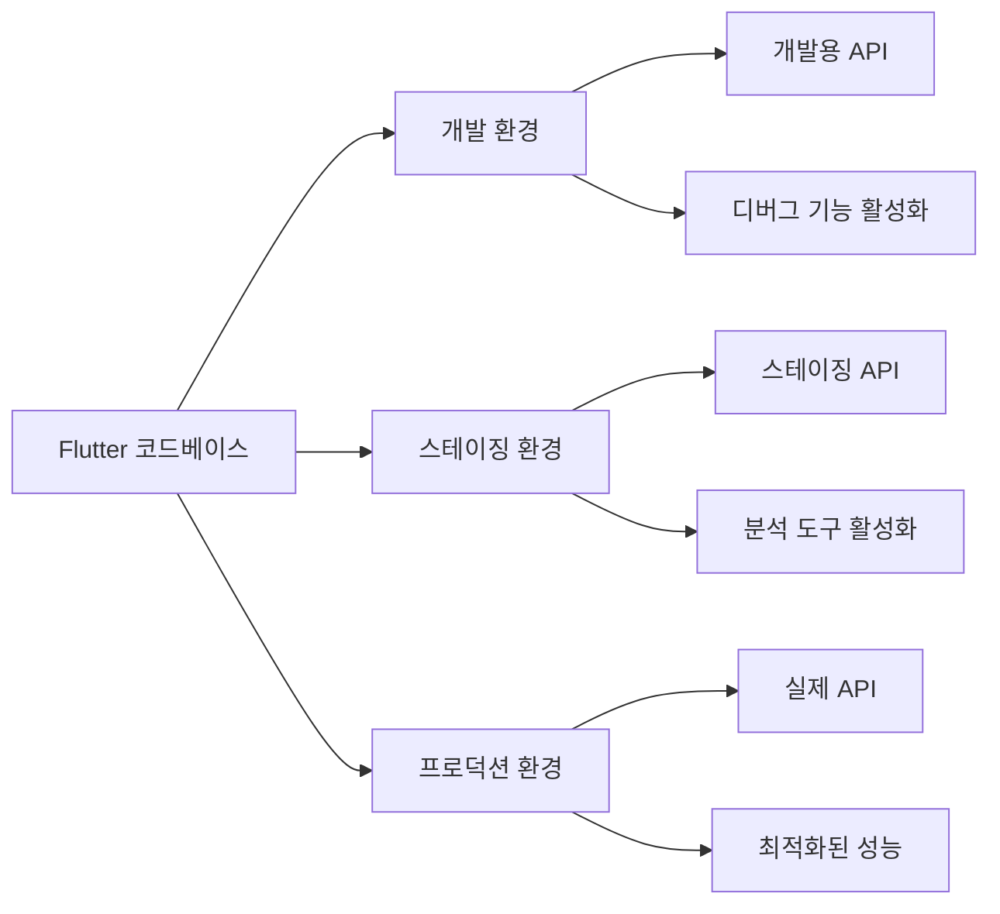

# 환경 분리 및 Flavor 설정

실제 앱 개발에서는 개발, 테스트, 스테이징, 프로덕션 등 여러 환경을 관리해야 합니다. Flutter에서는 Flavor라는 기능을 통해 서로 다른 환경에 맞는 앱 변형을 만들 수 있습니다. 이 장에서는 Flutter에서 환경을 분리하고 Flavor를 설정하는 방법에 대해 알아보겠습니다.

## 환경 분리의 필요성

동일한 코드베이스로 다양한 환경에서 작동하는 앱을 만들어야 하는 경우가 많습니다:



환경 분리가 필요한 이유:

1. **API 엔드포인트**: 개발, 스테이징, 프로덕션 서버가 다른 경우
2. **기능 제어**: 특정 환경에서만 활성화되는 실험적 기능
3. **분석 및 모니터링**: 프로덕션에서만 실제 분석 데이터 수집
4. **시각적 구분**: 개발자가 어떤 환경에서 실행 중인지 쉽게 구분
5. **앱 ID 분리**: 동일 기기에 여러 환경의 앱 설치 가능

## Flavor 개념 이해하기

Flavor는 동일한 코드베이스에서 다양한 앱 변형을 빌드하기 위한 설정입니다. 이는 안드로이드의 'Build Variants'와 iOS의 'Schemes/Configurations'와 유사한 개념입니다.

### 일반적인 Flavor 구성

보통 다음과 같은 Flavor를 구성합니다:

1. **development**: 개발 중인 환경, 개발 서버 사용
2. **staging**: 출시 전 테스트 환경, 스테이징 서버 사용
3. **production**: 최종 사용자에게 배포되는 환경, 실제 서버 사용

## Flavor 설정 방법

Flutter에서 Flavor를 설정하는 과정을 단계별로 알아보겠습니다.

### 1. Flutter 측 설정

#### lib/flavors.dart 파일 생성

먼저 Flavor를 정의하는 enum과 설정을 만듭니다:

```dart
enum Flavor {
  development,
  staging,
  production,
}

class FlavorConfig {
  final Flavor flavor;
  final String name;
  final String apiBaseUrl;
  final bool showDebugBanner;
  final String? sentryDsn;
  final bool reportErrors;

  // 기타 환경별 설정들...

  static FlavorConfig? _instance;

  factory FlavorConfig({
    required Flavor flavor,
    required String name,
    required String apiBaseUrl,
    bool showDebugBanner = true,
    String? sentryDsn,
    bool reportErrors = false,
  }) {
    _instance ??= FlavorConfig._internal(
      flavor: flavor,
      name: name,
      apiBaseUrl: apiBaseUrl,
      showDebugBanner: showDebugBanner,
      sentryDsn: sentryDsn,
      reportErrors: reportErrors,
    );

    return _instance!;
  }

  FlavorConfig._internal({
    required this.flavor,
    required this.name,
    required this.apiBaseUrl,
    required this.showDebugBanner,
    required this.sentryDsn,
    required this.reportErrors,
  });

  static FlavorConfig get instance {
    return _instance!;
  }

  static bool get isDevelopment => instance.flavor == Flavor.development;
  static bool get isStaging => instance.flavor == Flavor.staging;
  static bool get isProduction => instance.flavor == Flavor.production;
}
```

#### 각 환경별 진입점 생성

각 Flavor에 대한 main 파일을 생성합니다:

**lib/main_development.dart**:

```dart
import 'package:flutter/material.dart';
import 'flavors.dart';
import 'app.dart';

void main() {
  FlavorConfig(
    flavor: Flavor.development,
    name: 'DEV',
    apiBaseUrl: 'https://dev-api.example.com',
    showDebugBanner: true,
    reportErrors: false,
  );

  runApp(const MyApp());
}
```

**lib/main_staging.dart**:

```dart
import 'package:flutter/material.dart';
import 'flavors.dart';
import 'app.dart';

void main() {
  FlavorConfig(
    flavor: Flavor.staging,
    name: 'STAGING',
    apiBaseUrl: 'https://staging-api.example.com',
    showDebugBanner: true,
    reportErrors: true,
    sentryDsn: 'https://your-staging-sentry-dsn',
  );

  runApp(const MyApp());
}
```

**lib/main_production.dart**:

```dart
import 'package:flutter/material.dart';
import 'flavors.dart';
import 'app.dart';

void main() {
  FlavorConfig(
    flavor: Flavor.production,
    name: 'PROD',
    apiBaseUrl: 'https://api.example.com',
    showDebugBanner: false,
    reportErrors: true,
    sentryDsn: 'https://your-production-sentry-dsn',
  );

  runApp(const MyApp());
}
```

#### 공통 앱 구성 생성

**lib/app.dart**:

```dart
import 'package:flutter/material.dart';
import 'flavors.dart';

class MyApp extends StatelessWidget {
  const MyApp({Key? key}) : super(key: key);

  @override
  Widget build(BuildContext context) {
    return MaterialApp(
      title: 'Flavor Example',
      debugShowCheckedModeBanner: FlavorConfig.instance.showDebugBanner,
      theme: ThemeData(
        primarySwatch: Colors.blue,
      ),
      home: const MyHomePage(),
    );
  }
}

class MyHomePage extends StatelessWidget {
  const MyHomePage({Key? key}) : super(key: key);

  @override
  Widget build(BuildContext context) {
    return Scaffold(
      appBar: AppBar(
        title: const Text('Flavor Example'),
      ),
      body: Center(
        child: Column(
          mainAxisAlignment: MainAxisAlignment.center,
          children: [
            Text(
              '현재 환경: ${FlavorConfig.instance.name}',
              style: Theme.of(context).textTheme.headlineMedium,
            ),
            const SizedBox(height: 20),
            Text(
              'API URL: ${FlavorConfig.instance.apiBaseUrl}',
              style: Theme.of(context).textTheme.titleMedium,
            ),
            // 환경에 따라 다른 UI 표시
            if (FlavorConfig.isDevelopment)
              ElevatedButton(
                onPressed: () {},
                child: const Text('개발 전용 기능'),
              ),
          ],
        ),
      ),
    );
  }
}
```

### 2. Android 설정

**android/app/build.gradle** 파일을 수정하여 각 Flavor에 대한 설정을 추가합니다:

```gradle
android {
    // 기존 설정...

    flavorDimensions "environment"
    productFlavors {
        development {
            dimension "environment"
            applicationIdSuffix ".dev"
            versionNameSuffix "-dev"
            resValue "string", "app_name", "MyApp Dev"
        }
        staging {
            dimension "environment"
            applicationIdSuffix ".staging"
            versionNameSuffix "-staging"
            resValue "string", "app_name", "MyApp Staging"
        }
        production {
            dimension "environment"
            // 프로덕션은 기본 applicationId 사용
            resValue "string", "app_name", "MyApp"
        }
    }

    // Android 앱 변형에 맞게 Flutter 엔트리 포인트 매핑
    // Gradle 7.0 이상에서는 적용되지 않을 수 있음
    // 이 경우 아래 buildTypes 방식으로 대체
    productFlavors.all { flavor ->
        flavor.manifestPlaceholders = [
            appName: flavor.resValue.find { it.key == "string" && it.name == "app_name" }?.value ?: "MyApp"
        ]
    }
}
```

### 3. iOS 설정

iOS에서는 Xcode 구성과 스키마를 설정해야 합니다. 터미널에서 다음 명령을 실행하여 Flutter의 도우미 패키지를 설치합니다:

```bash
flutter pub add --dev flutter_flavorizr
```

**pubspec.yaml**에 flutter_flavorizr 설정을 추가합니다:

```yaml
flavorizr:
  app:
    android:
      flavorDimensions: "environment"
    ios:
      xcodeproj: "Runner.xcodeproj"
      buildSettings:
        BUNDLE_ID_SUFFIX:
          development: ".dev"
          staging: ".staging"
          production: ""
  flavors:
    development:
      app:
        name: "MyApp Dev"
      android:
        applicationId: "com.example.myapp.dev"
      ios:
        bundleId: "com.example.myapp.dev"
    staging:
      app:
        name: "MyApp Staging"
      android:
        applicationId: "com.example.myapp.staging"
      ios:
        bundleId: "com.example.myapp.staging"
    production:
      app:
        name: "MyApp"
      android:
        applicationId: "com.example.myapp"
      ios:
        bundleId: "com.example.myapp"
```

그런 다음 다음 명령을 실행하여 설정을 적용합니다:

```bash
flutter pub run flutter_flavorizr
```

이 명령은 iOS와 Android 모두에 대한 Flavor 설정을 자동으로 구성합니다.

## Flavor 앱 실행 방법

설정한 Flavor로 앱을 실행하려면 다음 명령어를 사용합니다:

```bash
# 개발 환경으로 실행
flutter run --flavor development -t lib/main_development.dart

# 스테이징 환경으로 실행
flutter run --flavor staging -t lib/main_staging.dart

# 프로덕션 환경으로 실행
flutter run --flavor production -t lib/main_production.dart
```

## Flavor에 따른 앱 아이콘 및 스플래시 변경

각 환경에 따라 다른 앱 아이콘과 스플래시 화면을 설정할 수 있습니다.

### Android 아이콘 변경

각 Flavor에 맞는 리소스 디렉토리를 생성합니다:

- android/app/src/development/res/mipmap-\*
- android/app/src/staging/res/mipmap-\*
- android/app/src/production/res/mipmap-\*

각 디렉토리에 해당 환경의 아이콘을 배치합니다.

### iOS 아이콘 변경

iOS는 flutter_flavorizr를 사용했다면 이미 각 Flavor에 대한 Asset Catalog가 생성되어 있을 것입니다. 각 환경에 맞는 아이콘을 해당 Asset Catalog에 추가하면 됩니다.

## 환경별 구성 파일 사용

각 환경에 특화된 구성을 JSON, YAML 등의 파일로 관리할 수도 있습니다:

**assets/config/development.json**:

```json
{
  "apiUrl": "https://dev-api.example.com",
  "timeout": 30,
  "featureFlags": {
    "newFeature": true,
    "experimentalUI": true
  }
}
```

**assets/config/production.json**:

```json
{
  "apiUrl": "https://api.example.com",
  "timeout": 10,
  "featureFlags": {
    "newFeature": false,
    "experimentalUI": false
  }
}
```

코드에서 다음과 같이 사용합니다:

```dart
import 'dart:convert';
import 'package:flutter/services.dart';
import 'flavors.dart';

class AppConfig {
  final String apiUrl;
  final int timeout;
  final Map<String, bool> featureFlags;

  AppConfig({
    required this.apiUrl,
    required this.timeout,
    required this.featureFlags,
  });

  static Future<AppConfig> load() async {
    final flavor = FlavorConfig.instance.flavor.toString().split('.').last;
    final configString = await rootBundle.loadString('assets/config/$flavor.json');
    final config = json.decode(configString);

    return AppConfig(
      apiUrl: config['apiUrl'],
      timeout: config['timeout'],
      featureFlags: Map<String, bool>.from(config['featureFlags']),
    );
  }

  bool isFeatureEnabled(String featureName) {
    return featureFlags[featureName] ?? false;
  }
}
```

## 환경 변수 및 시크릿 관리

### 방법 1: .env 파일 사용

flutter_dotenv 패키지를 사용하여 환경 변수를 관리할 수 있습니다:

```bash
flutter pub add flutter_dotenv
```

각 환경에 맞는 .env 파일을 생성합니다:

**.env.development**:

```
API_KEY=dev_api_key_123
SENTRY_DSN=https://dev.sentry.io/123
```

**.env.production**:

```
API_KEY=prod_api_key_789
SENTRY_DSN=https://prod.sentry.io/789
```

main 파일에서 해당 환경의 .env 파일을 로드합니다:

```dart
import 'package:flutter_dotenv/flutter_dotenv.dart';

Future<void> main() async {
  await dotenv.load(fileName: '.env.development');

  FlavorConfig(
    // 설정...
  );

  runApp(const MyApp());
}
```

### 방법 2: --dart-define 사용

빌드 시 다트 컴파일러에 직접 환경 변수를 전달할 수 있습니다:

```bash
flutter run --flavor production -t lib/main_production.dart --dart-define=API_KEY=my_secret_key --dart-define=BASE_URL=https://api.example.com
```

코드에서 다음과 같이 접근합니다:

```dart
const apiKey = String.fromEnvironment('API_KEY');
const baseUrl = String.fromEnvironment('BASE_URL');
```

## Flavor를 이용한 환경별 Firebase 설정

Firebase 프로젝트를 환경별로 분리하여 관리하는 것이 좋습니다:

1. 각 환경(개발, 스테이징, 프로덕션)에 대한 Firebase 프로젝트 생성
2. 각 환경에 맞는 google-services.json(Android) 및 GoogleService-Info.plist(iOS) 파일 다운로드
3. 파일 이름 변경(예: google-services-dev.json, google-services-prod.json)
4. 빌드 스크립트에서 현재 Flavor에 따라 적절한 파일을 복사하도록 설정

**android/app/build.gradle**:

```gradle
android {
    // 기존 설정...

    applicationVariants.all { variant ->
        variant.tasks.matching { it.name == "processDebugGoogleServices" || it.name == "processReleaseGoogleServices" }.all { task ->
            task.doFirst {
                def flavor = variant.flavorName
                copy {
                    from "../../firebase/${flavor}/google-services.json"
                    into '.'
                }
            }
        }
    }
}
```

## Visual Studio Code에서 Flavor 실행 구성

VS Code에서 편리하게 Flavor를 실행할 수 있도록 구성할 수 있습니다. `.vscode/launch.json` 파일을 생성하거나 수정합니다:

```json
{
  "version": "0.2.0",
  "configurations": [
    {
      "name": "Development",
      "request": "launch",
      "type": "dart",
      "program": "lib/main_development.dart",
      "args": ["--flavor", "development"]
    },
    {
      "name": "Staging",
      "request": "launch",
      "type": "dart",
      "program": "lib/main_staging.dart",
      "args": ["--flavor", "staging"]
    },
    {
      "name": "Production",
      "request": "launch",
      "type": "dart",
      "program": "lib/main_production.dart",
      "args": ["--flavor", "production"]
    }
  ]
}
```

## Riverpod과 함께 Flavor 사용하기

Riverpod을 사용하는 경우, 환경별 Provider를 구성할 수 있습니다:

```dart
import 'package:flutter_riverpod/flutter_riverpod.dart';
import 'flavors.dart';

// API 클라이언트 Provider
final apiClientProvider = Provider<ApiClient>((ref) {
  final config = FlavorConfig.instance;
  return ApiClient(
    baseUrl: config.apiBaseUrl,
    timeout: FlavorConfig.isProduction ? 10 : 30,
  );
});

// 기능 플래그 Provider
final featureFlagProvider = Provider<FeatureFlag>((ref) {
  switch (FlavorConfig.instance.flavor) {
    case Flavor.development:
      return FeatureFlag(
        enableExperimentalFeatures: true,
        showDebugMenu: true,
      );
    case Flavor.staging:
      return FeatureFlag(
        enableExperimentalFeatures: true,
        showDebugMenu: false,
      );
    case Flavor.production:
      return FeatureFlag(
        enableExperimentalFeatures: false,
        showDebugMenu: false,
      );
  }
});
```

## 실전 팁 및 모범 사례

### 1. 일관된 환경 관리

- 개발, 테스트, 스테이징, 프로덕션 등 모든 환경을 일관되게 관리
- 환경별 차이점을 명확히 문서화

### 2. 환경별 시각적 구분

- 개발 및 스테이징 환경에서는 앱 이름, 아이콘, 색상 등으로 구분하여 실수 방지
- 예: 개발 환경에서는 앱 바에 "DEV" 배지 표시

### 3. 배포 자동화

- CI/CD 파이프라인에서 Flavor를 활용하여 자동 빌드 및 배포
- 예: develop 브랜치 푸시 → 개발 환경 빌드, main 브랜치 푸시 → 프로덕션 빌드

### 4. 안전한 시크릿 관리

- API 키, 비밀번호 등은 소스 코드나 공개 저장소에 커밋하지 않기
- CI/CD 시스템의 시크릿 관리 기능이나 암호화된 환경 파일 사용

## 결론

Flutter의 Flavor 기능을 활용하면 단일 코드베이스로 여러 환경에 맞춘 앱을 효율적으로 관리할 수 있습니다. 올바른 환경 분리는 개발 효율성을 높이고, 테스트를 용이하게 하며, 배포 과정을 안전하게 만듭니다. 환경별 구성, 아이콘, 이름, API 엔드포인트 등을 적절히 분리하여 관리함으로써 더 안정적인 앱 개발이 가능해집니다.
