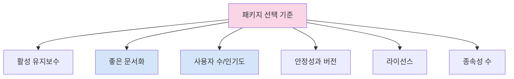

# 추천 패키지 모음

Flutter 앱을 개발할 때 모든 기능을 직접 구현할 필요는 없습니다. 커뮤니티가 개발하고 유지 관리하는 수많은 패키지를 활용하면 개발 시간을 단축하고 코드 품질을 향상시킬 수 있습니다. 이 장에서는 Flutter 앱 개발에 유용한 추천 패키지들을 카테고리별로 소개합니다.

## 패키지 선택 기준

패키지를 선택할 때는 다음 사항을 고려하세요:



1. **활성 유지보수**: 최근 업데이트 날짜와 이슈 해결 속도 확인
2. **문서화 품질**: 좋은 README와 사용 예제
3. **인기도와 채택률**: 'likes' 및 'popularity' 점수
4. **종속성**: 최소한의 종속성을 가진 패키지 선호
5. **안정성**: 정식 출시 버전(non-prerelease) 선호
6. **라이선스**: 프로젝트에 호환되는 라이선스인지 확인

## 상태 관리

### 1. Riverpod

[riverpod](https://pub.dev/packages/flutter_riverpod) - 효율적이고 유연한 상태 관리

Riverpod는 Provider 패턴의 진화 버전으로, 타입 안전성과 코드 구성을 개선했습니다.

```dart
// 기본 Riverpod 사용법
final counterProvider = StateNotifierProvider<Counter, int>((ref) {
  return Counter();
});

class Counter extends StateNotifier<int> {
  Counter() : super(0);

  void increment() => state++;
}

// 코드에서 사용
class CounterWidget extends ConsumerWidget {
  @override
  Widget build(BuildContext context, WidgetRef ref) {
    final count = ref.watch(counterProvider);

    return Text('카운트: $count');
  }
}
```

Riverpod 2.0 이상에서는 코드 생성을 활용한 더 간결한 문법을 제공합니다:

```dart
@riverpod
class Counter extends _$Counter {
  @override
  int build() => 0;

  void increment() => state++;
}
```

### 2. Bloc/Cubit

[flutter_bloc](https://pub.dev/packages/flutter_bloc) - 예측 가능한 상태 관리

블록 패턴을 사용하면 UI와 비즈니스 로직을 명확히 분리할 수 있습니다.

```dart
// 상태 정의
abstract class CounterState {}
class CounterInitial extends CounterState {}
class CounterValue extends CounterState {
  final int value;
  CounterValue(this.value);
}

// Cubit 정의
class CounterCubit extends Cubit<CounterState> {
  CounterCubit() : super(CounterValue(0));

  void increment() {
    final currentState = state;
    if (currentState is CounterValue) {
      emit(CounterValue(currentState.value + 1));
    }
  }
}

// UI에서 사용
BlocProvider(
  create: (context) => CounterCubit(),
  child: BlocBuilder<CounterCubit, CounterState>(
    builder: (context, state) {
      if (state is CounterValue) {
        return Text('카운트: ${state.value}');
      }
      return const Text('로딩 중...');
    },
  ),
)
```

## 네트워크 및 API

### 1. Dio

[dio](https://pub.dev/packages/dio) - 강력한 HTTP 클라이언트

Dio는 인터셉터, 폼 데이터, 취소 및 시간 초과 기능을 갖춘 HTTP 클라이언트입니다.

```dart
final dio = Dio();

// GET 요청
Future<User> getUser(int id) async {
  final response = await dio.get('https://api.example.com/users/$id');
  return User.fromJson(response.data);
}

// POST 요청
Future<Response> createUser(User user) async {
  return await dio.post(
    'https://api.example.com/users',
    data: user.toJson(),
    options: Options(headers: {'Authorization': 'Bearer $token'}),
  );
}

// 인터셉터 설정
dio.interceptors.add(LogInterceptor(responseBody: true));
```

### 2. Retrofit

[retrofit](https://pub.dev/packages/retrofit) - 타입 안전한 REST 클라이언트

Dio와 함께 사용하여 타입 안전한 API 클라이언트를 생성합니다.

```dart
@RestApi(baseUrl: "https://api.example.com")
abstract class RestClient {
  factory RestClient(Dio dio, {String baseUrl}) = _RestClient;

  @GET("/users/{id}")
  Future<User> getUser(@Path("id") int id);

  @POST("/users")
  Future<User> createUser(@Body() User user);
}

// 사용 방법
final dio = Dio();
final client = RestClient(dio);
final user = await client.getUser(1);
```

### 3. GraphQL

[graphql_flutter](https://pub.dev/packages/graphql_flutter) - GraphQL 클라이언트

GraphQL API와 통신하기 위한 클라이언트입니다.

```dart
// 클라이언트 설정
final HttpLink httpLink = HttpLink('https://api.example.com/graphql');
final AuthLink authLink = AuthLink(
  getToken: () async => 'Bearer $token',
);
final Link link = authLink.concat(httpLink);

final GraphQLClient client = GraphQLClient(
  cache: GraphQLCache(),
  link: link,
);

// 쿼리 실행
const String readRepositories = r'''
  query ReadRepositories($nRepositories: Int!) {
    viewer {
      repositories(last: $nRepositories) {
        nodes {
          id
          name
          viewerHasStarred
        }
      }
    }
  }
''';

final QueryOptions options = QueryOptions(
  document: gql(readRepositories),
  variables: {'nRepositories': 50},
);

final QueryResult result = await client.query(options);
```

## 로컬 데이터 저장

### 1. Hive

[hive](https://pub.dev/packages/hive) - 경량 NoSQL 데이터베이스

Hive는 빠른 키-값 데이터베이스로, 간단한 데이터 저장에 적합합니다.

```dart
// 모델 정의
@HiveType(typeId: 0)
class Person extends HiveObject {
  @HiveField(0)
  late String name;

  @HiveField(1)
  late int age;
}

// 초기화
await Hive.initFlutter();
Hive.registerAdapter(PersonAdapter());
final box = await Hive.openBox<Person>('people');

// 데이터 저장 및 검색
final person = Person()
  ..name = '홍길동'
  ..age = 30;
await box.put('person_1', person);

final retrievedPerson = box.get('person_1');
```

### 2. Shared Preferences

[shared_preferences](https://pub.dev/packages/shared_preferences) - 간단한 키-값 저장소

작은 데이터를 저장하는 데 사용하는 간단한 키-값 저장소입니다.

```dart
// 데이터 저장
final prefs = await SharedPreferences.getInstance();
await prefs.setString('name', '홍길동');
await prefs.setInt('age', 30);
await prefs.setBool('isLoggedIn', true);

// 데이터 검색
final name = prefs.getString('name') ?? '이름 없음';
final age = prefs.getInt('age') ?? 0;
final isLoggedIn = prefs.getBool('isLoggedIn') ?? false;

// 데이터 삭제
await prefs.remove('name');
```

### 3. SQLite (via Drift)

[drift](https://pub.dev/packages/drift) - 타입 안전한 SQLite ORM

Drift(이전의 Moor)는 Flutter용 타입 안전한 SQL 도구입니다.

```dart
// 테이블 정의
class TodoItems extends Table {
  IntColumn get id => integer().autoIncrement()();
  TextColumn get title => text().withLength(min: 1, max: 50)();
  TextColumn get content => text().nullable()();
  DateTimeColumn get createdAt => dateTime().nullable()();
  BoolColumn get completed => boolean().withDefault(const Constant(false))();
}

// 데이터베이스 정의
@DriftDatabase(tables: [TodoItems])
class AppDatabase extends _$AppDatabase {
  AppDatabase(QueryExecutor e) : super(e);

  @override
  int get schemaVersion => 1;

  // 모든 할 일 얻기
  Future<List<TodoItem>> getAllTodos() => select(todoItems).get();

  // 할 일 추가
  Future<int> addTodo(TodoItemsCompanion todo) => into(todoItems).insert(todo);

  // 할 일 업데이트
  Future<bool> updateTodo(TodoItem todo) => update(todoItems).replace(todo);

  // 완료된 할 일 삭제
  Future<int> deleteCompleted() =>
    (delete(todoItems)..where((t) => t.completed)).go();
}
```

## UI 컴포넌트 및 스타일링

### 1. Flex Color Scheme

[flex_color_scheme](https://pub.dev/packages/flex_color_scheme) - 테마 생성 및 관리

Material Design 기반의 테마를 쉽게 생성하고 관리할 수 있습니다.

```dart
import 'package:flex_color_scheme/flex_color_scheme.dart';

// 라이트 테마
final lightTheme = FlexThemeData.light(
  scheme: FlexScheme.mandyRed,
  surfaceMode: FlexSurfaceMode.levelSurfacesLowScaffold,
  blendLevel: 9,
  appBarOpacity: 0.95,
  subThemesData: const FlexSubThemesData(
    blendOnLevel: 10,
    blendOnColors: false,
    inputDecoratorRadius: 25.0,
  ),
  visualDensity: FlexColorScheme.comfortablePlatformDensity,
  useMaterial3: true,
);

// 다크 테마
final darkTheme = FlexThemeData.dark(
  scheme: FlexScheme.mandyRed,
  surfaceMode: FlexSurfaceMode.levelSurfacesLowScaffold,
  blendLevel: 15,
  appBarOpacity: 0.90,
  subThemesData: const FlexSubThemesData(
    blendOnLevel: 20,
    inputDecoratorRadius: 25.0,
  ),
  visualDensity: FlexColorScheme.comfortablePlatformDensity,
  useMaterial3: true,
);

// 앱에 적용
MaterialApp(
  theme: lightTheme,
  darkTheme: darkTheme,
  themeMode: ThemeMode.system,
  // ...
)
```

### 2. Flutter Screenutil

[flutter_screenutil](https://pub.dev/packages/flutter_screenutil) - 반응형 UI 지원

다양한 화면 크기에 맞게 UI 요소의 크기를 조정합니다.

```dart
// 초기화 (디자인 파일 기준 크기)
void main() {
  runApp(const MyApp());
}

class MyApp extends StatelessWidget {
  const MyApp({Key? key}) : super(key: key);

  @override
  Widget build(BuildContext context) {
    return ScreenUtilInit(
      designSize: const Size(360, 690),
      minTextAdapt: true,
      splitScreenMode: true,
      builder: (context, child) {
        return MaterialApp(
          debugShowCheckedModeBanner: false,
          title: '반응형 UI',
          theme: ThemeData(
            primarySwatch: Colors.blue,
            textTheme: Typography.englishLike2018.apply(fontSizeFactor: 1.sp),
          ),
          home: child,
        );
      },
      child: const HomePage(),
    );
  }
}

// 사용 예시
Container(
  width: 100.w,   // 디자인 파일의 100px을 비율에 맞게 조정
  height: 50.h,   // 디자인 파일의 50px을 비율에 맞게 조정
  padding: EdgeInsets.all(10.r), // 반응형 패딩
  child: Text(
    '반응형 텍스트',
    style: TextStyle(fontSize: 14.sp), // 반응형 폰트 크기
  ),
)
```

### 3. Cached Network Image

[cached_network_image](https://pub.dev/packages/cached_network_image) - 이미지 캐싱

네트워크 이미지를 로드하고 캐싱합니다.

```dart
CachedNetworkImage(
  imageUrl: 'https://example.com/image.jpg',
  placeholder: (context, url) => const CircularProgressIndicator(),
  errorWidget: (context, url, error) => const Icon(Icons.error),
  fit: BoxFit.cover,
  width: 200,
  height: 200,
)
```

### 4. Infinite Scroll Pagination

[infinite_scroll_pagination](https://pub.dev/packages/infinite_scroll_pagination) - 페이징 처리

대량의 데이터를 페이징 처리하여 스크롤 목록에 표시합니다.

```dart
class PaginatedItemsScreen extends StatefulWidget {
  @override
  _PaginatedItemsScreenState createState() => _PaginatedItemsScreenState();
}

class _PaginatedItemsScreenState extends State<PaginatedItemsScreen> {
  static const _pageSize = 20;

  final PagingController<int, Item> _pagingController =
      PagingController(firstPageKey: 0);

  @override
  void initState() {
    _pagingController.addPageRequestListener((pageKey) {
      _fetchPage(pageKey);
    });
    super.initState();
  }

  Future<void> _fetchPage(int pageKey) async {
    try {
      final newItems = await fetchItems(pageKey, _pageSize);
      final isLastPage = newItems.length < _pageSize;

      if (isLastPage) {
        _pagingController.appendLastPage(newItems);
      } else {
        final nextPageKey = pageKey + newItems.length;
        _pagingController.appendPage(newItems, nextPageKey);
      }
    } catch (error) {
      _pagingController.error = error;
    }
  }

  @override
  Widget build(BuildContext context) {
    return PagedListView<int, Item>(
      pagingController: _pagingController,
      builderDelegate: PagedChildBuilderDelegate<Item>(
        itemBuilder: (context, item, index) => ItemWidget(item: item),
      ),
    );
  }

  @override
  void dispose() {
    _pagingController.dispose();
    super.dispose();
  }
}
```

## 네비게이션 및 라우팅

### 1. Go Router

[go_router](https://pub.dev/packages/go_router) - 선언적 라우팅

Go Router는 Flutter에서 선언적 라우팅을 구현합니다.

```dart
final router = GoRouter(
  routes: [
    GoRoute(
      path: '/',
      builder: (context, state) => const HomePage(),
    ),
    GoRoute(
      path: '/users',
      builder: (context, state) => const UsersPage(),
      routes: [
        GoRoute(
          path: ':id',
          builder: (context, state) {
            final id = state.params['id']!;
            return UserDetailsPage(id: id);
          },
        ),
      ],
    ),
    GoRoute(
      path: '/settings',
      builder: (context, state) => const SettingsPage(),
    ),
  ],
  errorBuilder: (context, state) => NotFoundPage(),
);

// MaterialApp에 라우터 설정
MaterialApp.router(
  routerConfig: router,
  title: 'Go Router 예제',
)

// 탐색
context.go('/users/123');
context.push('/settings');
```

### 2. Auto Route

[auto_route](https://pub.dev/packages/auto_route) - 코드 생성 기반 라우팅

코드 생성을 활용한 타입 안전한 라우팅 솔루션입니다.

```dart
@MaterialAutoRouter(
  replaceInRouteName: 'Page,Route',
  routes: <AutoRoute>[
    AutoRoute(page: HomePage, initial: true),
    AutoRoute(page: UsersPage),
    AutoRoute(page: UserDetailsPage, path: '/users/:id'),
    AutoRoute(page: SettingsPage),
  ],
)
class $AppRouter {}

// AppRouter 인스턴스 생성
final appRouter = AppRouter();

// MaterialApp에 라우터 설정
MaterialApp.router(
  routerDelegate: appRouter.delegate(),
  routeInformationParser: appRouter.defaultRouteParser(),
)

// 타입 안전한 탐색
context.router.push(const UsersRoute());
context.router.push(UserDetailsRoute(id: '123'));
```

## 유틸리티 및 생산성

### 1. Freezed

[freezed](https://pub.dev/packages/freezed) - 코드 생성 기반 불변 모델

불변 모델 클래스를 쉽게 생성할 수 있는 코드 생성 패키지입니다.

```dart
@freezed
class User with _$User {
  const factory User({
    required String id,
    required String name,
    required int age,
    String? email,
  }) = _User;

  factory User.fromJson(Map<String, dynamic> json) => _$UserFromJson(json);
}

// 사용 예시
const user = User(id: '1', name: '홍길동', age: 30);

// 불변 복사
final updatedUser = user.copyWith(age: 31, email: 'hong@example.com');
```

### 2. Flutter Hooks

[flutter_hooks](https://pub.dev/packages/flutter_hooks) - 함수형 위젯 구성

React Hooks에서 영감을 받은 패키지로, 상태 관리 및 수명 주기 로직을 재사용 가능하게 만듭니다.

```dart
class CounterWithHooks extends HookWidget {
  @override
  Widget build(BuildContext context) {
    // useState 훅을 사용하여 상태 생성
    final counter = useState(0);

    // useEffect 훅을 사용하여 부수 효과 처리
    useEffect(() {
      print('카운터: ${counter.value}');
      return () => print('정리: ${counter.value}');
    }, [counter.value]);

    // 사용자 정의 훅 사용
    final animation = useAnimationController(
      duration: const Duration(seconds: 1),
    );

    return Column(
      children: [
        Text('카운트: ${counter.value}'),
        ElevatedButton(
          onPressed: () => counter.value++,
          child: const Text('증가'),
        ),
      ],
    );
  }
}
```

### 3. GetIt

[get_it](https://pub.dev/packages/get_it) - 서비스 로케이터

간단한 서비스 로케이터 및 의존성 주입 컨테이너입니다.

```dart
// GetIt 인스턴스 생성
final getIt = GetIt.instance;

// 의존성 등록
void setupDependencies() {
  // 싱글톤 등록
  getIt.registerSingleton<ApiClient>(ApiClient());

  // 팩토리 등록
  getIt.registerFactory<UserRepository>(() => UserRepository(getIt<ApiClient>()));

  // 지연 싱글톤 등록
  getIt.registerLazySingleton<AuthService>(() => AuthService(getIt<ApiClient>()));
}

// 의존성 사용
final userRepository = getIt<UserRepository>();
final apiClient = getIt<ApiClient>();
```

## 이미지 및 미디어

### 1. Photo View

[photo_view](https://pub.dev/packages/photo_view) - 이미지 뷰어

확대/축소 및 팬 제스처가 있는 이미지 뷰어입니다.

```dart
PhotoView(
  imageProvider: const NetworkImage('https://example.com/image.jpg'),
  minScale: PhotoViewComputedScale.contained * 0.8,
  maxScale: PhotoViewComputedScale.covered * 2,
  initialScale: PhotoViewComputedScale.contained,
  backgroundDecoration: BoxDecoration(
    color: Colors.black,
  ),
)
```

### 2. Video Player

[video_player](https://pub.dev/packages/video_player) - 비디오 재생

다양한 비디오 소스에서 비디오를 재생할 수 있습니다.

```dart
class VideoPlayerScreen extends StatefulWidget {
  @override
  _VideoPlayerScreenState createState() => _VideoPlayerScreenState();
}

class _VideoPlayerScreenState extends State<VideoPlayerScreen> {
  late VideoPlayerController _controller;

  @override
  void initState() {
    super.initState();
    // 네트워크 비디오 로드
    _controller = VideoPlayerController.network(
      'https://example.com/video.mp4',
    )..initialize().then((_) {
      setState(() {});
    });
  }

  @override
  Widget build(BuildContext context) {
    return _controller.value.isInitialized
        ? AspectRatio(
            aspectRatio: _controller.value.aspectRatio,
            child: Stack(
              alignment: Alignment.bottomCenter,
              children: [
                VideoPlayer(_controller),
                VideoProgressIndicator(_controller, allowScrubbing: true),
                Positioned(
                  child: IconButton(
                    icon: Icon(
                      _controller.value.isPlaying ? Icons.pause : Icons.play_arrow,
                    ),
                    onPressed: () {
                      setState(() {
                        _controller.value.isPlaying
                            ? _controller.pause()
                            : _controller.play();
                      });
                    },
                  ),
                ),
              ],
            ),
          )
        : const Center(child: CircularProgressIndicator());
  }

  @override
  void dispose() {
    _controller.dispose();
    super.dispose();
  }
}
```

## 인증 및 권한

### 1. Firebase Auth

[firebase_auth](https://pub.dev/packages/firebase_auth) - Firebase 인증

Firebase 인증 서비스를 사용하여 사용자 인증을 처리합니다.

```dart
// Firebase 초기화
await Firebase.initializeApp();
final FirebaseAuth auth = FirebaseAuth.instance;

// 이메일/비밀번호로 회원가입
Future<UserCredential> signUp(String email, String password) async {
  return await auth.createUserWithEmailAndPassword(
    email: email,
    password: password,
  );
}

// 이메일/비밀번호로 로그인
Future<UserCredential> signIn(String email, String password) async {
  return await auth.signInWithEmailAndPassword(
    email: email,
    password: password,
  );
}

// 로그아웃
Future<void> signOut() async {
  await auth.signOut();
}

// 현재 사용자 가져오기
User? getCurrentUser() {
  return auth.currentUser;
}

// 인증 상태 변경 감지
auth.authStateChanges().listen((User? user) {
  if (user == null) {
    print('로그아웃 상태');
  } else {
    print('로그인 상태: ${user.email}');
  }
});
```

### 2. Permission Handler

[permission_handler](https://pub.dev/packages/permission_handler) - 권한 처리

앱 권한을 요청하고 확인합니다.

```dart
// 카메라 권한 요청
Future<void> requestCameraPermission() async {
  final status = await Permission.camera.request();

  if (status.isGranted) {
    // 권한이 부여됨, 카메라 관련 기능 실행
    openCamera();
  } else if (status.isDenied) {
    // 권한이 거부됨, 사용자에게 권한의 필요성 설명
    showPermissionDialog();
  } else if (status.isPermanentlyDenied) {
    // 권한이 영구적으로 거부됨, 앱 설정으로 이동하도록 안내
    await openAppSettings();
  }
}

// 여러 권한 동시 요청
Future<void> requestMultiplePermissions() async {
  Map<Permission, PermissionStatus> statuses = await [
    Permission.camera,
    Permission.microphone,
    Permission.storage,
  ].request();

  if (statuses[Permission.camera]!.isGranted &&
      statuses[Permission.microphone]!.isGranted) {
    // 카메라와 마이크 권한이 부여됨, 비디오 녹화 시작
    startVideoRecording();
  }
}
```

## 폼 처리 및 검증

### 1. Formz

[formz](https://pub.dev/packages/formz) - 폼 상태 관리

폼 입력 및 검증을 간소화합니다.

```dart
// 이메일 입력 모델
enum EmailValidationError { empty, invalid }

class Email extends FormzInput<String, EmailValidationError> {
  const Email.pure() : super.pure('');
  const Email.dirty([String value = '']) : super.dirty(value);

  static final _emailRegex = RegExp(
    r'^[a-zA-Z0-9.]+@[a-zA-Z0-9]+\.[a-zA-Z]+',
  );

  @override
  EmailValidationError? validator(String value) {
    if (value.isEmpty) return EmailValidationError.empty;
    if (!_emailRegex.hasMatch(value)) return EmailValidationError.invalid;
    return null;
  }
}

// 비밀번호 입력 모델
enum PasswordValidationError { empty, tooShort }

class Password extends FormzInput<String, PasswordValidationError> {
  const Password.pure() : super.pure('');
  const Password.dirty([String value = '']) : super.dirty(value);

  @override
  PasswordValidationError? validator(String value) {
    if (value.isEmpty) return PasswordValidationError.empty;
    if (value.length < 8) return PasswordValidationError.tooShort;
    return null;
  }
}

// Riverpod과 함께 사용
@riverpod
class LoginForm extends _$LoginForm {
  @override
  FormzStatus build() {
    return FormzStatus.pure;
  }

  Email _email = const Email.pure();
  Password _password = const Password.pure();

  void emailChanged(String value) {
    _email = Email.dirty(value);
    _validateForm();
  }

  void passwordChanged(String value) {
    _password = Password.dirty(value);
    _validateForm();
  }

  void _validateForm() {
    state = Formz.validate([_email, _password]);
  }

  String? get emailError {
    switch (_email.error) {
      case EmailValidationError.empty:
        return '이메일을 입력해주세요';
      case EmailValidationError.invalid:
        return '유효한 이메일 주소를 입력해주세요';
      default:
        return null;
    }
  }

  String? get passwordError {
    switch (_password.error) {
      case PasswordValidationError.empty:
        return '비밀번호를 입력해주세요';
      case PasswordValidationError.tooShort:
        return '비밀번호는 최소 8자 이상이어야 합니다';
      default:
        return null;
    }
  }

  Future<void> submit() async {
    if (state.isInvalid) return;

    // 로그인 로직
  }
}
```

### 2. Flutter Form Builder

[flutter_form_builder](https://pub.dev/packages/flutter_form_builder) - 선언적 폼 빌더

쉽게 폼을 작성하고 관리할 수 있는 위젯 모음입니다.

```dart
final _formKey = GlobalKey<FormBuilderState>();

FormBuilder(
  key: _formKey,
  autovalidateMode: AutovalidateMode.onUserInteraction,
  child: Column(
    children: [
      FormBuilderTextField(
        name: 'email',
        decoration: const InputDecoration(labelText: '이메일'),
        validator: FormBuilderValidators.compose([
          FormBuilderValidators.required(),
          FormBuilderValidators.email(),
        ]),
      ),
      FormBuilderTextField(
        name: 'password',
        decoration: const InputDecoration(labelText: '비밀번호'),
        obscureText: true,
        validator: FormBuilderValidators.compose([
          FormBuilderValidators.required(),
          FormBuilderValidators.minLength(8),
        ]),
      ),
      FormBuilderCheckbox(
        name: 'agree',
        title: const Text('이용약관에 동의합니다'),
        validator: FormBuilderValidators.equal(
          true,
          errorText: '이용약관에 동의해야 합니다',
        ),
      ),
      ElevatedButton(
        onPressed: () {
          if (_formKey.currentState?.saveAndValidate() ?? false) {
            final formData = _formKey.currentState!.value;
            // 폼 제출 로직
            print(formData);
          }
        },
        child: const Text('제출'),
      ),
    ],
  ),
)
```

## 애니메이션 및 UI 효과

### 1. Lottie

[lottie](https://pub.dev/packages/lottie) - Lottie 애니메이션

After Effects 애니메이션을 Lottie 형식으로 재생합니다.

```dart
// 애셋에서 Lottie 파일 로드
Lottie.asset(
  'assets/animations/loading.json',
  width: 200,
  height: 200,
  fit: BoxFit.cover,
)

// 네트워크에서 Lottie 파일 로드
Lottie.network(
  'https://example.com/animation.json',
  controller: _controller,
  onLoaded: (composition) {
    _controller.duration = composition.duration;
    _controller.forward();
  },
)
```

### 2. Flutter Animate

[flutter_animate](https://pub.dev/packages/flutter_animate) - 선언적 애니메이션

위젯 애니메이션을 간소화하는 선언적 API입니다.

```dart
// 단일 애니메이션
Text('안녕하세요!')
  .animate()
  .fadeIn(duration: 600.ms, curve: Curves.easeOutQuad)
  .slideX(begin: -1, end: 0)

// 연속 애니메이션
Text('안녕하세요!')
  .animate()
  .fadeIn(duration: 500.ms)
  .then(delay: 200.ms) // 지연
  .slideY(begin: 1, end: 0, duration: 400.ms, curve: Curves.easeOut)

// 다수의 위젯 애니메이션
Column(
  children: [
    for (int i = 0; i < 10; i++)
      ListTile(title: Text('항목 $i'))
        .animate()
        .fadeIn(delay: 100.ms * i) // 순차적 지연
        .slideX() // 기본값 사용
  ],
)
```

## 결론

이 장에서 소개한 패키지들은 Flutter 앱 개발을 더 효율적이고 생산적으로 만들어 줍니다. 모든 앱이 동일한 패키지 세트를 필요로 하는 것은 아니므로, 프로젝트의 특정 요구 사항에 맞는 패키지를 선택하는 것이 중요합니다.

패키지를 선택할 때는 문서화 품질, 유지 관리 상태, 커뮤니티 지원 및 라이선스를 고려하세요. 또한 앱에 불필요한 크기를 추가하지 않도록 패키지의 크기와 종속성도 확인하는 것이 좋습니다.

Flutter는 계속 발전하고 있으며, 새로운 패키지와 라이브러리가 정기적으로 출시되고 있습니다. pub.dev에서 최신 패키지를 확인하고, 원하는 기능을 구현하기 전에 먼저 훌륭한 패키지가 이미 존재하는지 확인하는 습관을 들이세요.
