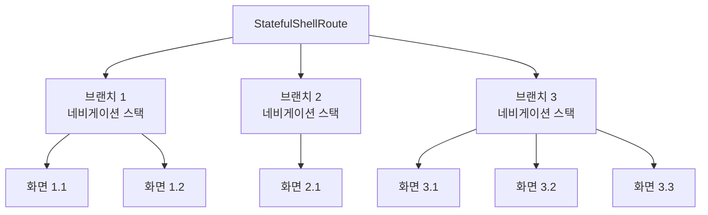

# 라우트 가드, ShellRoute, DeepLink

이 장에서는 go_router를 활용한 고급 라우팅 기법에 대해 알아보겠습니다. 라우트 가드를 통한 접근 제어, ShellRoute를 이용한 중첩 네비게이션, 그리고 딥 링크를 통한 앱 외부에서의 접근 방법을 살펴보겠습니다.

## 라우트 가드 (Route Guards)

라우트 가드는 특정 경로에 대한 접근을 제어하는 메커니즘으로, 사용자 인증이나 권한 검사 등에 활용됩니다.

### redirect를 활용한 기본 라우트 가드

go_router의 `redirect` 기능을 사용하여 라우트 가드를 구현할 수 있습니다:

```dart
final GoRouter router = GoRouter(
  routes: [...],

  // 전역 리다이렉트 (모든 라우트에 적용)
  redirect: (context, state) {
    // 현재 인증 상태 확인
    final isLoggedIn = AuthService.isLoggedIn;

    // 로그인이 필요한 경로 목록
    final protectedRoutes = ['/profile', '/settings', '/cart'];
    final isProtectedRoute = protectedRoutes.any(
      (route) => state.matchedLocation.startsWith(route),
    );

    // 로그인 페이지 여부 확인
    final isLoginRoute = state.matchedLocation == '/login';

    // 로그인 되지 않았고 보호된 경로로 접근 시도
    if (!isLoggedIn && isProtectedRoute) {
      return '/login?redirect=${state.matchedLocation}';
    }

    // 이미 로그인된 상태에서 로그인 페이지 접근 시도
    if (isLoggedIn && isLoginRoute) {
      return '/';
    }

    // 조건에 해당하지 않으면 리다이렉트 없음 (원래 경로 유지)
    return null;
  },
);
```

### 특정 라우트에 대한 가드

개별 라우트에 대해서도 리다이렉트를 설정할 수 있습니다:

```dart
GoRoute(
  path: '/admin',
  redirect: (context, state) {
    final user = AuthService.currentUser;

    // 관리자 권한 확인
    if (user == null || !user.hasAdminRole) {
      return '/access-denied';
    }

    // 권한이 있으면 원래 경로로 진행
    return null;
  },
  builder: (context, state) => AdminDashboard(),
),
```

### 상태 변화에 따른 리다이렉트 갱신

인증 상태가 변경될 때 라우트를 재평가하기 위해 `refreshListenable`을 사용합니다:

```dart
// 인증 상태 관리를 위한 ChangeNotifier
class AuthNotifier extends ChangeNotifier {
  bool _isLoggedIn = false;

  bool get isLoggedIn => _isLoggedIn;

  Future<void> login() async {
    _isLoggedIn = true;
    notifyListeners(); // 상태 변경 알림 (라우터가 이를 감지)
  }

  Future<void> logout() async {
    _isLoggedIn = false;
    notifyListeners();
  }
}

// 인증 상태 변경을 감지하는 라우터
final GoRouter router = GoRouter(
  refreshListenable: authNotifier, // 인증 상태 변경 감지
  redirect: (context, state) {
    // 리다이렉트 로직...
  },
  routes: [...],
);
```

## ShellRoute를 이용한 네비게이션

ShellRoute는 중첩 네비게이션을 구현하는 데 사용되며, 특히 바텀 네비게이션 바나 탭 바와 같은 영구적인 UI 요소가 있는 앱에 유용합니다.

### StatefulShellRoute 기본 개념

StatefulShellRoute는 여러 브랜치(branch)를 관리하는 라우트로, 각 브랜치는 자체 네비게이션 상태와 히스토리를 가집니다:



### 바텀 네비게이션 바 구현

StatefulShellRoute를 사용하여 바텀 네비게이션 바를 구현해 보겠습니다:

```dart
final GoRouter router = GoRouter(
  initialLocation: '/',
  routes: [
    // StatefulShellRoute 정의 (indexedStack 방식 사용)
    StatefulShellRoute.indexedStack(
      // 쉘 UI 구성
      builder: (context, state, navigationShell) {
        return ScaffoldWithNavBar(navigationShell: navigationShell);
      },
      // 브랜치 정의
      branches: [
        // 홈 탭
        StatefulShellBranch(
          routes: [
            GoRoute(
              path: '/',
              builder: (context, state) => HomeScreen(),
              routes: [
                // 홈 탭 내부의 중첩 라우트
                GoRoute(
                  path: 'details/:id',
                  builder: (context, state) {
                    final id = state.pathParameters['id']!;
                    return DetailsScreen(id: id);
                  },
                ),
              ],
            ),
          ],
        ),

        // 검색 탭
        StatefulShellBranch(
          routes: [
            GoRoute(
              path: '/search',
              builder: (context, state) => SearchScreen(),
            ),
          ],
        ),

        // 프로필 탭
        StatefulShellBranch(
          routes: [
            GoRoute(
              path: '/profile',
              builder: (context, state) => ProfileScreen(),
            ),
          ],
        ),
      ],
    ),
  ],
);

// 바텀 네비게이션 바가 있는 스캐폴드
class ScaffoldWithNavBar extends StatelessWidget {
  final StatefulNavigationShell navigationShell;

  const ScaffoldWithNavBar({required this.navigationShell});

  @override
  Widget build(BuildContext context) {
    return Scaffold(
      body: navigationShell, // 현재 브랜치의 화면 표시
      bottomNavigationBar: BottomNavigationBar(
        currentIndex: navigationShell.currentIndex,
        items: const [
          BottomNavigationBarItem(icon: Icon(Icons.home), label: '홈'),
          BottomNavigationBarItem(icon: Icon(Icons.search), label: '검색'),
          BottomNavigationBarItem(icon: Icon(Icons.person), label: '프로필'),
        ],
        onTap: (index) {
          // 탭 인덱스에 해당하는 브랜치로 이동
          navigationShell.goBranch(index);
        },
      ),
    );
  }
}
```

### 브랜치 간 이동과 상태 유지

StatefulShellRoute의 강점은 각 브랜치 내의 네비게이션 상태가 유지된다는 점입니다:

```dart
// 검색 화면에서 사용자가 검색 결과로 이동한 후
// 다른 탭으로 이동했다가 다시 검색 탭으로 돌아오면
// 검색 결과 화면이 그대로 유지됩니다.

// 홈 탭에서 상세 화면으로 이동
context.go('/details/123');

// 프로필 탭으로 이동 (홈 탭의 상태는 유지됨)
context.go('/profile');

// 다시 홈 탭으로 이동하면 상세 화면이 표시됨
context.go('/');
```

## 딥 링크 (Deep Linking)

딥 링크는 앱의 특정 화면으로 직접 접근할 수 있는 외부 링크로, 웹 URL, 푸시 알림 등에서 활용됩니다.

### 안드로이드 딥 링크 설정

1. **AndroidManifest.xml 설정**:

```xml
<manifest ...>
  <application ...>
    <activity ...>
      <!-- 기존 인텐트 필터 -->
      <intent-filter>
        <action android:name="android.intent.action.MAIN"/>
        <category android:name="android.intent.category.LAUNCHER"/>
      </intent-filter>

      <!-- 딥 링크 인텐트 필터 추가 -->
      <intent-filter android:autoVerify="true">
        <action android:name="android.intent.action.VIEW" />
        <category android:name="android.intent.category.DEFAULT" />
        <category android:name="android.intent.category.BROWSABLE" />

        <!-- 딥 링크 스킴 및 호스트 설정 -->
        <data
          android:scheme="https"
          android:host="example.com" />
      </intent-filter>
    </activity>
  </application>
</manifest>
```

### iOS 딥 링크 설정

1. **Info.plist 설정**:

```xml
<key>CFBundleURLTypes</key>
<array>
  <dict>
    <key>CFBundleTypeRole</key>
    <string>Editor</string>
    <key>CFBundleURLName</key>
    <string>com.example.app</string>
    <key>CFBundleURLSchemes</key>
    <array>
      <string>myapp</string>
    </array>
  </dict>
</array>

<!-- Universal Links 설정 -->
<key>com.apple.developer.associated-domains</key>
<array>
  <string>applinks:example.com</string>
</array>
```

### Flutter에서 딥 링크 처리

go_router를 사용하면 딥 링크 처리가 매우 간단합니다:

```dart
// 딥 링크를 자동으로 처리하는 설정
void main() {
  // 앱 초기화
  WidgetsFlutterBinding.ensureInitialized();

  // 라우터 설정
  final router = GoRouter(
    // 라우트 설정
    routes: [...],
  );

  runApp(MyApp(router: router));
}

class MyApp extends StatelessWidget {
  final GoRouter router;

  const MyApp({required this.router});

  @override
  Widget build(BuildContext context) {
    return MaterialApp.router(
      routerConfig: router,
      title: '딥 링크 예제',
      // ...
    );
  }
}
```

### 딥 링크 테스트

딥 링크를 테스트하기 위해 터미널에서 다음 명령어를 실행할 수 있습니다:

**안드로이드**:

```bash
adb shell am start -a android.intent.action.VIEW -d "https://example.com/product/123" com.example.app
```

**iOS 시뮬레이터**:

```bash
xcrun simctl openurl booted "https://example.com/product/123"
```

### 푸시 알림에서 딥 링크 처리

푸시 알림을 통한 딥 링크를 처리하는 방법:

```dart
// firebase_messaging 패키지 사용 예제
FirebaseMessaging.onMessageOpenedApp.listen((RemoteMessage message) {
  final deepLink = message.data['deepLink'] as String?;
  if (deepLink != null) {
    // 앱이 실행 중일 때 푸시 알림을 탭하면 해당 경로로 이동
    router.go(deepLink);
  }
});

// 앱이 종료된 상태에서 푸시 알림을 탭한 경우
Future<void> setupInteractedMessage() async {
  RemoteMessage? initialMessage = await FirebaseMessaging.instance.getInitialMessage();

  if (initialMessage != null) {
    final deepLink = initialMessage.data['deepLink'] as String?;
    if (deepLink != null) {
      // 딥 링크로 이동
      router.go(deepLink);
    }
  }
}
```

## 고급 라우팅 테크닉

### 1. 동적 라우트 생성

API에서 가져온 데이터를 기반으로 동적으로 라우트를 생성할 수 있습니다:

```dart
// 동적 라우트 생성 예제
Future<List<GoRoute>> buildDynamicRoutes() async {
  // API에서 카테고리 목록 가져오기
  final categories = await apiService.getCategories();

  // 각 카테고리에 대한 라우트 생성
  return categories.map((category) {
    return GoRoute(
      path: '/category/${category.slug}',
      builder: (context, state) => CategoryScreen(category: category),
    );
  }).toList();
}
```

### 2. 라우트 전환 애니메이션 커스터마이징

라우트 간 전환 애니메이션을 세밀하게 제어할 수 있습니다:

```dart
GoRoute(
  path: '/details/:id',
  pageBuilder: (context, state) {
    final id = state.pathParameters['id']!;

    // 히어로 애니메이션을 위한 전환 페이지
    return CustomTransitionPage(
      key: state.pageKey,
      child: ProductDetailsScreen(id: id),
      transitionsBuilder: (context, animation, secondaryAnimation, child) {
        // 페이드 트랜지션
        return FadeTransition(
          opacity: CurveTween(curve: Curves.easeInOut).animate(animation),
          child: child,
        );
      },
    );
  },
),
```

## 요약

- **라우트 가드**를 사용하여 인증 상태에 따라 접근을 제어할 수 있습니다.
- **StatefulShellRoute**는 바텀 네비게이션 바와 같은 중첩 네비게이션을 효과적으로 구현할 수 있게 해줍니다.
- **딥 링크**를 통해 앱 외부에서 특정 화면으로 직접 접근할 수 있습니다.
- **안드로이드와 iOS** 모두에서 딥 링크를 설정하는 방법이 다릅니다.
- **푸시 알림**에서 딥 링크를 처리하여 특정 화면으로 이동할 수 있습니다.
- **동적 라우트 생성**, **커스텀 전환 애니메이션** 등 고급 라우팅 기법을 활용할 수 있습니다.

다음 섹션에서는 이러한 고급 라우팅 기법을 실제 앱에 적용하는 복수 화면 전환 실습을 진행하겠습니다.
