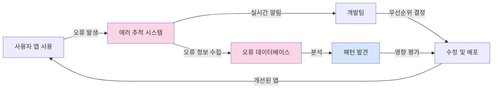

# 에러 추적: Crashlytics와 Sentry

모든 개발자는 완벽한 앱을 만들고 싶지만, 현실에서는 크래시와 예기치 않은 오류가 발생할 수 있습니다. 이러한 문제를 효과적으로 관리하기 위해 에러 추적 도구를 사용하는 것이 중요합니다. 이 문서에서는 Flutter 앱에서 사용할 수 있는 두 가지 주요 에러 추적 도구인 Firebase Crashlytics와 Sentry에 대해 알아보겠습니다.

## 에러 추적의 중요성

앱 출시 후 사용자 경험에 영향을 미치는 문제를 빠르게 발견하고 수정하는 것은 매우 중요합니다.



에러 추적 도구는 다음과 같은 이점을 제공합니다:

1. **실시간 모니터링**: 앱에서 발생하는 문제를 실시간으로 감지
2. **자세한 오류 정보**: 오류 발생 상황, 디바이스 정보, 앱 상태 등 상세 정보 제공
3. **우선순위 결정**: 가장 많이 발생하는 오류나 심각한, 최근에 발생한 오류에 집중
4. **사용자 영향 파악**: 얼마나 많은 사용자가 영향을 받는지 확인
5. **트렌드 분석**: 시간에 따른 오류 발생 패턴 분석

## Firebase Crashlytics

Firebase Crashlytics는 Google에서 제공하는 경량 실시간 크래시 리포팅 도구입니다.

### Firebase Crashlytics 특징

- **실시간 크래시 리포팅**: 오류 발생 직후 알림
- **이슈 우선순위 지정**: 영향을 받는 사용자 수, 심각도에 따른 자동 정렬
- **크래시 인사이트**: 문제의 근본 원인 파악 지원
- **최소한의 앱 성능 영향**: 백그라운드에서 효율적으로 작동
- **Firebase 생태계 통합**: Analytics, Performance Monitoring 등과 통합

### Firebase Crashlytics 설정하기

#### 1. Firebase 설정

Firebase 프로젝트가 아직 설정되지 않았다면, 먼저 [Firebase Console](https://console.firebase.google.com/)에서 프로젝트를 생성해야 합니다:

1. Firebase Console에서 프로젝트 생성
2. Flutter 앱 등록 (Android 및 iOS 패키지 이름 입력)
3. 설정 파일 다운로드 및 적용 (`google-services.json` 및 `GoogleService-Info.plist`)

#### 2. 필요한 패키지 추가

pubspec.yaml에 다음 패키지를 추가합니다:

```yaml
dependencies:
  firebase_core: ^2.15.0
  firebase_crashlytics: ^3.3.4
```

패키지를 설치합니다:

```bash
flutter pub get
```

#### 3. Android 설정

Android에서 Crashlytics를 설정하려면 `android/app/build.gradle` 파일에 다음 플러그인을 추가해야 합니다:

```gradle
// app/build.gradle 파일
dependencies {
  // ... 기존 종속성
  implementation 'com.google.firebase:firebase-crashlytics:18.4.0'
  implementation 'com.google.firebase:firebase-analytics:21.3.0'
}

apply plugin: 'com.google.firebase.crashlytics'
```

그리고 프로젝트 수준의 `android/build.gradle` 파일에 다음 내용을 추가합니다:

```gradle
// project/build.gradle 파일
buildscript {
  repositories {
    // ... 기존 저장소
    google()
  }
  dependencies {
    // ... 기존 종속성
    classpath 'com.google.firebase:firebase-crashlytics-gradle:2.9.9'
  }
}
```

#### 4. iOS 설정

iOS의 경우 `ios/Podfile`에 다음 내용을 추가합니다:

```ruby
target 'Runner' do
  // ... 기존 내용
  pod 'FirebaseCrashlytics'
end
```

그리고 다음 명령어를 실행합니다:

```bash
cd ios && pod install --repo-update
```

#### 5. Flutter 앱에서 Crashlytics 초기화

앱의 메인 파일에서 Crashlytics를 초기화합니다:

```dart
import 'package:firebase_core/firebase_core.dart';
import 'package:firebase_crashlytics/firebase_crashlytics.dart';
import 'package:flutter/foundation.dart';
import 'package:flutter/material.dart';

Future<void> main() async {
  WidgetsFlutterBinding.ensureInitialized();
  await Firebase.initializeApp();

  // Crashlytics 설정
  await FirebaseCrashlytics.instance.setCrashlyticsCollectionEnabled(!kDebugMode);

  // Flutter 오류를 Crashlytics에 보고
  FlutterError.onError = FirebaseCrashlytics.instance.recordFlutterFatalError;

  // Zone 오류도 잡아서 Crashlytics에 보고
  runZonedGuarded<Future<void>>(() async {
    runApp(const MyApp());
  }, (error, stack) {
    FirebaseCrashlytics.instance.recordError(error, stack, fatal: true);
  });
}
```

### Crashlytics 사용하기

#### 1. 에러 기록하기

```dart
try {
  // 위험한 작업 수행
} catch (e, stack) {
  FirebaseCrashlytics.instance.recordError(e, stack);
}
```

#### 2. 커스텀 로그 추가하기

```dart
// 로그 추가
FirebaseCrashlytics.instance.log('사용자가 결제 버튼 클릭');

// 로그와 함께 에러 기록
FirebaseCrashlytics.instance.recordError(
  exception,
  stackTrace,
  reason: '결제 처리 중 오류',
  information: ['상품 ID: $productId', '사용자 ID: $userId'],
);
```

#### 3. 사용자 정보 설정

```dart
// 비식별 사용자 ID 설정
FirebaseCrashlytics.instance.setUserIdentifier(userId);

// 커스텀 키-값 정보 추가
FirebaseCrashlytics.instance.setCustomKey('subscription_type', 'premium');
FirebaseCrashlytics.instance.setCustomKey('last_purchase_date', '2023-10-15');
```

#### 4. 테스트를 위한 강제 크래시

```dart
ElevatedButton(
  onPressed: () {
    FirebaseCrashlytics.instance.crash();  // 앱 크래시 발생
  },
  child: Text('테스트 크래시 발생'),
),
```

### Riverpod과 함께 사용하기

Riverpod을 사용하는 경우, 에러 관찰자를 만들 수 있습니다:

```dart
import 'package:flutter_riverpod/flutter_riverpod.dart';
import 'package:firebase_crashlytics/firebase_crashlytics.dart';

// Crashlytics 프로바이더
final crashlyticsProvider = Provider<FirebaseCrashlytics>((ref) {
  return FirebaseCrashlytics.instance;
});

// Riverpod 에러 관찰자
class CrashlyticsObserver extends ProviderObserver {
  final FirebaseCrashlytics crashlytics;

  CrashlyticsObserver(this.crashlytics);

  @override
  void providerDidFail(
    ProviderBase provider,
    Object error,
    StackTrace stackTrace,
    ProviderContainer container,
  ) {
    crashlytics.recordError(
      error,
      stackTrace,
      reason: 'Provider 오류: ${provider.name ?? provider.runtimeType}',
    );
  }
}

// main에서 설정
void main() {
  // ... Firebase 초기화 코드

  final container = ProviderContainer(
    observers: [
      CrashlyticsObserver(FirebaseCrashlytics.instance),
    ],
  );

  runApp(UncontrolledProviderScope(
    container: container,
    child: const MyApp(),
  ));
}
```

## Sentry

Sentry는 다양한 플랫폼에서 오류 추적, 성능 모니터링, 사용자 피드백 수집 등을 지원하는 종합 모니터링 플랫폼입니다.

### Sentry 특징

- **다양한 플랫폼 지원**: Flutter, Web, 서버 등 통합 모니터링
- **실시간 오류 추적**: 발생 직후 알림
- **성능 모니터링**: 앱 성능 측정 및 병목 현상 파악
- **릴리스 추적**: 특정 버전에서의 오류 추적
- **풍부한 컨텍스트**: 사용자 정보, 브레드크럼, 태그 등 상세 정보
- **자체 호스팅 옵션**: 온프레미스 설치 가능

### Sentry 설정하기

#### 1. 계정 생성 및 프로젝트 설정

1. [Sentry 웹사이트](https://sentry.io/)에서 계정 생성
2. 새 프로젝트 생성 (Flutter 플랫폼 선택)
3. DSN(Data Source Name) 복사

#### 2. 패키지 추가

pubspec.yaml에 다음 패키지를 추가합니다:

```yaml
dependencies:
  sentry_flutter: ^7.9.0
```

패키지를 설치합니다:

```bash
flutter pub get
```

#### 3. Sentry 초기화

앱의 메인 파일에서 Sentry를 초기화합니다:

```dart
import 'package:flutter/material.dart';
import 'package:sentry_flutter/sentry_flutter.dart';

Future<void> main() async {
  await SentryFlutter.init(
    (options) {
      options.dsn = 'https://your-dsn-here@o0.ingest.sentry.io/0';
      options.tracesSampleRate = 1.0;  // 성능 모니터링 활성화 (0.0 - 1.0)
      options.environment = 'production';  // 환경 설정
      options.attachScreenshot = true;  // 스크린샷 첨부 (iOS/Android만 지원)
      options.attachViewHierarchy = true;  // UI 계층 구조 첨부
      options.debug = false;  // 프로덕션에서는 false로 설정
    },
    appRunner: () => runApp(const MyApp()),
  );
}
```

### Sentry 사용하기

#### 1. 에러 캡처하기

```dart
try {
  // 위험한 작업 수행
} catch (exception, stackTrace) {
  await Sentry.captureException(
    exception,
    stackTrace: stackTrace,
  );
}
```

#### 2. 커스텀 이벤트 기록하기

```dart
Sentry.captureMessage(
  '사용자가 결제를 완료했습니다',
  level: SentryLevel.info,
);
```

#### 3. 트랜잭션 및 성능 모니터링

```dart
// 트랜잭션 시작
final transaction = Sentry.startTransaction(
  'processPayment',
  'operation',
);

try {
  // 작업 수행
  await processPayment();

  // 작업 성공
  transaction.status = SpanStatus.ok();
} catch (exception) {
  // 작업 실패
  transaction.status = SpanStatus.internalError();
  await Sentry.captureException(exception);
} finally {
  // 트랜잭션 종료
  await transaction.finish();
}
```

#### 4. 사용자 정보 추가

```dart
Sentry.configureScope((scope) {
  scope.setUser(SentryUser(
    id: 'user-123',
    email: 'user@example.com',
    ipAddress: '{{auto}}',
    data: {'subscription': 'premium'},
  ));
});
```

#### 5. 브레드크럼 추가

브레드크럼은 오류 발생 전의 사용자 활동을 추적하는 데 유용합니다:

```dart
// 사용자 활동 기록
Sentry.addBreadcrumb(
  Breadcrumb(
    category: 'ui.click',
    message: '결제 버튼 클릭',
    level: SentryLevel.info,
    data: {'productId': '12345'},
  ),
);
```

### Riverpod과 함께 사용하기

```dart
import 'package:flutter_riverpod/flutter_riverpod.dart';
import 'package:sentry_flutter/sentry_flutter.dart';

// Riverpod 에러 관찰자
class SentryProviderObserver extends ProviderObserver {
  @override
  void providerDidFail(
    ProviderBase provider,
    Object error,
    StackTrace stackTrace,
    ProviderContainer container,
  ) {
    Sentry.captureException(
      error,
      stackTrace: stackTrace,
      hint: Hint.withMap({
        'provider': provider.name ?? provider.runtimeType.toString(),
      }),
    );
  }
}

// main에서 설정
void main() async {
  await SentryFlutter.init(
    (options) {
      options.dsn = 'your-dsn-here';
      // 기타 옵션 설정
    },
    appRunner: () {
      final container = ProviderContainer(
        observers: [SentryProviderObserver()],
      );

      runApp(UncontrolledProviderScope(
        container: container,
        child: const MyApp(),
      ));
    },
  );
}
```

## Crashlytics와 Sentry 비교

두 도구 모두 훌륭한 오류 추적 기능을 제공하지만, 몇 가지 차이점이 있습니다:

| 기능          | Firebase Crashlytics                    | Sentry                      |
| ------------- | --------------------------------------- | --------------------------- |
| 가격          | 무료                                    | 제한적 무료 티어, 유료 플랜 |
| 설정 난이도   | 쉬움                                    | 중간                        |
| 플랫폼 지원   | 모바일 중심                             | 모바일, 웹, 서버 등 다양    |
| 생태계 통합   | Firebase 서비스와 통합                  | 다양한 플랫폼 지원          |
| 성능 모니터링 | 제한적 (Firebase Performance 별도 사용) | 기본 포함                   |
| 사용자 피드백 | 지원하지 않음                           | 지원                        |
| 자체 호스팅   | 지원하지 않음                           | 지원                        |
| 실시간 알림   | 이메일, 슬랙 등                         | 이메일, 슬랙, PagerDuty 등  |

### Crashlytics가 적합한 경우

- Firebase 생태계를 이미 사용 중인 경우
- 무료 솔루션이 필요한 경우
- 모바일 앱에 특화된 기능이 필요한 경우
- 간단한 설정을 선호하는 경우

### Sentry가 적합한 경우

- 여러 플랫폼(모바일, 웹, 서버 등)을 모니터링하는 경우
- 더 상세한 오류 컨텍스트가 필요한 경우
- 성능 모니터링이 중요한 경우
- 사용자 피드백 수집 기능이 필요한 경우
- 데이터 주권이 중요하여 자체 호스팅이 필요한 경우

## 에러 추적 모범 사례

### 1. 의미 있는 오류 컨텍스트 제공

```dart
try {
  await api.fetchData();
} catch (e, stack) {
  // 구체적인 맥락 정보 추가
  await errorTracker.recordError(
    e,
    stack,
    reason: 'API 데이터 가져오기 실패',
    information: [
      '엔드포인트: /users',
      '요청 파라미터: $parameters',
      '네트워크 상태: ${connectivity.status}',
    ],
  );
}
```

### 2. 사용자를 구분하되 개인정보 보호

```dart
// 좋은 예: 식별 가능하지만 개인정보는 아닌 ID 사용
errorTracker.setUserIdentifier('user_12345');

// 나쁜 예: 개인 이메일 사용
errorTracker.setUserIdentifier('user@example.com');  // 개인정보!
```

### 3. 중요 흐름에 브레드크럼 추가

```dart
// 주요 사용자 액션 추적
void onCheckoutButtonPressed() {
  // 브레드크럼 추가
  errorTracker.addBreadcrumb(
    'checkout_started',
    {'cart_total': '$cartTotal', 'items_count': '${cart.items.length}'},
  );

  // 결제 로직 실행
  startCheckoutProcess();
}
```

### 4. 릴리스 및 환경 구분

```dart
// Crashlytics
FirebaseCrashlytics.instance.setCustomKey('app_version', '1.2.3');
FirebaseCrashlytics.instance.setCustomKey('environment', 'production');

// Sentry
await SentryFlutter.init(
  (options) {
    options.dsn = 'your-dsn';
    options.release = '1.2.3';
    options.environment = 'production';
  },
  appRunner: () => runApp(MyApp()),
);
```

### 5. 비동기 초기화 패턴 사용

```dart
Future<void> initializeApp() async {
  try {
    await Firebase.initializeApp();
    await FirebaseCrashlytics.instance.setCrashlyticsCollectionEnabled(true);

    // 다른 초기화 로직
    await loadSettings();
    await authenticateUser();
  } catch (e, stack) {
    FirebaseCrashlytics.instance.recordError(e, stack);
    // 폴백 또는 기본 설정으로 진행
  }
}
```

### 6. 디버그와 릴리스 모드 분리

```dart
// 디버그 모드에서는 에러 추적 비활성화
bool shouldEnableErrorTracking = kReleaseMode;

// 또는 더 세분화된 제어
bool shouldEnableErrorTracking = kReleaseMode || kProfileMode;

FirebaseCrashlytics.instance.setCrashlyticsCollectionEnabled(
  shouldEnableErrorTracking,
);
```

## 결론

효과적인 에러 추적은 안정적인 앱을 유지하고 사용자 경험을 향상시키는 데 필수적입니다. Firebase Crashlytics와 Sentry는 각자의 강점을 가진 뛰어난 도구로, 프로젝트의 요구사항에 맞게 선택할 수 있습니다.

Crashlytics는 Firebase 생태계와의 통합, 무료 사용, 간편한 설정이 장점이며, Sentry는 크로스 플랫폼 지원, 성능 모니터링, 사용자 피드백, 자체 호스팅 등의 고급 기능을 제공합니다.

어떤 도구를 선택하든, 의미 있는 컨텍스트를 제공하고, 사용자 개인정보를 보호하며, 중요 흐름을 추적하는 등의 모범 사례를 따르는 것이 중요합니다. 이를 통해 오류를 효과적으로 감지하고 해결하여 사용자에게 더 안정적인 앱 경험을 제공할 수 있습니다.
