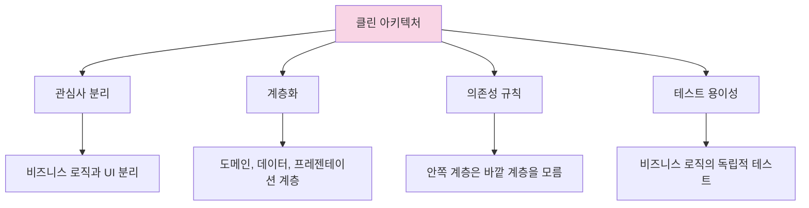

# 클린 아키텍처 도입하기

Flutter 앱의 규모가 커지고 복잡해질수록 코드의 유지보수성, 확장성, 테스트 용이성을 확보하는 것이 중요해집니다. 클린 아키텍처는 이러한 문제를 해결하기 위한 소프트웨어 설계 방법론으로, Flutter 앱에도 효과적으로 적용할 수 있습니다. 이 문서에서는 Flutter에 클린 아키텍처를 도입하는 방법을 실용적인 관점에서 살펴보겠습니다.

## 클린 아키텍처란?

클린 아키텍처는 로버트 C. 마틴(Robert C. Martin, 일명 Uncle Bob)이 제안한 소프트웨어 아키텍처 패턴으로, 다음과 같은 핵심 원칙을 따릅니다:



### 클린 아키텍처의 주요 원칙

1. **관심사 분리(Separation of Concerns)**: 서로 다른 책임을 가진 코드를 분리합니다.
2. **의존성 규칙(Dependency Rule)**: 모든 의존성은 외부 계층에서 내부 계층으로 향해야 합니다. 내부 계층은 외부 계층에 대해 알지 못합니다.
3. **비즈니스 규칙 독립성**: 비즈니스 규칙은 UI, 데이터베이스, 프레임워크, 외부 라이브러리와 독립적이어야 합니다.

### 클린 아키텍처의 계층

클린 아키텍처는 일반적으로 다음 세 가지 주요 계층으로 구성됩니다:

1. **도메인 계층(Domain Layer)**: 비즈니스 로직과 엔티티를 포함하는 핵심 계층입니다.
2. **데이터 계층(Data Layer)**: 데이터 소스와의 통신을 담당하는 계층입니다.
3. **프레젠테이션 계층(Presentation Layer)**: UI와 사용자 상호작용을 처리하는 계층입니다.

## Flutter에서의 클린 아키텍처 구현

Flutter에서 클린 아키텍처를 구현하기 위한 구체적인 접근 방식을 살펴보겠습니다.

### 1. 프로젝트 구조 설정

클린 아키텍처를 적용한 Flutter 프로젝트의 기본 구조는 다음과 같습니다:

```
lib/
├── core/                # 공통 기능 및 유틸리티
│   ├── error/           # 오류 처리
│   ├── network/         # 네트워크 관련
│   └── utils/           # 유틸리티 함수
│
├── data/                # 데이터 계층
│   ├── datasources/     # 데이터 소스 구현
│   │   ├── local/       # 로컬 데이터 소스
│   │   └── remote/      # 원격 데이터 소스
│   ├── models/          # 데이터 모델(DTO)
│   └── repositories/    # 리포지토리 구현
│
├── domain/              # 도메인 계층
│   ├── entities/        # 비즈니스 엔티티
│   ├── repositories/    # 리포지토리 인터페이스
│   └── usecases/        # 유스케이스(비즈니스 로직)
│
├── presentation/        # 프레젠테이션 계층
│   ├── pages/           # 화면 위젯
│   ├── providers/       # 상태 관리
│   └── widgets/         # 재사용 위젯
│
└── main.dart            # 앱 진입점
```

이 구조는 기능별 구조와 결합하여 사용할 수도 있습니다:

```
lib/
├── core/               # 공통 기능 및 유틸리티
│
├── features/           # 기능별 구성
│   ├── auth/           # 인증 기능
│   │   ├── data/
│   │   ├── domain/
│   │   └── presentation/
│   │
│   ├── products/       # 상품 기능
│   │   ├── data/
│   │   ├── domain/
│   │   └── presentation/
│   │
│   └── cart/           # 장바구니 기능
│       ├── data/
│       ├── domain/
│       └── presentation/
│
└── main.dart            # 앱 진입점
```

### 2. 계층별 구현 방법

#### 도메인 계층(Domain Layer)

도메인 계층은 비즈니스 로직을 담당하는 핵심 계층으로, 다음과 같은 요소로 구성됩니다:

1. **엔티티(Entities)**: 비즈니스 객체 모델
2. **리포지토리 인터페이스(Repository Interfaces)**: 데이터 액세스 추상화
3. **유스케이스(Use Cases)**: 비즈니스 로직을 캡슐화

```dart
// 1. 엔티티 정의
// domain/entities/product.dart
class Product {
  final String id;
  final String name;
  final double price;
  final String description;

  const Product({
    required this.id,
    required this.name,
    required this.price,
    required this.description,
  });
}

// 2. 리포지토리 인터페이스
// domain/repositories/product_repository.dart
abstract class ProductRepository {
  Future<List<Product>> getProducts();
  Future<Product> getProductById(String id);
  Future<void> saveProduct(Product product);
  Future<void> deleteProduct(String id);
}

// 3. 유스케이스
// domain/usecases/get_products.dart
class GetProducts {
  final ProductRepository repository;

  GetProducts(this.repository);

  Future<List<Product>> execute() {
    return repository.getProducts();
  }
}

// domain/usecases/get_product_by_id.dart
class GetProductById {
  final ProductRepository repository;

  GetProductById(this.repository);

  Future<Product> execute(String id) {
    return repository.getProductById(id);
  }
}
```

#### 데이터 계층(Data Layer)

데이터 계층은 데이터 저장소(API, 로컬 DB 등)와의 통신을 담당하고, 도메인 계층에 정의된 리포지토리 인터페이스를 구현합니다:

1. **데이터 모델(Data Models)**: API나 DB와 통신하기 위한 DTO(Data Transfer Object)
2. **데이터 소스(Data Sources)**: 실제 데이터 액세스 로직
3. **리포지토리 구현(Repository Implementations)**: 도메인 계층에 정의된 인터페이스 구현

```dart
// 1. 데이터 모델
// data/models/product_model.dart
class ProductModel {
  final String id;
  final String name;
  final double price;
  final String description;

  const ProductModel({
    required this.id,
    required this.name,
    required this.price,
    required this.description,
  });

  // JSON 직렬화/역직렬화
  factory ProductModel.fromJson(Map<String, dynamic> json) {
    return ProductModel(
      id: json['id'],
      name: json['name'],
      price: json['price'].toDouble(),
      description: json['description'],
    );
  }

  Map<String, dynamic> toJson() {
    return {
      'id': id,
      'name': name,
      'price': price,
      'description': description,
    };
  }

  // 도메인 엔티티로 변환
  Product toEntity() {
    return Product(
      id: id,
      name: name,
      price: price,
      description: description,
    );
  }

  // 도메인 엔티티에서 변환
  factory ProductModel.fromEntity(Product product) {
    return ProductModel(
      id: product.id,
      name: product.name,
      price: product.price,
      description: product.description,
    );
  }
}

// 2. 데이터 소스
// data/datasources/remote/product_remote_data_source.dart
abstract class ProductRemoteDataSource {
  Future<List<ProductModel>> getProducts();
  Future<ProductModel> getProductById(String id);
  Future<void> saveProduct(ProductModel product);
  Future<void> deleteProduct(String id);
}

// data/datasources/remote/product_remote_data_source_impl.dart
class ProductRemoteDataSourceImpl implements ProductRemoteDataSource {
  final http.Client client;
  final String baseUrl;

  ProductRemoteDataSourceImpl({
    required this.client,
    required this.baseUrl,
  });

  @override
  Future<List<ProductModel>> getProducts() async {
    try {
      final response = await client.get(
        Uri.parse('$baseUrl/products'),
        headers: {'Content-Type': 'application/json'},
      );

      if (response.statusCode == 200) {
        final List<dynamic> jsonList = json.decode(response.body);
        return jsonList.map((json) => ProductModel.fromJson(json)).toList();
      } else {
        throw ServerException();
      }
    } catch (e) {
      throw ServerException();
    }
  }

  // 다른 메서드 구현...
}

// 3. 리포지토리 구현
// data/repositories/product_repository_impl.dart
class ProductRepositoryImpl implements ProductRepository {
  final ProductRemoteDataSource remoteDataSource;
  final NetworkInfo networkInfo;

  ProductRepositoryImpl({
    required this.remoteDataSource,
    required this.networkInfo,
  });

  @override
  Future<List<Product>> getProducts() async {
    if (await networkInfo.isConnected) {
      try {
        final remoteProducts = await remoteDataSource.getProducts();
        return remoteProducts.map((model) => model.toEntity()).toList();
      } on ServerException {
        throw ServerFailure();
      }
    } else {
      throw NetworkFailure();
    }
  }

  // 다른 메서드 구현...
}
```

#### 프레젠테이션 계층(Presentation Layer)

프레젠테이션 계층은 UI와 사용자 상호작용을 담당하며, Riverpod을 사용하여 상태를 관리합니다:

1. **상태 관리(State Management)**: Riverpod 프로바이더
2. **UI 위젯(UI Widgets)**: 화면 및 컴포넌트

```dart
// 1. 상태 관리 (Riverpod)
// presentation/providers/product_providers.dart
import 'package:flutter_riverpod/flutter_riverpod.dart';

// 의존성 주입을 위한 프로바이더
final productRepositoryProvider = Provider<ProductRepository>((ref) {
  final remoteDataSource = ref.read(productRemoteDataSourceProvider);
  final networkInfo = ref.read(networkInfoProvider);

  return ProductRepositoryImpl(
    remoteDataSource: remoteDataSource,
    networkInfo: networkInfo,
  );
});

final getProductsUseCaseProvider = Provider<GetProducts>((ref) {
  final repository = ref.read(productRepositoryProvider);
  return GetProducts(repository);
});

// 상태 프로바이더
final productsProvider = FutureProvider<List<Product>>((ref) async {
  final getProductsUseCase = ref.read(getProductsUseCaseProvider);
  return getProductsUseCase.execute();
});

final productDetailsProvider = FutureProvider.family<Product, String>((ref, id) async {
  final getProductByIdUseCase = ref.read(getProductByIdUseCaseProvider);
  return getProductByIdUseCase.execute(id);
});

// 2. UI 위젯
// presentation/pages/product_list_page.dart
class ProductListPage extends ConsumerWidget {
  @override
  Widget build(BuildContext context, WidgetRef ref) {
    final productsAsync = ref.watch(productsProvider);

    return Scaffold(
      appBar: AppBar(title: Text('상품 목록')),
      body: productsAsync.when(
        data: (products) => ListView.builder(
          itemCount: products.length,
          itemBuilder: (context, index) {
            final product = products[index];
            return ListTile(
              title: Text(product.name),
              subtitle: Text('\$${product.price}'),
              onTap: () => Navigator.of(context).pushNamed(
                '/product/${product.id}',
              ),
            );
          },
        ),
        loading: () => Center(child: CircularProgressIndicator()),
        error: (error, stackTrace) => Center(
          child: Text('오류가 발생했습니다: $error'),
        ),
      ),
    );
  }
}
```

### 3. 의존성 주입(Dependency Injection)

클린 아키텍처에서 의존성 주입은 매우 중요합니다. Riverpod을 사용하면 의존성 주입을 효과적으로 관리할 수 있습니다:

```dart
// core/di/injection_container.dart
import 'package:flutter_riverpod/flutter_riverpod.dart';
import 'package:http/http.dart' as http;

// 인프라 계층 프로바이더
final httpClientProvider = Provider<http.Client>((ref) {
  return http.Client();
});

final networkInfoProvider = Provider<NetworkInfo>((ref) {
  final connectivity = ref.read(connectivityProvider);
  return NetworkInfoImpl(connectivity);
});

// 데이터 소스 프로바이더
final productRemoteDataSourceProvider = Provider<ProductRemoteDataSource>((ref) {
  final client = ref.read(httpClientProvider);
  return ProductRemoteDataSourceImpl(
    client: client,
    baseUrl: 'https://api.example.com',
  );
});

// 리포지토리 프로바이더
final productRepositoryProvider = Provider<ProductRepository>((ref) {
  final remoteDataSource = ref.read(productRemoteDataSourceProvider);
  final networkInfo = ref.read(networkInfoProvider);

  return ProductRepositoryImpl(
    remoteDataSource: remoteDataSource,
    networkInfo: networkInfo,
  );
});

// 유스케이스 프로바이더
final getProductsUseCaseProvider = Provider<GetProducts>((ref) {
  final repository = ref.read(productRepositoryProvider);
  return GetProducts(repository);
});

final getProductByIdUseCaseProvider = Provider<GetProductById>((ref) {
  final repository = ref.read(productRepositoryProvider);
  return GetProductById(repository);
});
```

### 4. 에러 처리

클린 아키텍처에서 에러 처리는 일관되고 체계적으로 이루어져야 합니다:

```dart
// core/error/exceptions.dart
class ServerException implements Exception {}
class CacheException implements Exception {}
class NetworkException implements Exception {}

// core/error/failures.dart
abstract class Failure {}

class ServerFailure extends Failure {}
class CacheFailure extends Failure {}
class NetworkFailure extends Failure {}

// 에러 처리 예시
// data/repositories/product_repository_impl.dart
@override
Future<List<Product>> getProducts() async {
  if (await networkInfo.isConnected) {
    try {
      final remoteProducts = await remoteDataSource.getProducts();
      return remoteProducts.map((model) => model.toEntity()).toList();
    } on ServerException {
      throw ServerFailure();
    }
  } else {
    throw NetworkFailure();
  }
}
```

## 실제 Flutter 예제: Todo 앱

실제 Todo 앱 예제를 통해 클린 아키텍처를 적용하는 방법을 살펴보겠습니다.

### 도메인 계층 구현

```dart
// domain/entities/todo.dart
class Todo {
  final String id;
  final String title;
  final String description;
  final bool completed;

  const Todo({
    required this.id,
    required this.title,
    required this.description,
    required this.completed,
  });
}

// domain/repositories/todo_repository.dart
abstract class TodoRepository {
  Future<List<Todo>> getTodos();
  Future<Todo> getTodoById(String id);
  Future<void> addTodo(Todo todo);
  Future<void> updateTodo(Todo todo);
  Future<void> deleteTodo(String id);
}

// domain/usecases/get_todos.dart
class GetTodos {
  final TodoRepository repository;

  GetTodos(this.repository);

  Future<List<Todo>> execute() {
    return repository.getTodos();
  }
}

// domain/usecases/add_todo.dart
class AddTodo {
  final TodoRepository repository;

  AddTodo(this.repository);

  Future<void> execute(Todo todo) {
    return repository.addTodo(todo);
  }
}
```

### 데이터 계층 구현

```dart
// data/models/todo_model.dart
import 'package:json_annotation/json_annotation.dart';

part 'todo_model.g.dart';

@JsonSerializable()
class TodoModel {
  final String id;
  final String title;
  final String description;
  final bool completed;

  const TodoModel({
    required this.id,
    required this.title,
    required this.description,
    required this.completed,
  });

  factory TodoModel.fromJson(Map<String, dynamic> json) =>
      _$TodoModelFromJson(json);

  Map<String, dynamic> toJson() => _$TodoModelToJson(this);

  // 변환 메서드
  Todo toEntity() => Todo(
    id: id,
    title: title,
    description: description,
    completed: completed,
  );

  factory TodoModel.fromEntity(Todo todo) => TodoModel(
    id: todo.id,
    title: todo.title,
    description: todo.description,
    completed: todo.completed,
  );
}

// data/datasources/todo_remote_data_source.dart
abstract class TodoRemoteDataSource {
  Future<List<TodoModel>> getTodos();
  Future<TodoModel> getTodoById(String id);
  Future<void> addTodo(TodoModel todo);
  Future<void> updateTodo(TodoModel todo);
  Future<void> deleteTodo(String id);
}

// data/datasources/todo_remote_data_source_impl.dart
class TodoRemoteDataSourceImpl implements TodoRemoteDataSource {
  final http.Client client;
  final String baseUrl;

  TodoRemoteDataSourceImpl({
    required this.client,
    required this.baseUrl,
  });

  @override
  Future<List<TodoModel>> getTodos() async {
    try {
      final response = await client.get(
        Uri.parse('$baseUrl/todos'),
        headers: {'Content-Type': 'application/json'},
      );

      if (response.statusCode == 200) {
        final List<dynamic> jsonList = json.decode(response.body);
        return jsonList.map((json) => TodoModel.fromJson(json)).toList();
      } else {
        throw ServerException();
      }
    } catch (e) {
      throw ServerException();
    }
  }

  // 다른 메서드 구현...
}

// data/repositories/todo_repository_impl.dart
class TodoRepositoryImpl implements TodoRepository {
  final TodoRemoteDataSource remoteDataSource;
  final NetworkInfo networkInfo;

  TodoRepositoryImpl({
    required this.remoteDataSource,
    required this.networkInfo,
  });

  @override
  Future<List<Todo>> getTodos() async {
    if (await networkInfo.isConnected) {
      try {
        final remoteTodos = await remoteDataSource.getTodos();
        return remoteTodos.map((model) => model.toEntity()).toList();
      } on ServerException {
        throw ServerFailure();
      }
    } else {
      throw NetworkFailure();
    }
  }

  // 다른 메서드 구현...
}
```

### 프레젠테이션 계층 구현

```dart
// presentation/providers/todo_providers.dart
import 'package:flutter_riverpod/flutter_riverpod.dart';

// 리포지토리 프로바이더
final todoRepositoryProvider = Provider<TodoRepository>((ref) {
  final remoteDataSource = ref.read(todoRemoteDataSourceProvider);
  final networkInfo = ref.read(networkInfoProvider);

  return TodoRepositoryImpl(
    remoteDataSource: remoteDataSource,
    networkInfo: networkInfo,
  );
});

// 유스케이스 프로바이더
final getTodosUseCaseProvider = Provider<GetTodos>((ref) {
  final repository = ref.read(todoRepositoryProvider);
  return GetTodos(repository);
});

final addTodoUseCaseProvider = Provider<AddTodo>((ref) {
  final repository = ref.read(todoRepositoryProvider);
  return AddTodo(repository);
});

// 상태 프로바이더
final todosProvider = FutureProvider<List<Todo>>((ref) async {
  final getTodosUseCase = ref.read(getTodosUseCaseProvider);
  return getTodosUseCase.execute();
});

// 상태 관리 노티파이어
final todoListNotifierProvider = StateNotifierProvider<TodoListNotifier, AsyncValue<List<Todo>>>((ref) {
  final getTodosUseCase = ref.read(getTodosUseCaseProvider);
  final addTodoUseCase = ref.read(addTodoUseCaseProvider);

  return TodoListNotifier(
    getTodosUseCase: getTodosUseCase,
    addTodoUseCase: addTodoUseCase,
  );
});

class TodoListNotifier extends StateNotifier<AsyncValue<List<Todo>>> {
  final GetTodos getTodosUseCase;
  final AddTodo addTodoUseCase;

  TodoListNotifier({
    required this.getTodosUseCase,
    required this.addTodoUseCase,
  }) : super(const AsyncValue.loading()) {
    _loadTodos();
  }

  Future<void> _loadTodos() async {
    state = const AsyncValue.loading();
    try {
      final todos = await getTodosUseCase.execute();
      state = AsyncValue.data(todos);
    } catch (e, stackTrace) {
      state = AsyncValue.error(e, stackTrace);
    }
  }

  Future<void> addTodo(Todo todo) async {
    try {
      await addTodoUseCase.execute(todo);
      _loadTodos(); // 목록 다시 로드
    } catch (e) {
      // 오류 처리
    }
  }
}

// presentation/pages/todo_list_page.dart
class TodoListPage extends ConsumerWidget {
  @override
  Widget build(BuildContext context, WidgetRef ref) {
    final todosAsync = ref.watch(todoListNotifierProvider);

    return Scaffold(
      appBar: AppBar(title: Text('Todo 목록')),
      body: todosAsync.when(
        data: (todos) => ListView.builder(
          itemCount: todos.length,
          itemBuilder: (context, index) {
            final todo = todos[index];
            return ListTile(
              title: Text(todo.title),
              subtitle: Text(todo.description),
              trailing: Checkbox(
                value: todo.completed,
                onChanged: (value) {
                  // 체크박스 상태 변경 처리
                },
              ),
            );
          },
        ),
        loading: () => Center(child: CircularProgressIndicator()),
        error: (error, stackTrace) => Center(
          child: Text('오류가 발생했습니다: $error'),
        ),
      ),
      floatingActionButton: FloatingActionButton(
        onPressed: () {
          // 새 Todo 추가 화면으로 이동
          Navigator.of(context).pushNamed('/add-todo');
        },
        child: Icon(Icons.add),
      ),
    );
  }
}
```

## 클린 아키텍처의 장점과 단점

### 장점

1. **관심사 분리**: 비즈니스 로직, 데이터 액세스, UI가 명확히 분리됩니다.
2. **테스트 용이성**: 각 계층이 독립적이므로 단위 테스트가 용이합니다.
3. **유지보수성**: 코드가 구조화되어 있어 변경이 필요할 때 영향 범위가 제한적입니다.
4. **확장성**: 새로운 기능을 추가하거나 기존 구현을 교체하기 쉽습니다.
5. **프레임워크 독립성**: 핵심 비즈니스 로직이 Flutter나 외부 라이브러리에 의존하지 않습니다.

### 단점

1. **초기 설정 복잡성**: 작은 프로젝트에서는 과도한 보일러플레이트 코드가 생길 수 있습니다.
2. **학습 곡선**: 팀원들이 아키텍처를 이해하고 적용하는 데 시간이 필요합니다.
3. **개발 속도**: 초기에는 개발 속도가 느려질 수 있습니다.
4. **코드량 증가**: 인터페이스, 구현체, 모델 변환 등으로 인해 코드량이 증가합니다.

## 실용적인 접근 방식

모든 프로젝트에 완전한 클린 아키텍처가 필요한 것은 아닙니다. 프로젝트 규모와 팀 특성에
따라 다음과 같이 접근할 수 있습니다:

### 소규모 프로젝트

소규모 프로젝트에서는 간소화된 아키텍처를 적용할 수 있습니다:

```
lib/
├── data/                # 데이터 액세스
│   ├── models/
│   └── repositories/
├── screens/             # UI 화면
│   ├── home/
│   └── details/
├── providers/           # 상태 관리
└── main.dart
```

### 중규모 프로젝트

중규모 프로젝트에서는 도메인 계층의 일부 개념을 도입할 수 있습니다:

```
lib/
├── data/                # 데이터 계층
│   ├── models/
│   └── repositories/
├── domain/              # 도메인 계층 (간소화)
│   └── usecases/
├── presentation/        # 프레젠테이션 계층
│   ├── pages/
│   └── providers/
├── core/                # 유틸리티
└── main.dart
```

### 대규모 프로젝트

대규모 프로젝트에서는 완전한 클린 아키텍처와 기능별 구조를 결합할 수 있습니다:

```
lib/
├── core/
├── features/
│   ├── auth/
│   │   ├── data/
│   │   ├── domain/
│   │   └── presentation/
│   ├── home/
│   │   ├── data/
│   │   ├── domain/
│   │   └── presentation/
│   └── settings/
│       ├── data/
│       ├── domain/
│       └── presentation/
└── main.dart
```

## 점진적 도입 전략

기존 프로젝트에 클린 아키텍처를 도입할 때는 점진적인 접근이 필요합니다:

1. **계층 분리부터 시작**: 먼저 UI, 비즈니스 로직, 데이터 액세스 코드를 분리합니다.
2. **한 기능씩 리팩토링**: 새로운 기능이나 중요한 기능부터 클린 아키텍처로 리팩토링합니다.
3. **테스트 작성**: 리팩토링과 함께 단위 테스트를 작성하여 안정성을 확보합니다.
4. **인터페이스 도입**: 점진적으로 인터페이스와 의존성 주입을 도입합니다.

## 결론

클린 아키텍처는 Flutter 앱의 확장성, 유지보수성, 테스트 용이성을 크게 향상시킬 수 있습니다. 하지만 모든 프로젝트에 동일한 수준으로 적용할 필요는 없으며, 프로젝트의 규모와 특성에 맞게 적절히 조정하는 것이 중요합니다.

처음에는 복잡해 보일 수 있지만, 핵심 원칙을 이해하고 점진적으로 도입한다면 장기적으로 더 안정적이고 유지보수하기 쉬운 코드베이스를 구축할 수 있습니다. 특히 팀 규모가 크거나 앱이 계속 성장할 것으로 예상되는 경우 클린 아키텍처의 도입을 고려해볼 가치가 있습니다.
